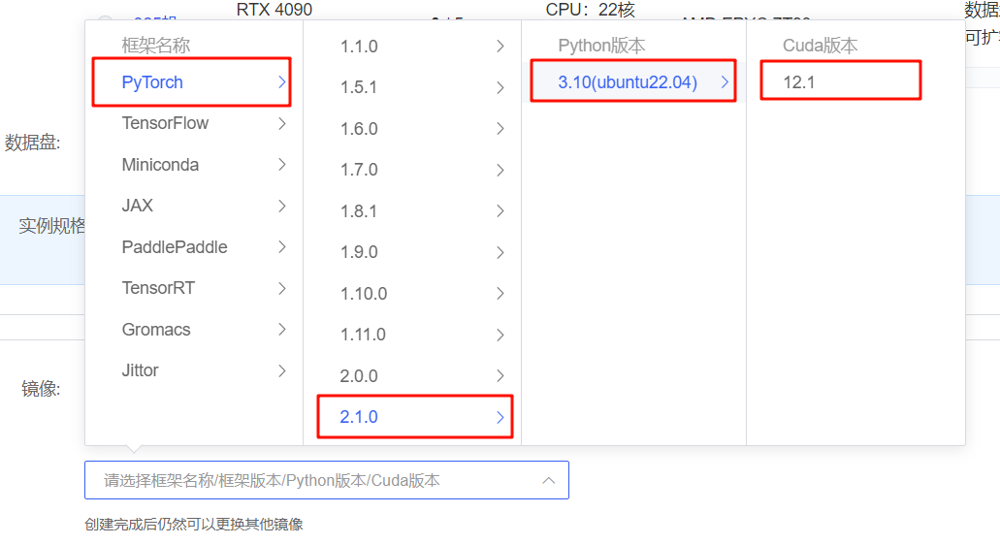
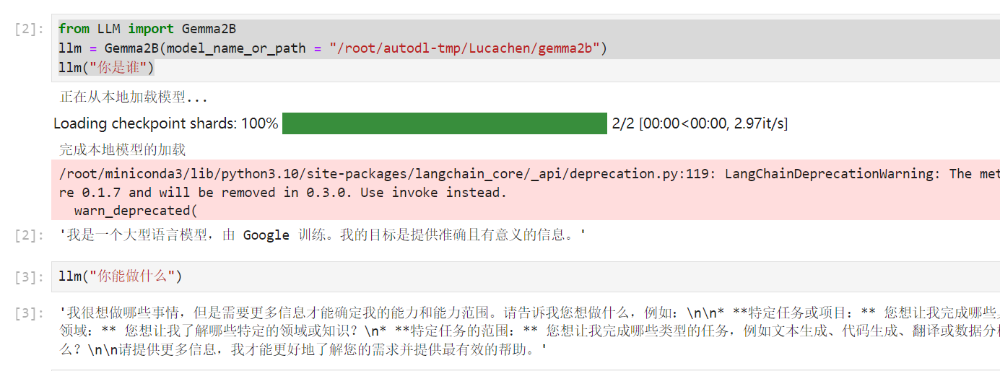

# Gemma-2B langchain access

## Environment preparation

Rent a 3090 or other 24G graphics card machine on the platform, as shown in the following figure, select the image `PyTorch-->2.1.0-->3.10(ubuntu22.04)-->12.1`

Next, open JupyterLab on the server you just rented, and open the terminal to start environment configuration, model download and run demonstration. 



pip changes the source to speed up downloading and installing dependent packages

```shell
# Upgrade pip
python -m pip install --upgrade pip
# Change the pypi source to speed up the installation of the library
pip config set global.index-url https://pypi.tuna.tsinghua.edu.cn/simple

pip install modelscope==1.11.0
pip install langchain==0.1.15
pip install "transformers>=4.40.0" accelerate tiktoken einops scipy transformers_stream_generator==0.1.16
pip install modelscope==1.11.0
pip install transformers==4.40.0
``` 

## Model download

Use the snapshot_download function in modelscope to download the model. The first parameter is the model name, and the parameter cache_dir is the download path of the model.

Create a new model_download.py file in the /root/autodl-tmp path and enter the following content in it. Remember to save the file after pasting the code, as shown in the figure below. And run `python /root/autodl-tmp/model_download.py` to execute the download. The model size is 15 GB, and it takes about 2 minutes to download the model.

```python 
import torch
from modelscope import snapshot_download, AutoModel, AutoTokenizer
import os
model_dir = snapshot_download('Lucachen/gemma2b', cache_dir='/root/autodl-tmp', revision='master')
```

## Code preparation

To build LLM applications conveniently, we need to customize an LLM class based on the locally deployed Gemma2B and connect Gemma2B to the LangChain framework. After completing the customized LLM class, the LangChain interface can be called in a completely consistent manner without considering the inconsistency of the underlying model call.

Customizing the LLM class based on the locally deployed Gemma2B is not complicated. We only need to inherit a subclass from the LangChain.llms.base.LLM class and rewrite the constructor and _call function:

```python
from langchain.llms.base import LLM
from typing import Any, List, Optional
from langchain.callbacks.manager import CallbackManagerForLLMRun
from transformers import AutoTokenizer, AutoModelForCausalLM, GenerationConfig, pipeline
import torch
class Gemma2B(LLM):
# Customize LLM class based on local gemma2b
tokenizer: AutoTokenizer = None
model: AutoModelForCausalLM = None
pipeline: pipeline = None
def __init__(self, model_name_or_path:str):
super().__init__()
print("Loading model from local...")
self.tokenizer = AutoTokenizer.from_pretrained(model_name_or_path)
self.pipeline = pipeline("text-generation",model=model_name_or_path,model_kwargs={"torch_dtype": torch.bfloat16},device="cuda") self.tokenizer.pad_token = self.tokenizer.eos_token print("Complete loading of local model") def _call(self, prompt : str, stop: Optional[List[str]] = None, run_manager: Optional[CallbackManagerForLLMRun] = None, **kwargs: Any): messages = [{"role": "user", "content": prompt}] prompt = self.pipeline.tokenizer.apply_chat_template(messages, tokenize=False , add_generation_prompt=True) outputs = self.pipeline(prompt,
max_new_tokens=1024,
add_special_tokens=True,
do_sample=True,
temperature=0.7,
top_k=50,
top_p=0.95
)
response = outputs[0]["generated_text"][len(prompt):]
return response

@property
def _llm_type(self) -> str:
return "Gemma2B"
```

In the above class definition, we rewrite the constructor and _call function respectively: for the constructor, we load the locally deployed Gemma model at the beginning of object instantiation to avoid the long time of reloading the model for each call; the _call function is the core function of the LLM class, LangChain will call this function to call LLM, in which we call the instantiated pipelinee generation method, so as to call the model and return the call result.

In the overall project, we encapsulate the above code as LLM.py, and then directly introduce the custom LLM class from this file.

```python
from LLM import Gemma2B
llm = Gemma2B(model_name_or_path = "/root/autodl-tmp/Lucachen/gemma2b")
llm("Who are you")
```

