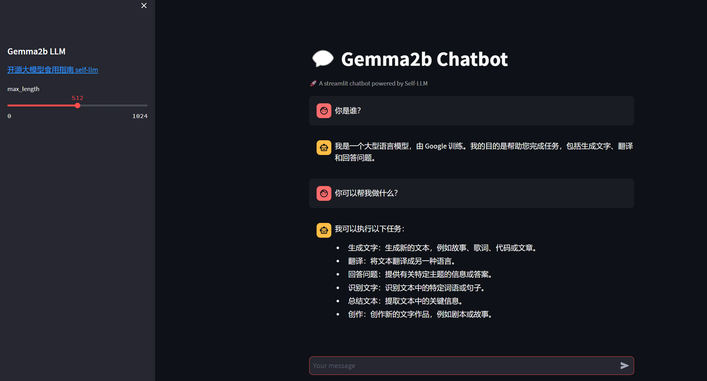

# 03-Gemma-2B-Chat WebDemo deployment

## Environment preparation

Rent a 3090 or other 24G graphics card machine in the platform, and select `PyTorch-->2.1.0-->3.10(ubuntu22.04)-->12.1` as shown in the following figure.
Next, open JupyterLab on the server you just rented, and open the terminal in it to start environment configuration, model download and run the demonstration.


pip source change and installation of dependent packages

```shell
# Upgrade pip
python -m pip install --upgrade pip
# Change pypi source to accelerate library installation
pip config set global.index-url https://pypi.tuna.tsinghua.edu.cn/simple

pip install modelscope==1.9.5
pip install transformers==4.35.2
pip install streamlit==1.24.0
pip install sentencepiece==0.1.99
pipinstall accelerate==0.24.1
pip install transformers_stream_generator==0.0.4
```

## Model download:

Use the snapshot_download function in modelscope to download the model. The first parameter is the model name, and the parameter cache_dir is the download path of the model.

Create a new download.py file in the /root/autodl-tmp path and enter the following content in it. Remember to save the file after pasting the code, as shown in the figure below. And run python /root/autodl-tmp/download.py to download. The model size is 15 GB. It takes about 10 to 20 minutes to download the model.

```Python
import torch
from modelscope import snapshot_download, AutoModel, AutoTokenizer
import os
model_dir = snapshot_download('Lucachen/gemma2b',cache_dir='/root/autodl-tmp', revision='v1.0.4')
```

## Code preparation

Create a new file `chatBot.py` in the `/root/autodl-tmp` path and enter the following content in it. Remember to save the file after pasting the code. The following code has very detailed comments. If you have any questions, please raise an issue.

```Python
# Import required libraries
from transformers import AutoTokenizer, pipeline
import torch
import streamlit as st

# Create a title and a link in the sidebar
with st.sidebar:
st.markdown("## Gemma2b LLM")
"[Open Source Large Model Edible Guide self-llm](https://github.com/datawhalechina/self-llm.git)"
# Create a slider to select the maximum length, ranging from 0 to 1024, with a default value of 512
max_length = st.slider("max_length", 0, 1024, 512, step=1)

# Create a title and a subtitle
st.title("💬Gemma2b Chatbot")
st.caption("🚀 A streamlit chatbot powered by Self-LLM")

# Define model path
mode_name_or_path = '/root/autodl-tmp/Lucachen/gemma2b'

# Define a function to get the model and tokenizer
@st.cache_resource
def get_model():
# Get tokenizer from pre-trained model
tokenizer = AutoTokenizer.from_pretrained(mode_name_or_path, trust_remote_code=True)
# Get generation configuration from pre-trained model
get_text = pipeline("text-generation",model=mode_name_or_path,model_kwargs={"torch_dtype": torch.bfloat16},device="cuda")
# Set the model to evaluation mode
return tokenizer, get_text

# Load the model and tokenizer of Baichuan-7B-chat
tokenizer, get_text = get_model()

# If there is no "messages" in session_state, create a list containing default messages
if "messages" not in st.session_state:
st.session_state["messages"] = []

# Traverse all messages in session_state and display them on the chat interface
for msg in st.session_state.messages:
st.chat_message(msg["role"]).write(msg["content"])

# If the user enters content in the chat input box, do the following
if prompt := st.chat_input():
# Add the user's input to the messages list in session_state
st.session_state.messages.append({"role": "user", "content":prompt}) # # Display the user's input on the chat interface st.chat_message("user").write(prompt) print(st.session_state.messages) messages = [ {"role": "user", "content": prompt} ] prompt = get_text.tokenizer.apply_chat_template(st.session_state.messages, tokenize=False, add_generation_prompt=True) outputs = get_text( prompt, max_new_tokens=1024, add_special_tokens=True, do_sample=True, temperature=0.7, top_k=50 , top_p=0.95 ) response = outputs[0]["generated_text"][len(prompt):]
# Add the output of the model to the messages list in session_state
st.session_state.messages.append({"role": "assistant", "content": response})
# Display the output of the model on the chat interface
st.chat_message("assistant").write(response)
```

## Run demo

Run the following command in the terminal to start the streamlit service, map the port to the local according to the instructions of `autodl`, and then open the link [http://localhost:6006/](http://localhost:6006/) in the browser to see the chat interface.

```Python
streamlit run /root/autodl-tmp/chatBot.py --server.address 127.0.0.1 --server.port 6006
```
As shown below:

