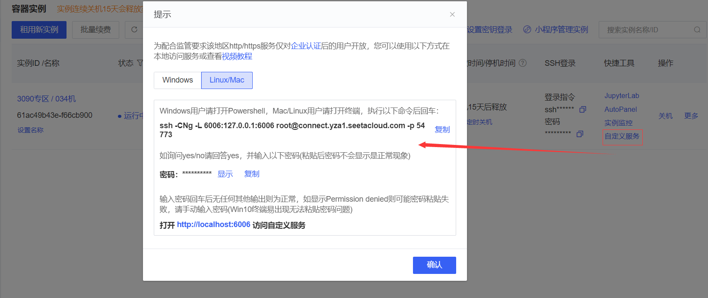

# Gemma-2-9b-it FastApi deployment call

## Environment preparation

Rent a graphics card machine with RTX 3090/24G video memory in the Autodl platform. As shown in the figure below, the image selection is PyTorch-->2.1.0-->3.10(ubuntu22.04)-->12.1.


## Environment configuration

pip source change to speed up downloading and installing dependent packages

```shell
# Upgrade pip
python -m pip install --upgrade pip

# Change pypi source to speed up library installation
pip config set global.index-url https://pypi.tuna.tsinghua.edu.cn/simple

# Install fastapi modelscope
pip install fastapi
pip install modelscope
pip install transformers==4.42.3
```

> Considering that some students may encounter some problems in configuring the environment, we have prepared an environment image of Gemma2 on the AutoDL platform, which is suitable for this warehouseGemma2 tutorial deployment environment. Click the link below and create an Autodl example directly.
> ***https://www.codewithgpu.com/i/datawhalechina/self-llm/self-llm-gemma2***

## Model download

Use the snapshot_download function in modelscope to download the model. The first parameter is the model name, and the parameter cache_dir is the download path of the model.

Then run the following code to execute the model download. The model size is about 18GB, and it takes about 5 minutes to download.

```python
from modelscope import snapshot_download
model_dir = snapshot_download('LLM-Research/gemma-2-9b-it', cache_dir='/root/autodl-tmp')
```

## Code preparation

Click Custom Service to open the AutoDL open port.


Machines in some areas need to configure AutoDL open ports. The configuration method is written in this project General-Setting directory, please refer to this document for the first use.

The configuration method is shown in the figure below.



Create a new api.py file and enter the following content in it. Please save the file in time after pasting the code.

The following code has very detailed comments. If you don’t understand it, please raise an issue.

```python
from fastapi import FastAPI, Request
from transformers import AutoTokenizer, AutoModelForCausalLM
import uvicorn
import json
import datetime
import torch

# Set device parameters
DEVICE = "cuda" # Use CUDA
DEVICE_ID = "0" # CUDA device ID, empty if not set
CUDA_DEVICE = f"{DEVICE}:{DEVICE_ID}" if DEVICE_ID else DEVICE # Combine CUDA device information

# Clear GPU memory function
def torch_gc():
iftorch.cuda.is_available(): # Check if CUDA is available
with torch.cuda.device(CUDA_DEVICE): # Specify CUDA device
torch.cuda.empty_cache() # Clear CUDA cache
torch.cuda.ipc_collect() # Collect CUDA memory fragments

# Create FastAPI application
app = FastAPI()

# Endpoint for handling POST requests
@app.post("/")
async def create_item(request: Request):
global model, tokenizer # Declare global variables to use models and tokenizers inside functions
json_post_raw = await request.json() # Get JSON data for POST request
json_post = json.dumps(json_post_raw) # Convert JSON data to string
json_post_list = json.listads(json_post) # Convert a string to a Python object
prompt = json_post_list.get('prompt') # Get the prompt in the request

# Call the model for dialogue generation
chat = [
{ "role": "user", "content": prompt },
]
prompt = tokenizer.apply_chat_template(chat, tokenize=False, add_generation_prompt=True)
inputs = tokenizer.encode(prompt, add_special_tokens=False, return_tensors="pt")
outputs = model.generate(input_ids=inputs.to(model.device), max_new_tokens=150)
outputs = tokenizer.decode(outputs[0])
response = outputs.split('model')[-1].replace('<end_of_turn>\n<eos>', '')

now = datetime.datetime.now() # Get the current time
time = now.strftime("%Y-%m-%d %H:%M:%S") # Format the time as a string

# Build response JSON
answer = {
"response": response,
"status": 200,
"time": time
}
# Build log information
log = "[" + time + "] " + '", prompt:"' + prompt + '", response:"' + repr(response) + '"'
print(log) # Print log
torch_gc() # Perform GPU memory cleanup
return answer # Return response

# Main function entry
if __name__ == '__main__':
# Load pre-trainingTokenizer and model
path = '/root/autodl-tmp/LLM-Research/gemma-2-9b-it'

print("Creat tokenizer...")
tokenizer = AutoTokenizer.from_pretrained(path)

print("Creat model...")
model = AutoModelForCausalLM.from_pretrained(
path,
device_map="cuda",
torch_dtype=torch.bfloat16,)

# Start FastAPI application
# Use port 6006 to map the port of autodl to the local, so as to use the api locally
uvicorn.run(app, host='0.0.0.0', port=6006, workers=1) # Start the application on the specified port and host
```

## Api deployment

Enter the following command in the terminal to start the api service:

```shell
python api.py
```

After loading is complete, the following message appears, indicating success.


By default, it is deployed on port 6006 and can be called through the POST method. You can use curl to call it, as shown below:

```shell
curl -X POST "http://127.0.0.1:6006" \
-H 'Content-Type: application/json' \
-d '{"prompt": "你好"}'
```


You can also use the requests library in python to call it, as shown below:

```python
import requests
import json

def get_completion(prompt):
headers = {'Content-Type': 'application/json'}
data = {"prompt": prompt}
response = requests.post(url='http://127.0.0.1:6006', headers=headers, data=json.dumps(data)) return response.json()['response'] if __name__ == '__main__': print(get_completion('Hello')) ``` 