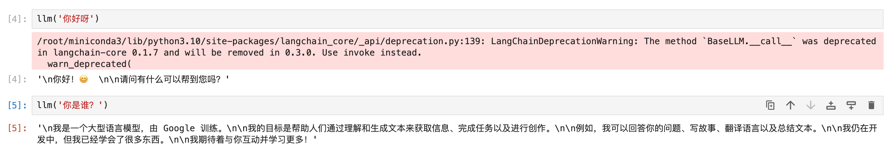

# 02-Gemma-2-9b-it langchain access 

## Environment preparation

Rent an RTX 3090/24G graphics card machine in the Autodl platform. As shown in the figure below, select PyTorch-->2.1.0-->3.10(ubuntu22.04)-->12.1.


Then open the terminal to start environment configuration, model download and run the demonstration. 

## Environment configuration

pip source change to speed up downloading and installing dependent packages

```shell
# Upgrade pip
python -m pip install --upgrade pip

# Change pypi source to speed up library installation
pip config set global.index-url https://pypi.tuna.tsinghua.edu.cn/simple

# Install langchain modelscope
pip install langchain==0.2.6
pip install modelscope
``` 

> Considering that some students may encounter some problems in configuring the environment, we have prepared Gemma2 on the AutoDL platformThe environment image is applicable to all deployment environments of the Gemma2 tutorial in this repository. Click the link below and create an Autodl example directly.
> ***https://www.codewithgpu.com/i/datawhalechina/self-llm/self-llm-gemma2***

## Model download

Use the snapshot_download function in modelscope to download the model. The first parameter is the model name, and the parameter cache_dir is the download path of the model.

Then run the following code to execute the model download. The model size is about 18GB, and it takes about 5 minutes to download.

```python
from modelscope import snapshot_download
model_dir = snapshot_download('LLM-Research/gemma-2-9b-it', cache_dir='/root/autodl-tmp')
```

## Code preparation

To build LLM applications conveniently, we need to customize an LLM class based on the locally deployed Gemma2 and connect Gemma2 to the LangChain framework.

Complete customizationAfter LLM class, LangChain's interface can be called in a completely consistent way without considering the inconsistency of the underlying model call.

Customizing LLM class based on local Gemma2 is not complicated. We only need to inherit a subclass from LangChain.llms.base.LLM class and rewrite the constructor and _call function:

```python
from langchain.llms.base import LLM
from typing import Any, List, Optional
from langchain.callbacks.manager import CallbackManagerForLLMRun
from transformers import AutoTokenizer, AutoModelForCausalLM
import torch

class Gemma2_LLM(LLM):
# Customize LLM class based on local Gemma2
tokenizer: AutoTokenizer = None
model: AutoModelForCausalLM = None

def __init__(self, mode_name_or_path :str): super().__init__() # Load the pretrained tokenizer and model print("Creat tokenizer...") self.tokenizer = AutoTokenizer.from_pretrained(mode_name_or_path) print("Creat model...") self.model = AutoModelForCausalLM.from_pretrained(mode_name_or_path, device_map="cuda",torch_dtype=torch.bfloat16,) def _call(self, prompt : str, stop: Optional[List[str]] = None, run_manager: Optional[CallbackManagerForLLMRun] = None, **kwargs: Any): # Call the model for conversation generation chat = [ { "role": "user", "content": prompt }, ] prompt = self.tokenizer.apply_chat_template(chat, tokenize=False, add_generation_prompt= True) inputs = self.tokenizer.encode(prompt, add_special_tokens=False, return_tensors="pt") outputs = self.model.generate(input_ids=inputs.to(self.model.device), max_new_tokens=150) outputs = self .tokenizer.decode(outputs[0]) response = outputs.split('model')[-1].replace('<end_of_turn>\n<eos>', '')

return response

@property
def _llm_type(self) -> str:
return "Gemma2_LLM"

```

In the above class definition, we rewrite the constructor and _call function respectively: for the constructor, we load the locally deployed Gemma2 model at the beginning of the object instantiation, so as to avoid the long time of reloading the model for each call; the _call function is the core function of the LLM class, which LangChain will call to call LLM. In this function, we call the generate method of the instantiated model to call the model and return the call result.

In the overall project, we encapsulate the above code as LLM.py, and then directly introduce the custom LLM class from this file.

## Call

Then you can use it like any other langchain large model function.

```python from LLM import Gemma2_LLM llm = Yuan2_LLM('/root/autodl-fs/YuanLLM/Yuan2-2B-Mars-hf')
print(llm("Who are you"))
```

