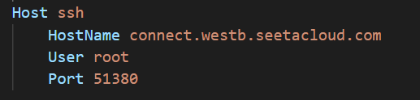
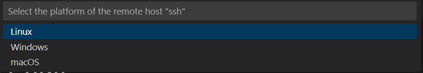
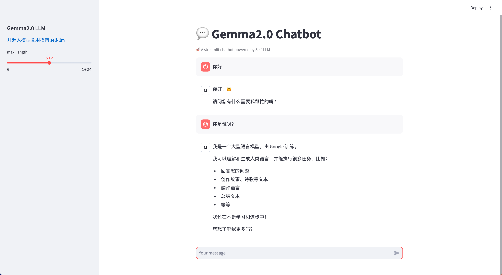

# Yuan2.0-2B WebDemo deployment

## Environment preparation

Rent an RTX 3090/24G graphics card machine in the Autodl platform. As shown in the figure below, select PyTorch-->2.1.0-->3.10(ubuntu22.04)-->12.1.


Then open the terminal to start environment configuration, model download and run the demonstration. 

## Environment configuration

pip changes the source to speed up downloading and installing dependent packages

```shell
# Upgrade pip
python -m pip install --upgrade pip

# Change the pypi source to speed up library installation
pip config set global.index-url https://pypi.tuna.tsinghua.edu.cn/simple

# Install einops modelscope streamlit
pip install einops modelscope streamlit==1.24.0
``` 

> Considering that some students may encounter some problems in configuring the environment, we have prepared an environment image of Gemma2 on the AutoDL platform.The image is applicable to all deployment environments of the Gemma2 tutorial in this repository. Click the link below and create an Autodl example directly.
> ***https://www.codewithgpu.com/i/datawhalechina/self-llm/self-llm-gemma2***

## Model download

Use the snapshot_download function in modelscope to download the model. The first parameter is the model name, and the parameter cache_dir is the download path of the model.

Then run the following code to execute the model download. The model size is about 18GB, and it takes about 5 minutes to download.

```python
# Import the required libraries
from transformers import AutoTokenizer, AutoModelForCausalLM
import torch
import streamlit as st

# Create a title and a link in the sidebar
with st.sidebar:
st.markdown("## Gemma2.0 LLM")
"[Open Source Large Model Eating Guide self-llm](https://github.com/datawhalechina/self-llm.git)"
# Create a slider to select the maximum length, ranging from 0 to 1024, with a default value of 512
max_length = st.slider("max_length", 0, 1024, 512, step=1)

# Create a title and a subtitle
st.title("💬 Gemma2.0 Chatbot")
st.caption("🚀 A streamlit chatbot powered by Self-LLM")

# Define the model path
path = '/root/autodl-tmp/LLM-Research/gemma-2-9b-it'

# Define a function to get the model and tokenizer
@st.cache_resource
def get_model():
print("Creat tokenizer...")
tokenizer = AutoTokenizer.from_pretrained(path)
print("Creat model...")
model = AutoModelForCausalLM.from_pretrained(path, device_map="cuda", torch_dtype=torch.bfloat16,)

return tokenizer, model

# Load emma-2-9b-it model and tokenizer

tokenizer, model = get_model()

# If there is no "messages" in session_state, create a list containing default messages
if "messages" not in st.session_state:
st.session_state["messages"] = []

# Traverse all messages in session_state and display them on the chat interface
for msg in st.session_state.messages:
st.chat_message(msg["role"]).write(msg["content"])

# If the user enters content in the chat input box, do the following
if prompt := st.chat_input():
# Add the user's input to the session_state in the messages list
st.session_state.messages.append({"role": "user", "content": prompt})

# Display the user's input on the chat interface
st.chat_message("user").write(prompt)

# Call the model
inputs = tokenizer.apply_chat_template(st.session_state.messages, tokenize=False, add_generation_prompt=True)
inputs = tokenizer.encode(inputs, add_special_tokens=False, return_tensors="pt")
outputs = model.generate(input_ids=inputs.to(model.device), max_new_tokens=150)
outputs = tokenizer.decode(outputs[0])
response = outputs.split('model')[-1].replace('<end_of_turn>\n<eos>', '')

# Add the output of the model to the messages list in session_state
st.session_state.messages.append({"role": "model", "content": response})

# Display the output of the model on the chat interface
st.chat_message("model").write(response)

# print(st.session_state)
```

# Configure vscode ssh

Copy the machine ssh login command


Paste it into the .ssh/config of the local computer and modify it to the following format



Then connect to this ssh and select linx



Copy the password and enter it, press Enter to log in to the machine

## Run demo

Run the following command in the terminal to start the streamlit service

```shell
streamlit run chatBot.py --server.address 127.0.0.1 --server.port 6006
```

Click Open in the browser to see the chat interface.

The running effect is as follows:

