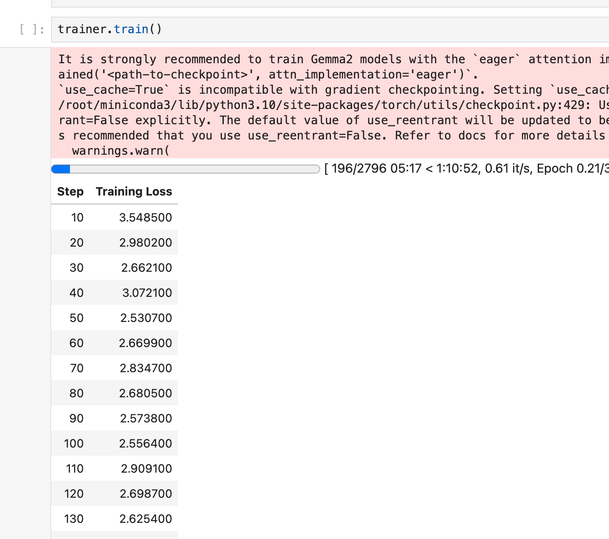
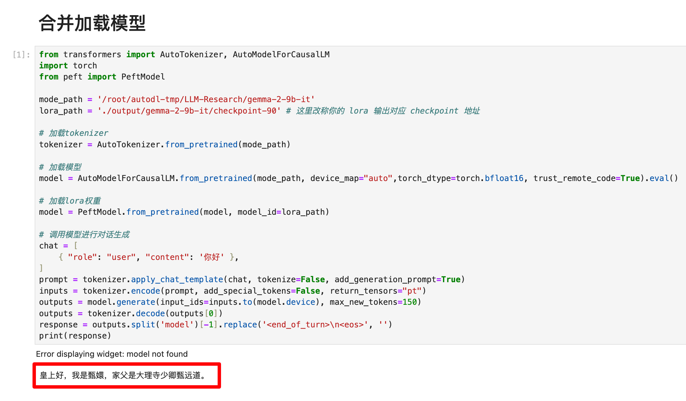

# Gemma-2-9b-it peft lora fine-tuning

In this section, we briefly introduce how to fine-tune the Gemma-2-9b-it model with Lora based on frameworks such as transformers and peft. Lora is an efficient fine-tuning method. For a deeper understanding of its principles, please refer to the blog: [Zhihu | Lora in a Simple Way](https://zhuanlan.zhihu.com/p/650197598).

This tutorial will provide you with a [nodebook](./04-Gemma-2-9b-it%20peft%20lora fine-tuning.ipynb) file in the same directory to help you learn better.

## Model download

Use the snapshot_download function in modelscope to download the model. The first parameter is the model name, and the parameter cache_dir is the download path of the model.

Create a new model_download.py file in the /root/autodl-tmp path and enter the following content in it. Please save the file in time after pasting the code, as shown in the figure below. And run `python /root/autodl-tmp/model_download.py` to download. The model size is 18GB. It takes about10 minutes.

```python
from modelscope import snapshot_download
model_dir = snapshot_download('LLM-Research/gemma-2-9b-it', cache_dir='/root/autodl-tmp')
``` 

## Environment configuration

After completing the basic environment configuration and local model deployment, you also need to install some third-party libraries. You can use the following command:

```bash
python -m pip install --upgrade pip
# Replace the pypi source to accelerate the installation of the library
pip config set global.index-url https://pypi.tuna.tsinghua.edu.cn/simple

pip install transformers==4.42.3 # Please be sure to install version 4.42.3
pip install datasets peft
```
> Considering that some students may encounter some problems in configuring the environment, we have prepared an environment image of Gemma2 on the AutoDL platform, which is applicable to all Gemma2 tutorials in this repositoryDeployment environment. Click the link below and create an Autodl example directly.
> ***https://www.codewithgpu.com/i/datawhalechina/self-llm/self-llm-gemma2***

In this tutorial, we will place the fine-tuning dataset in the root directory [/dataset](../dataset/huanhuan.json).

## Instruction set construction

LLM fine-tuning generally refers to the instruction fine-tuning process. The so-called instruction fine-tuning means that the fine-tuning data we use is in the form of:

```json
{
"instruction":"Answer the following user question and only output the answer.",
"input":"What is 1+1?",
"output":"2"
}
```

Among them, `instruction` is the user instruction, telling the model what task it needs to complete; `input` is the user input, which is the input content required to complete the user instruction; `output` is the output that the model should give.

That is, our core training goal is to enable the model to understand and follow user instructions. Therefore, when constructing the instruction set, we should build the task instruction set specifically for our target task. For example, in this section we use the open source [Chat-甄嬛](https://github.com/KMnO4-zx/huanhuan-chat) project as an example. Our goal is to build a personalized LLM that can simulate the conversation style of Zhen Huan, so the instructions we construct are as follows:

```json
{
"instruction": "Who are you?",
"input":"",
"output":"My father is Zhen Yuandao, the Shaoqing of Dali Temple."

}
```

All the instruction data sets we constructed are in the root directory.

## Data formatting

The data trained by `Lora` needs to be formatted and encoded before being input to the model for training. Students who are familiar with the `Pytorch` model training process will know that we generally need to encode the input text as input_ids and the output text as `labels`. The results after encoding are all multi-dimensional vectors. We first define a preprocessing function, which is used to encode the input and output text of each sample and return an encoded dictionary:

```python
def process_func(example):
MAX_LENGTH = 384 # Llama tokenizer will split a Chinese character into multiple tokens, so it is necessary to relax some maximum lengths to ensure data integrity
input_ids, attention_mask, labels = [], [], [] instruction = tokenizer(f"<bos><start_of_turn>user\n{example['instruction'] + example['input']}<end_of_turn>\n< start_of_turn>model\n", add_special_tokens=False) # add_special_tokens do not add special_tokens at the beginning response = tokenizer(f"{example['output']}<end_of_turn>\n", add_special_tokens=False) input_ids = instruction["input_ids"] + response["input_ids"] + [tokenizer.pad_token_id] attention_mask = instruction["attention_mask"] + response["attention_mask"] + [1] # Because we also need to pay attention to eos token, we add 1
labels = [-100] * len(instruction["input_ids"]) + response["input_ids"] + [tokenizer.pad_token_id] 
if len(input_ids) > MAX_LENGTH: # Do a truncation
input_ids = input_ids[:MAX_LENGTH]
attention_mask = attention_mask[:MAX_LENGTH]
labels = labels[:MAX_LENGTH]
return {
"input_ids": input_ids,
"attention_mask": attention_mask,
"labels": labels
}
```

`Gemma2` uses the following `Prompt Template` format:

```text
<bos><start_of_turn>user
Miss, other girls are all begging for the selection, but ours is the only one who wants to be left behind. The Bodhisattva must remember it for real - <end_of_turn>
<start_of_turn>model
Shh - it is said that making a wish out loud is not effective. <end_of_turn>
<eos>
```

## Load tokenizer and half-precision model

The model is loaded in half-precision format. If your graphics card is relatively new, you can load it in `torch.bfloat16` format. For custom models, be sure to specify the `trust_remote_code` parameter as `True`.

```python tokenizer = AutoTokenizer.from_pretrained('/root/autodl-tmp/LLM-Research/gemma-2-9b-it') tokenizer.pad_token_id = tokenizer.eos_token_id tokenizer.padding_side = 'right' model = AutoModelForCausalLM.from_pretrained('/root/autodl-tmp/LLM-Research/gemma-2-9b-it', device_map="cuda", torch_dtype=torch.bfloat16,)
```

## Define LoraConfig

Many parameters can be set in the `LoraConfig` class, but there are not many main parameters. I will briefly explain them. Students who are interested can directly look at the source code.

- `task_type`: model type
- `target_modules`: the name of the model layer to be trained, mainly the layer of the `attention` part. Different models have different names for the corresponding layers. You can pass in arrays, strings, or regular expressions.
- `r`: the rank of `lora`, see `Lora` principle for details
- `lora_alpha`: `Lora alaph`, see `Lora` principle for specific functions

What is the scaling of `Lora`? Of course it is not `r` (rank), this scaling is `lora_alpha/r`, and the scaling in this `LoraConfig` is 4 times.

```python config = LoraConfig( task_type=TaskType.CAUSAL_LM, target_modules=["q_proj","k_proj", "v_proj", "o_proj", 'gate_proj', 'up_proj', 'down_proj'],
inference_mode=False, # Training mode
r=8, # Lora rank
lora_alpha=32, # Lora alaph, see Lora principle for specific functions
lora_dropout=0.1# Dropout ratio
)
```

## Custom TrainingArguments parameters

The source code of the `TrainingArguments` class also introduces the specific functions of each parameter. Of course, you can explore it yourself. Here are a few common ones.

- `output_dir`: output path of the model
- `per_device_train_batch_size`: As the name suggests `batch_size`
- `gradient_accumulation_steps`: gradient accumulation. If your video memory is small, you can set `batch_size` to a smaller value to increase the gradient accumulation.
- `logging_steps`: how many steps to output `log` once
- `num_train_epochs`: As the name implies, `epoch`
- `gradient_checkpointing`: gradient check. Once this is turned on, the model must execute `model.enable_input_require_grads()`. You can explore this principle by yourself, so I won’t go into details here.

```python
args = TrainingArguments(
output_dir="./output/gemma-2-9b-it",
per_device_train_batch_size=1,
gradient_accumulation_steps=4,
logging_steps=10,
num_train_epochs=3,
save_steps=10, # For quick demonstration, set 10 here. It is recommended that you set it to 100
learning_rate=1e-4,
save_on_each_node=True,
gradient_checkpointing=True
)
```

## Use Trainer for training

```python
trainer = Trainer(
model=model,
args=args,
train_dataset=tokenized_id,
data_collator=DataCollatorForSeq2Seq(tokenizer=tokenizer, padding=True),
)
trainer.train()
```



## Load lora weight inference

After training, you can use the following method to load `lora` weights for inference:

```python
from transformers import AutoTokenizer, AutoModelForCausalLM
import torch
from peft import PeftModel

mode_path = '/root/autodl-tmp/LLM-Research/gemma-2-9b-it'
lora_path = './output/gemma-2-9b-it/checkpoint-90' # Change the name of your lora output to the corresponding checkpoint address# Load tokenizer
tokenizer = AutoTokenizer.from_pretrained(mode_path)

# Load model
model = AutoModelForCausalLM.from_pretrained(mode_path, device_map="auto",torch_dtype=torch.bfloat16, trust_remote_code=True).eval()

# Load lora weights
model = PeftModel.from_pretrained(model, model_id=lora_path)

# Call model for dialogue generation
chat = [
{ "role": "user", "content": 'Hello' },
]
prompt = tokenizer.apply_chat_template(chat, tokenize=False, add_generation_prompt=True)
inputs = tokenizer.encode(prompt, add_special_tokens=False, return_tensors="pt") outputs = model.generate(input_ids=inputs.to(model.device), max_new_tokens=150) outputs = tokenizer.decode(outputs[0]) response = outputs.split('model')[- 1].replace('<end_of_turn>\n<eos>', '') ``` 