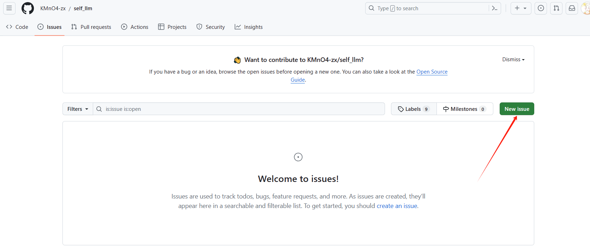
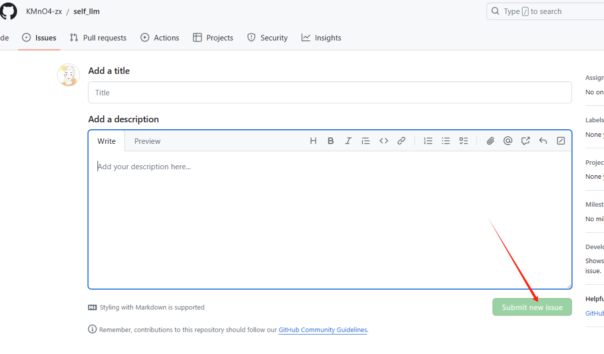
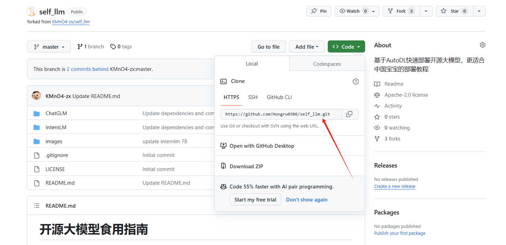
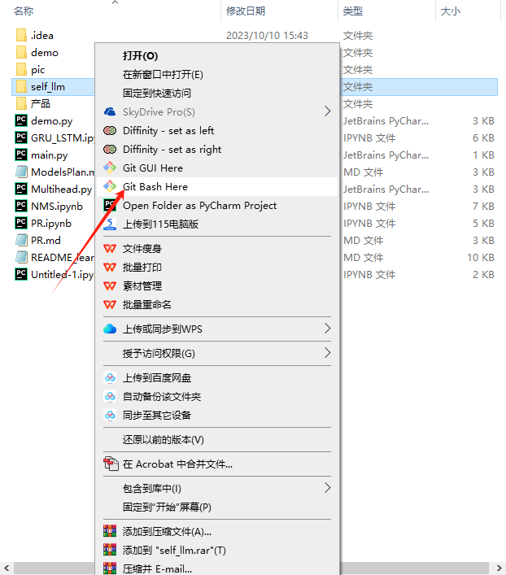

# 1. Github submit PR and modify PR
Partial reference to the blog written by ```I```---[Github submit PR and modify PR](https://blog.csdn.net/python_innocent/article/details/130560871)

## 1.1 Raise issues and PR from scratch:
- Generally, the first time you raise a PR, you should first raise an issue to describe your problem or proposal to ensure that your work meets the requirements. But this is not necessary, you can directly fork the repository and submit PR. It is very simple to raise an issue, the operation is as follows: 


- After forking the repository, make changes in your forked repository, and then click the pull request on your forked repository to merge your changes into the original repository. See below for details:

## 1.2 PR modification and correction
Modify in the fork: At this time, you have forked the repo and have changed the files you want to PR locally:

### 1.2.1 Create a new folder and add, delete, subtract, and modify---**Graphical interface version**

 

Write the folder name, then press the '/' key, a folder will be automatically generated, and then create a readme in it (you can delete it later)


To upload the local written things in the folder, just click this ```upload```


If you want to delete a folder or a file in it, just click these three dots and delete accordingly:


### 1.2.2 Create new folders and add, delete, and modify ---**Git version**

```'your/folk_repo_utl'```View method:



```
git clone 'your/folk_repo_utl' # Clone to local
cd /path/to/your/local/folder # Enter your local folder
```

- Here you can add, delete, reduce, and modify the forked local repository
- After adding, deleting, reducing, and modifying:

Here you need to use ```git bash```:


```
git init # Initialize as a Git repository

git add . # Add all files in the folder to the staging area
git commit -m "Added new folder" # Replace with your commit message

git remote add origin 'your/folk_repo_utl' # Associate the local repository with an existing remote repository
git push -u origin master # Push to the master branch of the remote repository
```

At this point, the locally modified repository updates have been pushed to the forked repository.

## 1.3 PR submission
- Submit a PR from your own fork repository

To submit a PR, select the ```new pull requests``` start to raise, pay attention to the warehouse names corresponding to base and head, base is the accepted original library, head is the fork that you have changed, and then submit it

 


## 1.4 Supplement

If the previous repo has been updated, but you did not pull the latest update when you forked:

```
git remote add upstream https://github.com/original-owner/original-repository.git 
# Add the original author's warehouse as a remote warehouse
git fetch upstream # Pull updates from the original warehouse
git checkout master # Switch to the master branch
git merge upstream/master # merge the updates of the original author's repository
git push origin master # Push the merged code to your own repository

```
## 1.5 Note
Sometimes the connection fails when ```push```, we can use ssh
```
git remote add origin git@github.com:username/repo.git
```
Then ```push``` is all right.

## 1.6 Summary of submitting PR operations
If you have updated the file in the forked repository and want to submit PR to the original repository:

1. Open the forked repository, find the Pull requests label at the top of the page and click it.

2. Click the New pull request button in the upper right corner.

3. On the Comparing changes page, you will see two drop-down menus. The left side shows your forked repository and the right side shows the original repository. Make sure you select the correct repository and select the branch you want to submit (usually master).

4. Click the Create pull request button and fill in a short title and description to describe the changes.

5. After confirmation, click Create pull request to submit PR