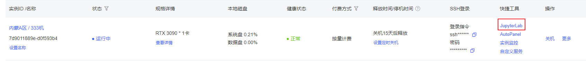

## InternLM-Chat-7B Transformers deployment call

### Environment preparation

Rent a 3090 or other 24G video memory graphics card machine on the [autoal](https://www.autodl.com/home) platform. As shown in the figure below, select the image `pytorch`-->`1.11.0`-->`3.8(ubuntu20.04)`-->`11.3`


Next, open the `JupyterLab` of the server you just rented, and open the terminal in it to start environment configuration, model download and run `demo`.



pip source change and installation of dependent packages

```
# Upgrade pip
python -m pip install --upgrade pip
# Change the pypi source to accelerate the installation of the library
pip config set global.index-url https://pypi.tuna.tsinghua.edu.cn/simple pip install modelscope==1.9.5 pip install transformers==4.35.2
pip install streamlit==1.24.0
pip install sentencepiece==0.1.99
pip install accelerate==0.24.1
```

### Model download

Use the snapshot_download function in `modelscope` (Mota Community) to download the model. The first parameter is the model name, and the parameter `cache_dir` is the download path of the model.

Create a `download.py` file in the `/root/autodl-tmp` path

```
#Switch the current working directory to the /root/autodl-tmp directory
cd /root/autodl-tmp
#Create an empty file named download.py
touch download.py
```

And enter the following content in it:

```
import torch
from modelscope import snapshot_download, AutoModel, AutoTokenizer
import os
model_dir = snapshot_download('Shanghai_AI_Laboratory/internlm-chat-7b', cache_dir='/root/autodl-tmp', revision='master')
```

After pasting the code, remember to save the file (Ctrl+S), as shown in the figure below.

 After saving, return to the terminal interface and run `Python /root/autodl-tmp/download.py` to download. The model size is 14GB, and it takes about 10 to 20 minutes to download the model.

### Code preparation

Create a new `trans.py` file in the `/root/autodl-tmp` path and enter the following content in it

```
# Import the required libraries
import torch
from transformers import AutoTokenizer, AutoModelForCausalLM

# Load tokenizer and model from pre-trained model
# AutoTokenizer is used to process text input and prepare model input
# AutoModelForCausalLM is a generative language model that supports generating dialogues
# trust_remote_code=True means trusting the code loaded from remoteCode
# Load the tokenizer of the pre-trained model through the AutoTokenizer.from_pretrained() function
tokenizer = AutoTokenizer.from_pretrained("/root/autodl-tmp/Shanghai_AI_Laboratory/internlm-chat-7b", trust_remote_code=True)

model = AutoModelForCausalLM.from_pretrained("/root/autodl-tmp/Shanghai_AI_Laboratory/internlm-chat-7b",trust_remote_code=True).to(torch.bfloat16).cuda()
# Load the model to the GPU (if available) and set it to evaluation mode
model = model.eval().cuda()

# Prepare the history of the conversation
# Before starting the conversation, the history is an empty list
# Call model.chat(tokenizer, "hello", history=[]) to generate a conversation. The model and tokenizer will be used to generate a conversation based on the given historyGenerate a response. The generated response is stored in the response variable
response, history = model.chat(tokenizer, "hello", history=[])

# Print the response text generated by the model
print(response)
```

Remember to save the file after pasting the code. The above code has detailed comments. If you have any questions, please raise an issue.

### Deployment

Enter the following command in the terminal to start the `transformers` service

```
cd /root/autodl-tmp
python trans.py
```

Wait patiently for it to load, and the return value is as follows:

Hello! How can I assist you today?


Then you can add a dialogue based on the above `trans.py` code, the code is as follows:

```
response,history = model.chat(tokenizer,"please provide three suggestions about time management",history=history)print(response)
```

Wait patiently for the loading. First, the response text generated by the first dialogue content model will appear as shown below. Then wait for a while and the response text generated by the second dialogue model will appear as shown below:


