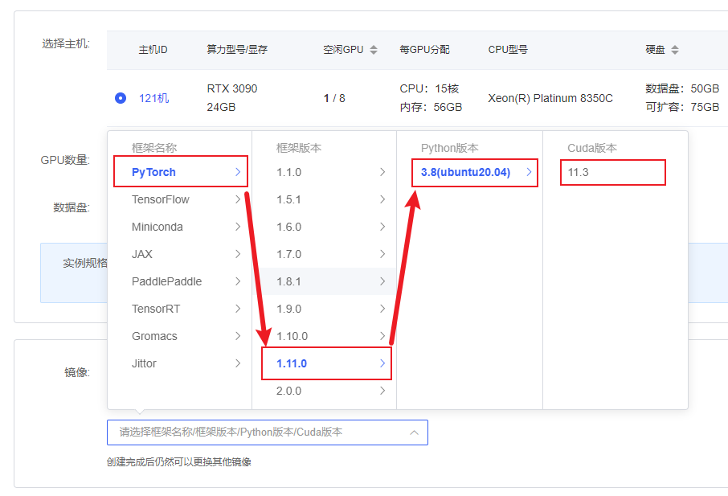
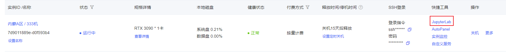
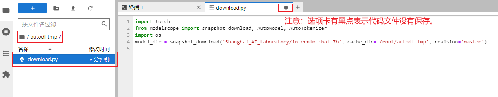

# internLM-Chat-7B FastApi deployment call

## Environment preparation

Rent a 3090 or other 24G video memory graphics card machine on the [autodl](https://www.autodl.com/) platform. As shown in the figure below, select `PyTorch`-->`1.11.0`-->`3.8(ubuntu20.04)`-->`11.3`



Next, open the `JupyterLab` of the server you just rented, and open the terminal in it to start environment configuration, model download and run `demo`.



Pip source change and installation of dependent packages

```shell
# Upgrade pip
python -m pip install --upgrade pip
# Change pypi source to accelerate library installation
pip config set global.index-url https://pypi.tuna.tsinghua.edu.cn/simple

pip install fastapi==0.104.1
pip install uvicorn==0.24.0.post1
pip install requests==2.25.1
pip install modelscope==1.9.5
pip install transformers==4.35.2
pip install streamlit==1.24.0
pip install sentencepiece==0.1.99
pip install accelerate==0.24.1
```
## Model download

Use the `snapshot_download` function in `modelscope` to download the model. The first parameter is the model name, and the parameter `cache_dir` is the download path of the model.

Create a new `download.py` file in the `/root/autodl-tmp` path and enter the following content in it. Remember to save the file after pasting the code, as shown in the figure below. And run `python /root/autodl-tmp/download.py` to download. The model size is 14 GB. It takes about 10~20 minutes to download the model.

```python
import torch
from modelscope import snapshot_download, AutoModel, AutoTokenizer
import os
model_dir = snapshot_download('Shanghai_AI_Laboratory/internlm-chat-7b', cache_dir='/root/autodl-tmp', revision='master')
```


## Code preparation

Create a new `api.py` file in the `/root/autodl-tmp` path and enter the following content in it. Remember to save the file after pasting the code. The following code has very detailed comments. If you have any questions, please raise an issue.

```python
from fastapi import FastAPI, Request
from transformers import AutoTokenizer, AutoModelForCausalLM
import uvicorn
import json
import datetime
import torch

# Set device parameters
DEVICE = "cuda" # Use CUDA
DEVICE_ID ="0" # CUDA device ID, empty if not set
CUDA_DEVICE = f"{DEVICE}:{DEVICE_ID}" if DEVICE_ID else DEVICE # Combine CUDA device information

# Clean up GPU memory function
def torch_gc():
if torch.cuda.is_available(): # Check if CUDA is available
with torch.cuda.device(CUDA_DEVICE): # Specify CUDA device
torch.cuda.empty_cache() # Clear CUDA cache
torch.cuda.ipc_collect() # Collect CUDA memory fragments

# Create FastAPI application
app = FastAPI()

# Endpoint to handle POST requests
@app.post("/")
async def create_item(request: Request):
global model, tokenizer # Declare global variables to use the model and tokenizer inside the function
json_post_raw = await request.json() # Get JSON data for POST request
json_post = json.dumps(json_post_raw) # Convert JSON data to string
json_post_list = json.loads(json_post) # Convert string to Python object
prompt = json_post_list.get('prompt') # Get prompt in request
history = json_post_list.get('history') # Get history in request
max_length = json_post_list.get('max_length') # Get maximum length in request
top_p = json_post_list.get('top_p') # Get top_p parameter in request
temperature = json_post_list.get('temperature') # Get temperature parameter in request
# Call model for dialogue generation
response, history = model.chat(
tokenizer,
prompt,
history=history,
max_length=max_length if max_length else 2048, # If the maximum length is not provided, 2048 is used by default
top_p=top_p if top_p else 0.7, # If the top_p parameter is not provided, 0.7 is used by default
temperature=temperature if temperature else 0.95 # If the temperature parameter is not provided, 0.95 is used by default
)
now = datetime.datetime.now() # Get the current time
time = now.strftime("%Y-%m-%d %H:%M:%S") # Format the time as a string
# Build the response JSON
answer = {
"response": response,
"history": history,"status": 200,
"time": time
}
# Build log information
log = "[" + time + "] " + '", prompt:"' + prompt + '", response:"' + repr(response) + '"'
print(log) # Print log
torch_gc() # Perform GPU memory cleanup
return answer # Return response

# Main function entry
if __name__ == '__main__':
# Load pre-trained tokenizer and model
tokenizer = AutoTokenizer.from_pretrained("/root/autodl-tmp/Shanghai_AI_Laboratory/internlm-chat-7b", trust_remote_code=True)
model = AutoModelForCausalLM.from_pretrained("/root/autodl-tmp/Shanghai_AI_Laboratory/internlm-chat-7b", trust_remote_code=True).to(torch.bfloat16).cuda()
model.eval() # Set the model to evaluation mode
# Start FastAPI application
# Use port 6006 to map the port of autodl to the local, so that the api can be used locally
uvicorn.run(app, host='0.0.0.0', port=6006, workers=1) # Start the application on the specified port and host
```

## Api deployment

Enter the following command in the terminal to start the `api` service

```shell
cd /root/autodl-tmp
python api.py
```

By default, it is deployed on port 6006 and called through the POST method. It can be called using `curl`, as shown below:
```shell
curl -X POST "http://127.0.0.1:6006" \
-H 'Content-Type: application/json' \
-d '{"prompt": "Hello", "history": []}'
```

You can also use the requests library in Python to call it, as follows:

```python
import requests
import json

def get_completion(prompt):
headers = {'Content-Type': 'application/json'}
data = {"prompt": prompt, "history": []}
response = requests.post(url='http://127.0.0.1:6006', headers=headers, data=json.dumps(data))
return response.json()['response']

if __name__ == '__main__':
print(get_completion('Hello'))
```

The return value is as follows:

```json
{
"response":"Hello! Can I help you with anything? ",
"history":[["Hello","Hello! Can I help you with anything?"]], "status":200, "time":"2023-11-19 20:08:40" } ```