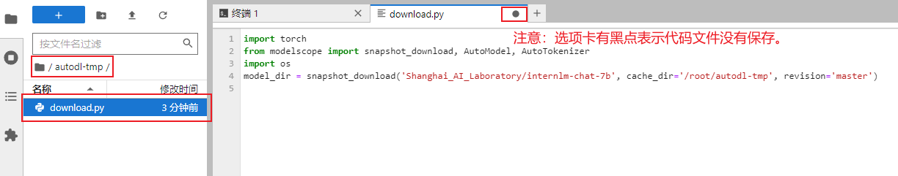

# InternLM-Chat-7B Dialogue Web

## Environment preparation

Rent a 3090 or other 24G video memory graphics card machine on the [autodl](https://www.autodl.com/) platform. As shown in the figure below, select `PyTorch`-->`1.11.0`-->`3.8(ubuntu20.04)`-->`11.3`


Next, open the `JupyterLab` of the server you just rented, and open the terminal in it to start environment configuration, model download and run `demo`.


pip source change and installation of dependent packages

```shell
# Upgrade pip
python -m pip install --upgrade pip
# Change pypi source to accelerate library installation
pip config set global.index-url https://pypi.tuna.tsinghua.edu.cn/simple

pip install modelscope==1.9.5
pip install transformers==4.35.2
pipinstall streamlit==1.24.0
pip install sentencepiece==0.1.99
pip install accelerate==0.24.1
```
## Model download

Use the `snapshot_download` function in `modelscope` to download the model. The first parameter is the model name, and the parameter `cache_dir` is the download path of the model.

Create a new `download.py` file in the `/root/autodl-tmp` path and enter the following content in it. Remember to save the file after pasting the code, as shown in the figure below. And run `python /root/autodl-tmp/download.py` to download. The model size is 14 GB. It takes about 10~20 minutes to download the model.

```python
import torch
from modelscope import snapshot_download, AutoModel, AutoTokenizer
import os
model_dir = snapshot_download('Shanghai_AI_Laboratory/internlm-chat-7b', cache_dir='/root/autodl-tmp', revision='master')
```


## Code preparation

First, `clone` the code and open the academic image acceleration that comes with the autodl platform. For detailed usage of academic image acceleration, please see: https://www.autodl.com/docs/network_turbo/

```shell
source /etc/network_turbo
```

Then switch the path and clone the code.

```shell
cd /root/autodl-tmp
git clone https://github.com/InternLM/InternLM.git
```

Switch the commit version to keep it consistent with the tutorial commit version, so that everyone can reproduce it better.

```shell
cd InternLM
git checkout 3028f07cb79e5b1d7342f4ad8d11efad3fd13d17
```

Finally, cancel the image acceleration, because the acceleration may have a certain impact on the normal network, to avoid trouble in the subsequent download of other models.
```shell
unset http_proxy && unset https_proxy
```

Replace the models in lines 29 and 33 of `/root/autodl-tmp/InternLM/web_demo.py` with the local `/root/autodl-tmp/Shanghai_AI_Laboratory/internlm-chat-7b`.


## web demo run

Run the following command to start the inference service

```shell
cd /root/autodl-tmp/InternLM
streamlit run web_demo.py --server.address 127.0.0.1 --server.port 6006
```

Map the port of `autodl` to the local [http://localhost:6006](http://localhost:6006/) This is only shown here once. The following two demos use the same method to map the `6006` port in `autodl` to the local `http://localhost:6006`.The same method is shown in the figure.


Note: The model will be loaded only after the `http://localhost:6006` page is opened in the browser, as shown in the figure below:


After the model is loaded, you can have a conversation with InternLM-Chat-7B, as shown in the figure below:

