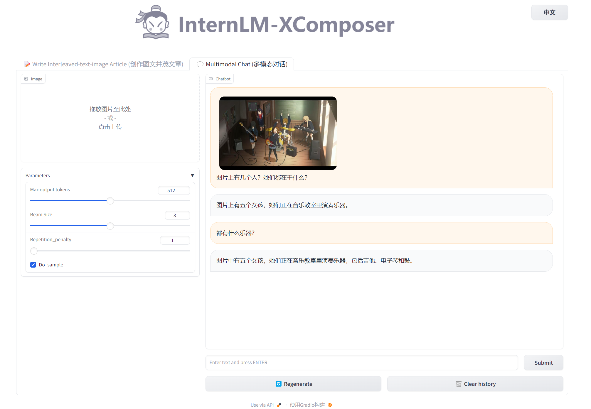

# Pu Yu Ling Bi Graphics Understanding & Creation

## Environment Preparation

First, rent a dual-card `3090` machine with a graphics card driver that supports `11.7` or above on `AutoDL`.
When selecting the image, select `Miniconda` --> `conda3` --> `3.8(ubuntu20.04)`--> `11.6`


Open the terminal in `jupyter lab` and first run the following command to install `PyTorch 2.0.1`

```shell
# Upgrade pip
python -m pip install --upgrade pip
pip install torch==2.0.1+cu117 torchvision==0.15.2+cu117 torchaudio==2.0.2 --index-url https://download.pytorch.org/whl/cu117
```

Next, run the following command to install `transformers`, `gradio` and other dependent packages. Please strictly install the following versions!

```shell
pip install transformers==4.33.1 timm==0.4.12 sentencepiece==0.1.99 gradio==3.44.4 markdown2==2.4.10 xlsxwriter==3.1.2 einops accelerate
```
## Model download

Install `modelscope`, an old friend for downloading models

```shell
pip install modelscope==1.9.5
```

Create a `download.py` file in the `/root/autodl-tmp` path and enter the following content in it, and run `python /root/autodl-tmp/download.py` to execute the download

```python
import torch
from modelscope import snapshot_download, AutoModel, AutoTokenizer
import os
model_dir = snapshot_download('Shanghai_AI_Laboratory/internlm-xcomposer-7b', cache_dir='/root/autodl-tmp',revision='master')
```

## Code preparation

In `/root/autodl-tmp` `git clone InternLM-XComposer` repository code

```shell
source /etc/network_turbo
cd /root/autodl-tmp
git clone https://github.com/InternLM/InternLM-XComposer.git
git checkout 3e8c79051a1356b9c388a6447867355c0634932d # It is best to ensure that the commit version is consistent with the tutorial
unset http_proxy && unset https_proxy
```

## Demo run

Run the following code in the terminal:

```shell
cd /root/autodl-tmp/InternLM-XComposer
python examples/web_demo.py \
--folder /root/autodl-tmp/Shanghai_AI_Laboratory/internlm-xcomposer-7b \
--num_gpus 2 \
--port 6006
```

After mapping the autodl port to the local computer, open `http://localhost:6006/` with a browser. We use `See Dunhuang Again` as a prompt to experience the function of graphic creation, as shown in the following figure:


Next, we can experience the ability to understand the following images, as shown below~

