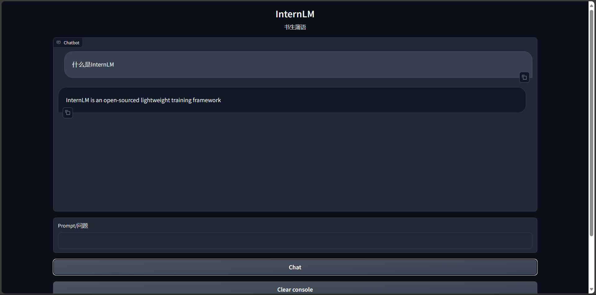

# Build a knowledge base assistant based on InternLM and LangChain

## Environment configuration

After the deployment of InternLM is completed, you also need to install the following dependency packages:

```bash
pip install langchain==0.0.292
pip install gradio==4.4.0
pip install chromadb==0.4.15
pip install sentence-transformers==2.2.2
pip install unstructured==0.10.30
pip install markdown==3.3.7
```

At the same time, we need to use the open source word vector model [Sentence Transformer](sentence-transformers/paraphrase-multilingual-MiniLM-L12-v2), and its model parameters can be downloaded to the local /root/autodl-tmp/embedding_model in a similar way to downloading the InternLM model parameters. At the same time, in this section, the model parameter files of InternLM-Chat-7B-V1.1 are stored in the local /root/autodl-tmp/model.

## Knowledge base construction

We selected a series of large model tool open source repositories from the Shanghai Artificial Intelligence Laboratory as the source of the corpus, including:

- [OpenCompass](https://github.com/open-compass/opencompass)

- [Imdeploy](https://github.com/InternLM/lmdeploy)

- [Xtuner](https://github.com/InternLM/xtuner)

- [InternLM-XComposer](https://github.com/InternLM/InternLM-XComposer)

- [Lagent](https://github.com/InternLM/lagent)

- [InternLM](https://github.com/InternLM/InternLM)

First, we need to clone the above remote open source repository to the local, you can use the following command:

```bash

# Enter the database disk
cd /root/autodl-tmp
# Open academic resource acceleration
source /etc/network_turbo
# clone the above open source repository
git clone https://github.com/open-compass/opencompass.git
git clone https://github.com/InternLM/lmdeploy.git
git clone https://github.com/InternLM/xtuner.git
git clone https://github.com/InternLM/InternLM-XComposer.git
git clone https://github.com/InternLM/lagent.git
git clone https://github.com/InternLM/InternLM.git
# Turn off academic resource acceleration
unset http_proxy && unset https_proxy
```

Next, for the convenience of corpus processing, we will use all the markdown and txt files in the above repository as sample corpora. Note that you can also select the code files in them to add to the knowledge base, but you need to do additional processing for the code file format.

First, we will use the above repositoryFind all the file paths that meet the conditions in the library. We define a function that will recursively specify the folder path and return all the file paths that meet the conditions (i.e., files with the suffix .md or .txt):

```python
import os
def get_files(dir_path):
# args: dir_path, target folder path
file_list = []
for filepath, dirnames, filenames in os.walk(dir_path):
# os.walk function will recursively traverse the specified folder
for filename in filenames:
# Determine whether the file type meets the requirements by the suffix
if filename.endswith(".md"):
# If it meets the requirements, add its absolute path to the result list
file_list.append(os.path.join(filepath, filename))
elif filename.endswith(".txt"):
file_list.append(os.path.join(filepath, filename))
return file_list
```

After getting all the target file paths, we can use the FileLoader object provided by LangChain to load the target file and get the plain text content parsed from the target file. Since different types of files require different FileLoaders, we determine the target file type and call the corresponding type of FileLoader in a targeted manner. At the same time, call the load method of the FileLoader object to get the loaded plain text object:

```python
from tqdm import tqdm
from langchain.document_loaders import UnstructuredFileLoader
from langchain.document_loaders import UnstructuredMarkdownLoader

def get_text(dir_path):
# args: dir_path, targetMark folder path
# First call the function defined above to get the target file path list
file_lst = get_files(dir_path)
# docs stores the plain text object after loading
docs = []
# Traverse all target files
for one_file in tqdm(file_lst):
file_type = one_file.split('.')[-1]
if file_type == 'md':
loader = UnstructuredMarkdownLoader(one_file)
elif file_type == 'txt':
loader = UnstructuredFileLoader(one_file)
else:
# If it is a file that does not meet the conditions, skip it directly
continue
docs.extend(loader.load())
return docs
```

Use the abovefunction, we get `docs` as a list corresponding to a plain text object. After getting the list, we can import it into the LangChain framework to build a vector database. To build a vector database from plain text objects, we need to first split the text into chunks and then vectorize the text chunks.

LangChain provides a variety of text chunking tools. Here we use the string recursive splitter and select a chunk size of 500 and a chunk overlap length of 150:

```python
from langchain.text_splitter import RecursiveCharacterTextSplitter

text_splitter = RecursiveCharacterTextSplitter(
chunk_size=500, chunk_overlap=150)
split_docs = text_splitter.split_documents(docs)
```

Then we use the open source word vector model [Sentence Transformer](https://huggingface.co/sentence-transformers/paraphrase-multilingual-MiniLM-L12-v2) to vectorize text. LangChain provides an interface for directly importing models from the HuggingFace open source community for vectorization:

```python
from langchain.embeddings.huggingface import HuggingFaceEmbeddings

embeddings = HuggingFaceEmbeddings(model_name="/root/autodl-tmp/embedding_model")
```

At the same time, we choose Chroma as the vector database. Based on the documents after segmentation and the loaded open source vectorization model, the corpus is loaded into the vector database under the specified path:

```python
from langchain.vectorstores import Chroma

# Define the persistence path
persist_directory = 'data_base/vector_db/chroma'
# Load the database
vectordb = Chroma.from_documents(
documents=split_docs,
embedding=embeddings,
persist_directory=persist_directory # allows us to save the persist_directory directory to disk
)
# Persist the loaded vector database to disk
vectordb.persist()
```

Combining the above code together to build a script for the knowledge base:

```python
# First import the required third-party libraries
from langchain.document_loaders import UnstructuredFileLoader
from langchain.document_loaders import UnstructuredMarkdownLoader
from langchain.text_splitter import RecursiveCharacterTextSplitter
from langchain.vectorstores import Chroma
from langchain.embeddings.huggingface import HuggingFaceEmbeddings
from tqdm import tqdm
import os

# Get file path function
def get_files(dir_path):
# args: dir_path, target folder path
file_list = []
for filepath, dirnames, filenames in os.walk(dir_path):
# os.walk function will recursively traverse the specified folder
for filename in filenames:
# Determine whether the file type meets the requirements by the suffix name
if filename.endswith(".md"):
# If it meets the requirements, add its absolute path to the result list
file_list.append(os.path.join(filepath, filename))
elif filename.endswith(".txt"):
file_list.append(os.path.join(filepath, filename))ename))
return file_list

# Load file function
def get_text(dir_path):
# args: dir_path, target folder path
# First call the function defined above to get the target file path list
file_lst = get_files(dir_path)
# docs stores the plain text object after loading
docs = []
# Traverse all target files
for one_file in tqdm(file_lst):
file_type = one_file.split('.')[-1]
if file_type == 'md':
loader = UnstructuredMarkdownLoader(one_file)
elif file_type == 'txt':
loader = UnstructuredFileLoader(one_file)
else:
# If it is a file that does not meet the conditionsFile, skip directly
continue
docs.extend(loader.load())
return docs

# Target folder
tar_dir = [
"/root/autodl-tmp/InternLM",
"/root/autodl-tmp/InternLM-XComposer",
"/root/autodl-tmp/lagent",
"/root/autodl-tmp/lmdeploy",
"/root/autodl-tmp/opencompass",
"/root/autodl-tmp/xtuner"
]

# Load target file
docs = []
for dir_path in tar_dir:
docs.extend(get_text(dir_path))

# Split text into chunks
text_splitter = RecursiveCharacterTextSplitter(
chunk_size=500, chunk_overlap=150)
split_docs =text_splitter.split_documents(docs)

# Load the open source word vector model
embeddings = HuggingFaceEmbeddings(model_name="/root/autodl-tmp/embedding_model")

# Build the vector database
# Define the persistence path
persist_directory = 'data_base/vector_db/chroma'
# Load the database
vectordb = Chroma.from_documents(
documents=split_docs,
embedding=embeddings,
persist_directory=persist_directory # Allows us to save the persist_directory directory to disk
)
# Persist the loaded vector database to disk
vectordb.persist()
```

Run the above script to build a persistent vector database locally, and then directly import the database without repeating the construction.

## InternLM access LangChain

To facilitate the construction of LLM applications,We need to customize an LLM class based on the locally deployed InternLM and connect InternLM to the LangChain framework. After completing the customized LLM class, the LangChain interface can be called in a completely consistent manner without considering the inconsistency of the underlying model call.

Customizing the LLM class based on the locally deployed InternLM is not complicated. We only need to inherit a subclass from the LangChain.llms.base.LLM class and rewrite the constructor and the `_call` function:

```python
from langchain.llms.base import LLM
from typing import Any, List, Optional
from langchain.callbacks.manager import CallbackManagerForLLMRun
from transformers import AutoTokenizer, AutoModelForCausalLM

class InternLM_LLM(LLM):
# Customize the LLM class based on the local InternLM
tokenizer : AutoTokenizer = None
model: AutoModelForCausalLM = None
def __init__(self, model_path: str):
# model_path: InternLM model path
# Initialize model from local
super().__init__()
print("Loading model from local...")
self.tokenizer = AutoTokenizer.from_pretrained(model_path, trust_remote_code=True)
self.model = AutoModelForCausalLM.from_pretrained(model_path, trust_remote_code=True).to(torch.bfloat16).cuda()
self.model = self.model.eval()
print("Complete loading of local model")
def _call(self, prompt : str, stop: Optional[List[str]] = None,
run_manager: Optional[CallbackManagerForLLMRun] = None,
**kwargs: Any):
# Rewrite the call function
response, history = self.model.chat(self.tokenizer, prompt , history=[])
return response

@property
def _llm_type(self) -> str:
return "InternLM"
```

In the above class definition, we rewrite the constructor and the `_call` function respectively: for the constructor, we load the locally deployed InternLM model at the beginning of the object instantiation to avoid the long time of reloading the model for each call; the `_call` function is the core function of the LLM class, and LangChain willCall this function to call LLM. In this function, we call the chat method of the instantiated model to call the model and return the call result.

In the overall project, we encapsulate the above code into llm.py, and then directly introduce the custom LLM class from this file.

## Build a retrieval Q&A chain

LangChain encapsulates the entire RAG process by providing a retrieval Q&A chain object. That is, we can call a `RetrievalQA` object provided by LangChain, and fill in the built database and custom LLM as parameters during initialization to easily complete the entire process of retrieval enhanced Q&A. LangChain will automatically complete the entire process of searching based on user questions, obtaining relevant documents, splicing into appropriate prompts, and handing them over to LLM Q&A.

First, we need to import the vector database built above. We can directly load the built database through Chroma and the word vector model defined above:

```python
from langchain.vectorstores import Chroma
from langchain.embeddings.huggingface import HuggingFaceEmbeddings
importos

# Define Embeddings
embeddings = HuggingFaceEmbeddings(model_name="/root/autodl-tmp/embedding_model")

# Vector database persistence path
persist_directory = 'data_base/vector_db/chroma'

# Load database
vectordb = Chroma(
persist_directory=persist_directory, 
embedding_function=embeddings
)
```

The `vectordb` object obtained by the above code is the vector database object we have built. This object can perform semantic vector retrieval for the user's `query` to obtain knowledge fragments related to the user's question.

Next, we instantiate a custom LLM object based on InternLM:

```python
from LLM import InternLM_LLM
llm = InternLM_LLM(model_path = "/root/autodl-tmp/model")
llm.predict("Who are you")
```

To build a retrieval question-answer chain, you also need to build a Prompt Template, which is actually based on a string with variables. After the retrieval, LangChain will fill the retrieved relevant document fragments into the variables of the Template, thereby realizing the construction of a knowledge-based Prompt. We can instantiate such a Template object based on the Template base class of LangChain:

```python
from langchain.prompts import PromptTemplate

# The Prompt template we constructed
template = """Use the following context to answer the last question. If you don't know the answer, say you don't know, don't try to make up an answer. Try to make the answer concise and to the point. Always say "Thank you for your question! ”.
{context}
Question: {question}
Useful answer: """

# Call the LangChain method to instantiate a Template object, which contains two variables, context and question. When actually called, these two variables will be filled with the retrieved document fragment and the user's question
QA_CHAIN_PROMPT= PromptTemplate(input_variables=["context","question"],template=template)
```

Finally, we can call the retrieval question and answer chain constructor provided by LangChain to build a retrieval question and answer chain based on InternLM based on our custom LLM, Prompt Template and vector knowledge base:

```python
from langchain.chains import RetrievalQA

qa_chain = RetrievalQA.from_chain_type(llm,retriever=vectordb.as_retriever(),return_source_documents=True,chain_type_kwargs={"prompt":QA_CHAIN_PROMPT})
```

The obtained `qa_chain` object can realize our core function, that is, the professional knowledge base assistant based on the InternLM model. We can compare the Q&A results of this retrieval Q&A chain with those of pure LLM:

```python
# Retrieval Q&A chain answer results
question = "What is InternLM"
result = qa_chain({"query": question})
print("The result of searching the Q&A chain to answer question:")
print(result["result"])

# Only LLM answer effect
result_2 = llm(question)
print("The result of the large model answering question:")
print(result_2)
```

## Deploy Web Demo

After completing the above core functions, we can deploy it to a web page based on the Gradio framework to build a small Demo for easy testing and use.

First, we encapsulate the above code content into a function that returns the constructed retrieval Q&A chain object, and call the function to get the retrieval Q&A chain object as soon as Gradio is started. Then, we directly use the object for Q&A dialogue to avoid repeated loading of the model:

```python

from langchain.vectorstores import Chroma
from langchain.embeddings.huggingface import HuggingFaceEmbeddings
import os
fromLLM import InternLM_LLM
from langchain.prompts import PromptTemplate
from langchain.chains import RetrievalQA

def load_chain():
# Load Q&A chain
# Define Embeddings
embeddings = HuggingFaceEmbeddings(model_name="/root/autodl-tmp/embedding_model")

# Vector database persistence path
persist_directory = 'data_base/vector_db/chroma'

# Load database
vectordb = Chroma(
persist_directory=persist_directory, # Allows us to save the persist_directory directory to disk
embedding_function=embeddings
)

# Load custom LLM
llm = InternLM_LLM(model_path = "/root/autodl-tmp/model")

# Define a Prompt Template
template = """Use the following context to answer the last question. If you don't know the answer, say you don't know, don't try to make up an answer. Try to keep your answers brief and to the point. Always say "Thanks for your question!" at the end of your answer.
{context}
Question: {question}
Useful answers: """

QA_CHAIN_PROMPT = PromptTemplate(input_variables=["context","question"],template=template)

# Run chain
qa_chain = RetrievalQA.from_chain_type(llm,retriever=vectordb.as_retriever(),return_source_documents=True,chain_type_kwargs={"prompt":QA_CHAIN_PROMPT})return qa_chain
```

Next, we define a class that is responsible for loading and storing the retrieval question and answer chain, and responding to the action of calling the retrieval question and answer chain to answer in the Web interface:

```python
class Model_center():
"""
Store the object of the retrieval question and answer chain
"""
def __init__(self):
# Constructor, load the retrieval question and answer chain
self.chain = load_chain()

def qa_chain_self_answer(self, question: str, chat_history: list = []):
"""
Call the question and answer chain to answer
"""
if question == None or len(question) < 1:
return "", chat_history
try:
chat_history.append(
(question,self.chain({"query": question})["result"]))
# Append the Q&A result directly to the Q&A history, and Gradio will display it
return "", chat_history
except Exception as e:
return e, chat_history

def clear_history(self):
self.chain.clear_history()
```

Then we just need to follow the Gradio framework usage method, instantiate a web interface and bind the click action to the answer method of the above class:

```python
import gradio as gr

# Instantiate the core function object
model_center = Model_center()
# Create a web interface
block = gr.Blocks()
with block as demo:
with gr.Row(equal_height=True): 
with gr.Column(scale=15):
# Display page title
gr.Markdown("""<h1><center>InternLM</center></h1>
<center>Shusheng Puyu</center>
""")

with gr.Row():
with gr.Column(scale=4):
# Create a chatbot object
chatbot = gr.Chatbot(height=450, show_copy_button=True)
# Create a text box component for input prompt.
msg = gr.Textbox(label="Prompt/Problem")

with gr.Row():
# Create a submit button.
db_wo_his_btn = gr.Button("Chat")with gr.Row():
# Create a clear button to clear the contents of the chatbot component.
clear = gr.ClearButton(
components=[chatbot], value="Clear console")

# Set the button's click event. When clicked, call the qa_chain_self_answer function defined above, pass in the user's message and chat history, and then update the text box and chatbot components.
db_wo_his_btn.click(model_center.qa_chain_self_answer, inputs=[
msg, chatbot], outputs=[msg, chatbot])

# Clear the chat history stored in the backend after clicking
clear.click(model_center.clear_history)gr.Markdown("""Reminder: <br>
1. It may take a long time to initialize the database, please wait patiently.
2. If an exception occurs during use, it will be displayed in the text input box, please do not panic. <br>
""")
gr.close_all()
# Start directly
demo.launch()
```

By encapsulating the above code as a run_gradio.py script and running it directly through the python command, you can start the Web Demo of the knowledge base assistant locally. It will run on port 7860 by default. Use a deployment method similar to mapping the server port to the local port to access:

