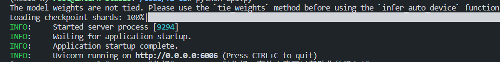
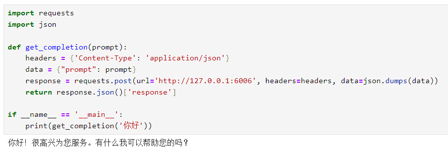

# InternLM2-7B-chat FastAPI deployment

InternLM2, the second generation of the Shusheng·Puyu large model, has open-sourced a 7 billion parameter basic model and a dialogue model (InternLM2-Chat-7B) for practical scenarios. The model has the following features:

- Effective support for 200,000-word long context: The model almost perfectly achieves the "needle in a haystack" of long texts in 200,000-word inputs, and its performance in long text tasks such as LongBench and L-Eval has also reached the leading level among open source models. You can try 200,000-word long context reasoning through LMDeploy.

- Comprehensive performance improvement: All capability dimensions have made comprehensive progress compared to the previous generation of models, and the improvement in reasoning, mathematics, code, dialogue experience, instruction following, and creative writing is particularly significant. The comprehensive performance has reached the leading level of open source models of the same scale. In terms of key capability evaluation, InternLM2-Chat-20B can be comparable to or even surpass ChatGPT (GPT-3.5).
- Code interpreter and data analysis: InternLM2-Chat-20B can reach the same level as GPT-4 in GSM8K and MATH when used with a code interpreter. Based on the strong basic ability in mathematics and tools, InternLM2-ChatProvides practical data analysis capabilities.
- Overall upgrade of tool calling capabilities: Based on stronger and more generalized command understanding, tool screening and result reflection capabilities, the new model can more reliably support the construction of complex intelligent entities, support effective multi-round calling of tools, and complete more complex tasks.

## Environment preparation

Rent a 3090 or other 24G graphics card machine on the Autodl platform. As shown in the figure below, select PyTorch-->2.0.0-->3.8(ubuntu20.04)-->11.8 (versions above 11.3 are acceptable).
Next, open JupyterLab on the server you just rented, and open the terminal in it to start environment configuration, model download and run demonstrations.


pip changes the source to speed up downloading and installing dependent packages

```shell
# Upgrade pip
python -m pip install --upgrade pip
# Change pypi source to speed up library installation
pip config set global.index-url https://pypi.tuna.tsinghua.edu.cn/simple

pip install fastapi==0.104.1
pip install uvicorn==0.24.0.post1
pip install requests==2.25.1
pip install modelscope==1.11.0
pip install transformers==4.37.0
pip install streamlit==1.24.0
pip install sentencepiece==0.1.99
pip install accelerate==0.24.1
pip install transformers_stream_generator==0.0.4
pip install protobuf
``` 

## Model download 

Use the snapshot_download function in modelscope to download the model. The first parameter is the model name, and the parameter cache_dir is the download path of the model.

Create a new model_download.py file in the /root/autodl-tmp path and enter the following content in it. Please save the file in time after pasting the code, as shown in the figure below. And run `python /root/autodl-tmp/model_download.py` Execute the download. The model size is 14GB. It takes about 2 minutes to download the model.

```python
import torch
from modelscope import snapshot_download, AutoModel, AutoTokenizer
import os
model_dir = snapshot_download('Shanghai_AI_Laboratory/internlm2-chat-7b', cache_dir='/root/autodl-tmp', revision='master')
``` 

## Code preparation 

Create a new api.py file in the /root/autodl-tmp path and enter the following content in it. Please save the file in time after pasting the code. The following code has very detailed comments. If you don’t understand anything, please raise an issue. 

```python
from fastapi import FastAPI, Request
from transformers import AutoTokenizer, AutoModelForCausalLM, GenerationConfig
import uvicorn
import json
import datetime
import torch

# Set device parameters
DEVICE = "cuda" # Use CUDA
DEVICE_ID = "0" # CUDA device ID, empty if not set
CUDA_DEVICE = f"{DEVICE}:{DEVICE_ID}" if DEVICE_ID else DEVICE # Combine CUDA device information

# Clean up GPU memory function
def torch_gc():
if torch.cuda.is_available(): # Check if CUDA is available
with torch.cuda.device(CUDA_DEVICE): # Specify CUDA device
torch.cuda.empty_cache() # Clear CUDA cache
torch.cuda.ipc_collect() # Collect CUDA memory fragments

# Create FastAPI application
app = FastAPI()

# Endpoint to handle POST requests
@app.post("/")async def create_item(request: Request):
global model, tokenizer # Declare global variables to use the model and tokenizer inside the function
json_post_raw = await request.json() # Get the JSON data of the POST request
json_post = json.dumps(json_post_raw) # Convert JSON data to a string
json_post_list = json.loads(json_post) # Convert a string to a Python object
prompt = json_post_list.get('prompt') # Get the prompt in the request

response, history = model.chat(tokenizer, prompt, history=[])

now = datetime.datetime.now() # Get the current time
time = now.strftime("%Y-%m-%d %H:%M:%S") # FormatTime is a string
# Build response JSON
answer = {
"response": response,
"status": 200,
"time": time
}
# Build log information
log = "[" + time + "] " + '", prompt:"' + prompt + '", response:"' + repr(response) + '"'
print(log) # Print log
torch_gc() # Perform GPU memory cleanup
return answer # Return response

# Main function entry
if __name__ == '__main__':
# Load pre-trained tokenizer and model
tokenizer = AutoTokenizer.from_pretrained("Shanghai_AI_Laboratory/internlm2-chat-7b", trust_remote_code=True)
model = AutoModelForCausalLM.from_pretrained("Shanghai_AI_Laboratory/internlm2-chat-7b", torch_dtype=torch.float16, trust_remote_code=True).cuda()
model = model.eval()
# Start FastAPI application
# Use port 6006 to map the port of autodl to the local computer, so that the api can be used locally
uvicorn.run(app, host='0.0.0.0', port=6006, workers=1) # Start the application on the specified port and host
``` 

## Api deployment 

Enter the following command in the terminal to start the api service: 

```shell 
cd /root/autodl-tmp
python api.py
``` 

After loading, the following information appears, indicating success.



By default, it is deployed on port 6006 and can be called via the POST method. You can use curl to call it, as shown below: 

```shell
curl -X POST "http://127.0.0.1:6006" \
-H 'Content-Type: application/json' \
-d '{"prompt": "你好"}'
``` 

You can also use the requests library in python to call it, as follows:

```python
import requests
import json

def get_completion(prompt):
headers = {'Content-Type': 'application/json'}
data = {"prompt": prompt}
response = requests.post(url='http://127.0.0.1:6006', headers=headers, data=json.dumps(data))
return response.json()['response']

if __name__ == '__main__':
print(get_completion('你好'))
```

The return value is as follows:

```json
{"response":"Hello! Is there anything I can help you with?","status":200,"time":"2024-02-05 18:08:19"}
``` 

