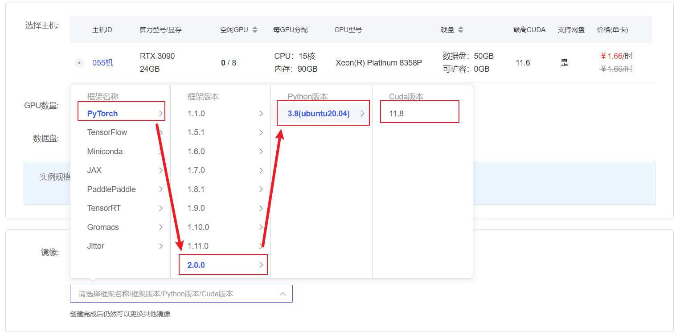

# InternLM2-7B-chat langchain access

InternLM2, the second generation of the Shusheng·Puyu large model, has open-sourced a 7 billion parameter basic model and a dialogue model (InternLM2-Chat-7B) for practical scenarios. The model has the following features:

- Effective support for 200,000-word ultra-long context: The model almost perfectly achieves the "needle in a haystack" of long texts in 200,000-word inputs, and its performance in long text tasks such as LongBench and L-Eval has also reached the leading level among open source models. You can try 200,000-word ultra-long context reasoning through LMDeploy.

- Comprehensive performance has been comprehensively improved: All capability dimensions have made comprehensive progress compared to the previous generation of models, and the capabilities in reasoning, mathematics, code, dialogue experience, instruction following, and creative writing have been particularly significantly improved. The comprehensive performance has reached the leading level of open source models of the same scale. In terms of key capability evaluation, InternLM2-Chat-20B can be comparable to or even surpass ChatGPT (GPT-3.5).
- Code interpreter and data analysis: InternLM2-Chat-20B can reach the same level as GPT-4 in GSM8K and MATH when used with a code interpreter.t provides practical data analysis capabilities.
- Overall upgrade of tool calling capabilities: Based on stronger and more generalized command understanding, tool screening and result reflection capabilities, the new version of the model can more reliably support the construction of complex intelligent entities, support effective multi-round calling of tools, and complete more complex tasks.

## Environment preparation

Rent a 3090 or other 24G graphics card machine in the autodl platform. As shown in the figure below, select PyTorch-->2.0.0-->3.8(ubuntu20.04)-->11.8


Next, open JupyterLab on the server you just rented, and open the terminal in it to start environment configuration, model download and run demo.

pip changes the source to speed up downloading and installing dependent packages

```shell
# Upgrade pip
python -m pip install --upgrade pip
# Change the pypi source to speed up library installation
pip config set global.index-url https://pypi.tuna.tsinghua.edu.cn/simple

pip install modelscope==1.11.0
pip install transformers==4.37.0
pip install sentencepiece==0.1.99
pip install accelerate==0.24.1
pip install transformers_stream_generator==0.0.4
pip install langchain
pip install protobuf
``` 

## Model download 

Use the snapshot_download function in modelscope to download the model. The first parameter is the model name, and the parameter cache_dir is the download path of the model.

Create a new model_download.py file in the /root/autodl-tmp path and enter the following content in it. Please save the file in time after pasting the code, as shown in the figure below. And run `python /root/autodl-tmp/model_download.py` to execute the download. The model size is 14GB, and it takes about 2 minutes to download the model.

```python
import torch
from modelscope import snapshot_download, AutoModel, AutoTokenizer
import os
model_dir = snapshot_download('Shanghai_AI_Laboratory/internlm2-chat-7b', cache_dir='/root/autodl-tmp', revision='master')
``` 

## Code preparation

To build LLM applications conveniently, we need to customize an LLM class based on the locally deployed InternLM2-LM and connect InternLM2 to the LangChain framework. After completing the customized LLM class, the LangChain interface can be called in a completely consistent manner without considering the inconsistency of the underlying model call.

Customizing the LLM class based on the locally deployed InternLM2 is not complicated. We only need to inherit a subclass from the LangChain.llms.base.LLM class and rewrite the constructor and _call function:

```python
from langchain.llms.base import LLM
from typing import Any, List, Optional
from langchain.callbacks.manager import CallbackManagerForLLMRun
from transformers import AutoTokenizer, AutoModelForCausalLM, GenerationConfig, LlamaTokenizerFast
import torch

class InternLM2_LLM(LLM):
# Customize LLM class based on local Qwen2
tokenizer: AutoTokenizer = None
model: AutoModelForCausalLM = None

def __init__(self, mode_name_or_path :str):

super().__init__()
print("Loading model from local...")
self.tokenizer = AutoTokenizer.from_pretrained(mode_name_or_path, trust_remote_code=True)self.model = AutoModelForCausalLM.from_pretrained(mode_name_or_path, torch_dtype=torch.float16, trust_remote_code=True).cuda() self.model = self.model.eval() print("Complete loading of local model") def _call(self, prompt : str, stop: Optional[List[str]] = None, run_manager: Optional[CallbackManagerForLLMRun] = None, **kwargs: Any): response, history = self.model.chat(self.tokenizer, prompt, history= []) return response @property
def _llm_type(self) -> str:
return "InternLM2_LLM"
```

In the above class definition, we rewrite the constructor and _call function respectively: for the constructor, we load the locally deployed InternLM2 model at the beginning of the object instantiation, so as to avoid the long time caused by reloading the model for each call; the _call function is the core function of the LLM class, LangChain will call this function to call LLM, in which we call the chat method of the instantiated model to call the model and return the call result.

In the overall project, we encapsulate the above code as LLM.py, and then directly introduce the custom LLM class from this file.

## Code running

Then you can use it like any other langchain large model function.

```python from LLM import InternLM2_LLM llm = InternLM2_LLM(mode_name_or_path = "/root/autodl-tmp/Shanghai_AI_Laboratory/internlm2-chat-7b") llm("Who are you")
```