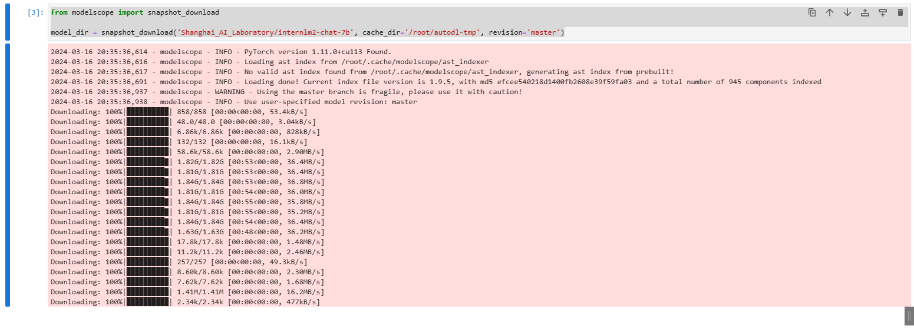

# InternLM2-7B-chat WebDemo deployment

InternLM2, the second generation of the Shusheng·Puyu large model, has open-sourced a 7 billion parameter basic model and a dialogue model (InternLM2-Chat-7B) for practical scenarios. The model has the following features:

- Effective support for 200,000-word long context: The model almost perfectly achieves the "needle in a haystack" of long texts in 200,000-word inputs, and its performance in long text tasks such as LongBench and L-Eval has also reached the leading level among open source models. You can try 200,000-word long context reasoning through LMDeploy.

- Comprehensive performance improvement: All capability dimensions have made comprehensive progress compared to the previous generation of models, and the improvement in reasoning, mathematics, code, dialogue experience, instruction following, and creative writing is particularly significant. The comprehensive performance has reached the leading level of open source models of the same scale. In terms of key capability evaluation, InternLM2-Chat-20B can be comparable to or even surpass ChatGPT (GPT-3.5).
- Code interpreter and data analysis: InternLM2-Chat-20B can reach the same level as GPT-4 in GSM8K and MATH when used with a code interpreter. Based on the strong basic ability in mathematics and tools, InternLM2-ChatProvides practical data analysis capabilities.
- Overall upgrade of tool calling capabilities: Based on stronger and more generalized command understanding, tool screening and result reflection capabilities, the new model can more reliably support the construction of complex intelligent entities, support effective multi-round calling of tools, and complete more complex tasks.

## Environment preparation

Rent a 3090 or other 24G graphics card machine in the Autodl platform. As shown in the figure below, select PyTorch-->2.0.0-->3.8(ubuntu20.04)-->11.8.


Next, open JupyterLab on the server you just rented and create a new file `Internlm2-7b-chat-web.ipynb`


Pip changes the source and installs dependent packages. Write the following code in the ipynb file and click Run

```
# Upgrade pip
!python -m pip install --upgrade pip
# Change the pypi source to accelerate the installation of the library
!pip config set global.index-url https://pypi.tuna.tsinghua.edu.cn/simple

# Install pythonDependencies
!pip install modelscope==1.9.5
!pip install transformers==4.36.2
!pip install streamlit==1.24.0
!pip install sentencepiece==0.1.99
!pip install accelerate==0.24.1
!pip install transformers_stream_generator==0.0.4
pip install protobuf
```

If you are running the command in the terminal, just run the following command

```bash
# Upgrade pip
python -m pip install --upgrade pip
# Change the installation of the pypi source acceleration library
pip config set global.index-url https://pypi.tuna.tsinghua.edu.cn/simple

# Install python dependencies
pip install modelscope==1.9.5
pip install transformers==4.36.2
pip install streamlit==1.24.0
pip install sentencepiece==0.1.99
pip install accelerate==0.24.1
pip install transformers_stream_generator==0.0.4
```

## Model download

InternLM2-chat-7b model:

* [huggingface](https://huggingface.co/internlm/internlm2-chat-7b)

* [modelscope](https://modelscope.cn/models/Shanghai_AI_Laboratory/internlm2-chat-7b/summary)

### Download using modelscope

Use the snapshot_download function in modelscope to download the model. The first parameter is the model name and the parameter cache_dir is the download path of the model.

Create a new code block in the `Internlm2-7b-chat-web.ipynb` file and run it to download the `internlm2-chat-7b` model. Model download requiresTime, let's go straight to [Code Preparation](#Code Preparation)

```
from modelscope import snapshot_download

model_dir = snapshot_download('Shanghai_AI_Laboratory/internlm2-chat-7b', cache_dir='/root/autodl-tmp', revision='master')

```



## Code Preparation

### Source Code Pull

The following operations can be performed in a new command line terminal while jupyter is running the downloaded model

```
# Start image acceleration
source /etc/network_turbo

cd /root/autodl-tmp
# Download Internlm code
git clone https://github.com/InternLM/InternLM.git
# Cancel proxy
unset http_proxy && unset https_proxy
```


### Install dependencies

```# Enter the source code directory
cd /root/autodl-tmp/InternLM/
# Install internlm dependencies
pip install -r requirements.txt
```

### Run using **InternLM**'s web_demo

Replace the models in lines 183 and 186 in `/root/autodl-tmp/InternLM/chat/web_demo.py` with the local `/root/autodl-tmp/Shanghai_AI_Laboratory/internlm2-chat-7b`.


After the modification is completed, start the `web_demo.py` file

```
# Enter the source code directory
cd /root/autodl-tmp/InternLM/
streamlit run ./chat/web_demo.py
```


At this time, we use ssh port forwarding to map the service started on `autodl` to the local port, using the following command. Open `powershell` locally

```
ssh -CNg -L 8501:127.0.0.1:8501 -p [SSH port of your autodl machine] root@[your autodl machine address]
ssh -CNg -L 8501:127.0.0.1:8501 -p 36494 root@region-45.autodl.pro
```


After loading the model, you can talk to InternLM2-Chat-7B, as shown below:

