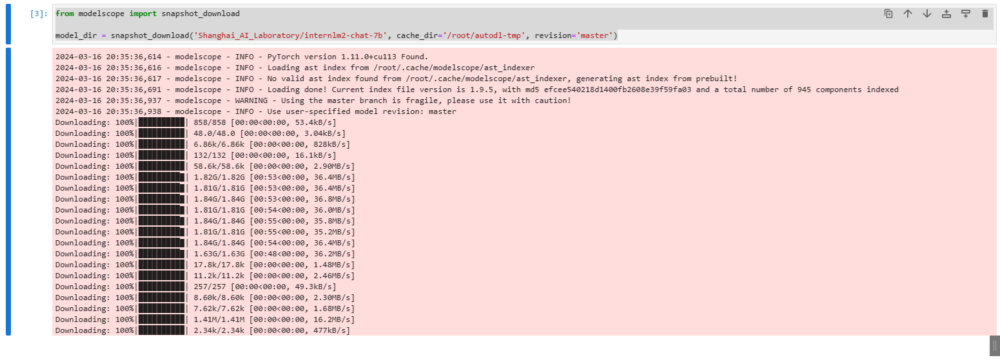
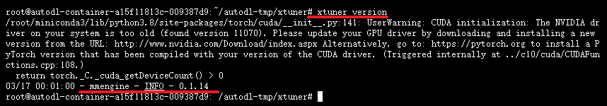
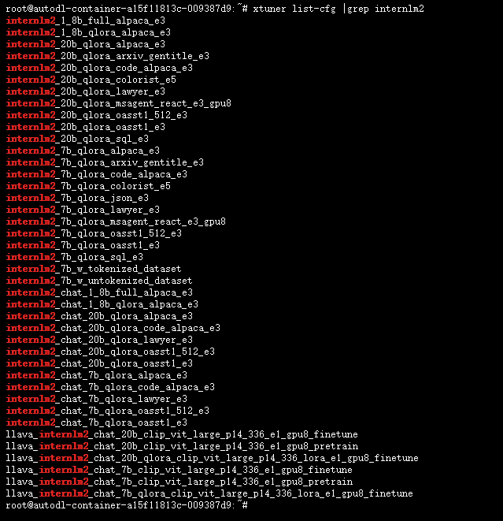
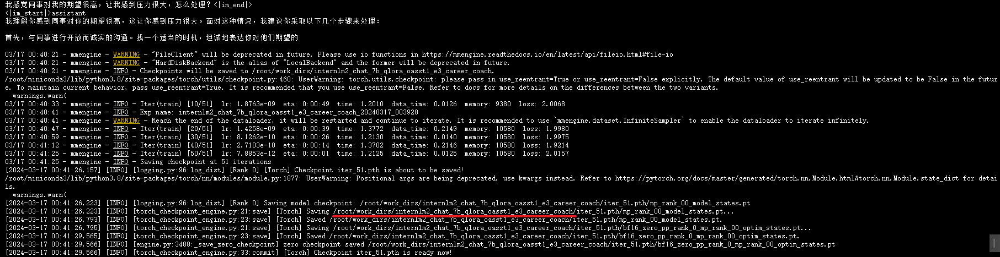
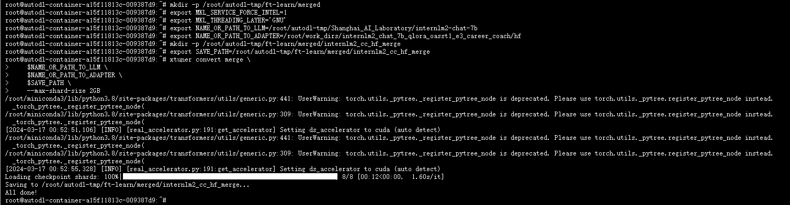

# InternLM2-7B-chat Xtuner Qlora fine-tuning

## Xtuner introduction
<div align="center">

<br /><br />
</div>

XTuner is a low-cost large model training toolbox developed by Shanghai Artificial Intelligence Laboratory. XTuner is an efficient, flexible and versatile lightweight large model fine-tuning tool library. Only **8G**. With a minimum of **8GB** video memory, you can fine-tune the InternLM2-7B model and create your own AI assistant.

Warehouse address: https://github.com/InternLM/xtuner

### Xtuner Features

**High Efficiency**

- Supports pre-training and lightweight fine-tuning of large language models LLM and multimodal graph and text models VLM. XTuner supports fine-tuning of 7B models under 8GB of video memory, and also supports fine-tuning of larger scale models (70B+) across multiple nodes and devices.
- Automatically distribute high-performance operators (such asFlashAttention, Triton kernels, etc.) to accelerate training throughput.
- Compatible with [DeepSpeed](https://github.com/microsoft/DeepSpeed) 🚀, easily apply various ZeRO training optimization strategies.

**Flexible**

- Supports multiple large language models, including but not limited to [InternLM](https://huggingface.co/internlm), [Mixtral-8x7B](https://huggingface.co/mistralai), [Llama2](https://huggingface.co/meta-llama), [ChatGLM](https://huggingface.co/THUDM), [Qwen](https://huggingface.co/Qwen), [Baichuan](https://huggingface.co/baichuan-inc).
- Supports pre-training and fine-tuning of the multimodal graph-text model LLaVA. The model [LLaVA-InternLM2-20B](https://huggingface.co/xtuner/llava-internlm2-20b) has excellent performance.
- Well-designed data pipeline, compatible with any data format, open source data or custom data can be quickly used.
- Supports multiple fine-tuning algorithms such as [QLoRA](http://arxiv.org/abs/2305.14314), [LoRA](http://arxiv.org/abs/2106.09685), full parameter fine-tuning, etc., to support users to make the best choice according to specific needs.

**All-round**

- Supports incremental pre-training, instruction fine-tuning and agent fine-tuning.
- Predefines many open source dialogue templates to support dialogue with open source or trained models.
- The trained model can be seamlessly connected to the deployment tool library [LMDeploy](https://github.com/InternLM/lmdeploy), the large-scale evaluation tool library [OpenCompass](https://github.com/open-compass/opencompass) and [VLMEvalKit](https://github.com/open-compass/VLMEvalKit).

## Environment preparation

Rent a graphics card machine with 24G video memory such as 3090 in the autodl platform, as shown belowSelect PyTorch-->2.0.0-->3.8(ubuntu20.04)-->11.8 in the image shown.

Next, open JupyterLab on the server you just rented, and open the terminal in it to start environment configuration, model download, and run the demonstration.


### Create a working directory

Create the working directory for this fine-tuning practice `/root/autodl-tmp/ft-learn`

```
# Create a fine-tuning working directory
mkdir -p /root/autodl-tmp/ft-learn

# Create a directory for storing fine-tuning datasets
mkdir -p /root/autodl-tmp/ft-learn/dataset

# Create a directory for storing fine-tuning configuration files
mkdir -p /root/autodl-tmp/ft-learn/config

```

### Install dependencies

```bash
# Upgrade pip
python -m pip install --upgrade pip
# Install python dependencies
pip install modelscope==1.9.5
pip install transformers==4.36.2
pip install streamlit==1.24.0
pip install sentencepiece==0.1.99
pip install accelerate==0.24.1
pip install transformers_stream_generator==0.0.4
pip install einops ujson
pip install protobuf
```

### Download the model using modelscope

Use the snapshot_download function in modelscope to download the model. The first parameter is the model name, and the parameter cache_dir is the download path of the model.

Create a new code block in the `Internlm2-7b-chat-web.ipynb` file and run it to download the `internlm2-chat-7b` model. Model downloading takes time, so let's go straight to the bottom

```
from modelscope import snapshot_download

model_dir = snapshot_download('Shanghai_AI_Laboratory/internlm2-chat-7b', cache_dir = snapshot_download('Shanghai_AI_Laboratory/internlm2-chat-7b', cache_dir = snapshot_download('Shanghai_AI_Laboratory/internlm2-chat-7b', cache_dir = cache ...he_dir='/root/autodl-tmp', revision='master')
```



### Install Xtuner

```bash
git clone -b v0.1.14 https://github.com/InternLM/xtuner
cd xtuner
# Install XTuner from source code
pip install -e '.[all]'
# After installation, you can use xtuner in the command line
# View xtuner usage help
xtuner help
# View xtuner version
xtuner version
```



## Dataset processing

I compiled `Psychological Big Model-Workplace Anxiety Corpus.xlsx`, and generated a `career_coach.jsonl` file through the `gen_qa_json.py` file

Run `python /root/autodl-tmp/ft-learn/dataset/gen_qa_json.py` generates files. You can also customize your own dataset according to my data corpus format. `gen_qa_json.py` file code is as follows:

```
import pandas as pd
import json

# Read Excel file
excel_file = './Psychological Model-Workplace Anxiety Corpus.xlsx' # Replace with the actual Excel file path
df = pd.read_excel(excel_file)

# Set the value of system
system_value = "You are a professional and experienced workplace coach with a psychology background. You always provide accurate, comprehensive and detailed answers based on the questions of patients with workplace anxiety."

# Organize the data into jsonL format
json_data = []
for index, row in df.iterrows():
conversation = [
{
"system": system_value,
"input": str(row['q']),
"output": str(row['a'])
}
]
json_data.append({"conversation": conversationion})

# Write json data to a file
output_json_file = 'career_coach.jsonl' # Replace with the actual output file path
with open(output_json_file, 'w', encoding='utf-8') as f:
json.dump(json_data, f, ensure_ascii=False)

print("JSONL file generated successfully!")

```

## Configuration file preparation

Xtuner has many built-in configuration files. You can view the configurable files through Xtuner

```bash
xtuner list-cfg
```

Since our base fine-tuning model is internLM2-chat-7b, we can check which configuration files Xtuner currently supports under InternLM2

```bash
xtuner list-cfg |grep internlm2
```



```bash
# Copy the configuration file
xtuner copy-cfg internlm2_chat_7b_qlora_oasst1_e3 /root/autodl-tmp/ft-learn/config
# Modify the configuration file name
mv /root/autodl-tmp/ft-learn/config/internlm2_chat_7b_qlora_oasst1_e3_copy.py /root/autodl-tmp/ft-learn/config/internlm2_chat_7b_qlora_oasst1_e3_career_coach.py
```

After copying, you need to modify several parameters of the configuration file

```bash
# PART 1
# Pre-trained model storage location
pretrained_model_name_or_path = '/root/autodl-tmp/Shanghai_AI_Laboratory/internlm2-chat-7b'

# Fine-tune the data storage location
data_path = '/root/autodl-tmp/ft-learn/dataset/career_coach.jsonl'

# Maximum text length in training
max_length = 512

# Size of each training batch
batch_size = 2

# Maximum training roundsnumber
max_epochs = 3

# Frequency of verification
evaluation_freq = 500

# Questions used to evaluate the output content (the questions used for evaluation should be consistent with the questions in the dataset as much as possible)
evaluation_inputs = [
'I feel very stressed in the workplace and always anxious. What should I do? ',
'I am always afraid of failure at work. How can I overcome this fear? ',
'I feel that my colleagues have high expectations of me, which makes me feel very stressed. How can I deal with it? '
]

# PART 3 in
# If this is not modified, the json file cannot be read directly
dataset=dict(type=load_dataset, path='json', data_files=dict(train=data_path))
# This also needs to be changed to None, otherwise a KeyError will be reported
dataset_map_fn=None

```

## Model fine-tuning

### Fine-tuning startup

```bash
xtuner train /root/autodl-tmp/ft-learn/config/internlm2_chat_7b_qlora_oasst1_e3_career_coach.py ​​--deepspeed deepspeed_zero2
```



After training, the parameter model is stored in the directory `/root/work_dirs/internlm2_chat_7b_qlora_oasst1_e3_career_coach/`

### Convert the model to HF

```
# Create a new folder for storing the model
mkdir -p /root/work_dirs/internlm2_chat_7b_qlora_oasst1_e3_career_coach/hf
# Add environment variables
export MKL_SERVICE_FORCE_INTEL=1
# Model conversion
xtuner convert pth_to_hf /root/autodl-tmp/ft-learn/config/internlm2_chat_7b_qlora_oasst1_e3_career_coach.py /root/work_dirs/internlm2_chat_7b_qlora_oasst1_e3_career_coach/iter_51.pth/ /root/work_dirs/internlm2_chat_7b_qlora_oasst1_e3_career_coach/hf
```

### Merge HF adapter to LLM

```bash
mkdir -p /root/autodl-tmp/ft-learn/merged

export MKL_SERVICE_FORCE_INTEL=1
export MKL_THREADING_LAYER='GNU'

# The location where the original model parameters are stored
export NAME_OR_PATH_TO_LLM=/root/autodl-tmp/Shanghai_AI_Laboratory/internlm2-chat-7b

# The location where the Hugging Face format parameters are stored
export NAME_OR_PATH_TO_ADAPTER=/root/work_dirs/internlm2_chat_7b_qlora_oasst1_e3_career_coach/hf

# The location where the parameters after the final merge are stored
mkdir -p /root/autodl-tmp/ft-learn/merged/internlm2_cc_hf_merge export SAVE_PATH=/root/autodl-tmp/ft-learn/merged/internlm2_cc_hf_merge

# Execute parameter Merge
xtuner convert merge \
$NAME_OR_PATH_TO_LLM \
$NAME_OR_PATH_TO_ADAPTER \
$SAVE_PATH \
--max-shard-size 2GB
```



## Introduction to Xtuner multi-round dialogue

XTuner adopts a more efficient method when training multi-round dialogue models, as shown in the figure below.

<div align="center">

</div>

We concatenate multiple rounds of conversations, then input them into the model, and calculate the loss of each position in parallel, while only the loss of the output part is transmitted back.The format of the multi-round dialogue dataset in XTuner is as follows:

```json
[{
"conversation":[
{
"system": "You are an AI asssistant."
"input": "Hello?",
"output": "Hello! How can I help you?"
},
{
"input": "What's the date today?",
"output": "Today is Monday, August 14, 2023."
},
{
"input": "Thank you!",
"output": "You are welcome."
}
]
},
{
"conversation":[
{
"system": "Youare an AI asssistant."
"input": "Hello?",
"output": "Hello! How can I help you?"
},
{
"input": "How's the weather today in Rosso?",
"output": "The weather in Rosso on Wednesday, August 16th, is going to be cloudy for most of the day, together with moderate rain around noon."
},
{
"input": "Thank you!",
"output": "You are welcome."
}
]
}]
```

The value corresponding to the "conversation" key in the dataset is a list, which is used to store eachInstructions and actual answers for rounds of dialogue (GroundTruth). In order to keep the format consistent, the "conversation" key in the incremental pre-training dataset and the single-round dialogue dataset also corresponds to a list, but the length of the list is 1. In the multi-round dialogue dataset, the length of the "conversation" list is n to accommodate the content of n rounds of dialogue.

Students who are interested in fine-tuning multi-round dialogues can also fine-tune the data according to the above data format.

## Written at the end

The workplace anxiety data corpus mentioned in this section about the fine-tuning steps of Xtuner is the corpus I used for fine-tuning the open source project career coach model. Students who are interested can also take a look at my open source project [career_coach](https://github.com/BaiYu96/career_coach), welcome to click on the star. The data part of the project introduces the collation and generation of multi-round dialogue data, which is actually the same as this tutorial.