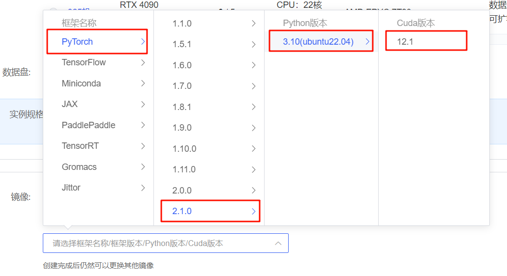

# Llama-3-8B-Instruct FastApi deployment call

## Environment preparation

Rent a 3090 or other 24G graphics card machine in the Autodl platform, and select `PyTorch-->2.1.0-->3.10(ubuntu22.04)-->12.1` as shown in the following figure.
Next, open JupyterLab on the server you just rented, and open the terminal in it to start environment configuration, model download and run demonstration.



pip changes the source to speed up downloading and installing dependent packages

```shell
# Upgrade pip
python -m pip install --upgrade pip
# Change pypi source to speed up library installation
pip config set global.index-url https://pypi.tuna.tsinghua.edu.cn/simple

pip install fastapi==0.110.2
pip install uvicorn==0.29.0
pip install requests==2.31.0
pip install modelscope==1.11.0
pip install transformers==4.40.0
pip install accelerate==0.29.3
```

fastapi==0.110.2
langchain==0.1.16
modelscope==1.11.0
streamlit==1.33.0
torch==2.1.2+cu121
transformers==4.40.0
uvicorn==0.29.0

> Considering that some students may encounter some problems in configuring the environment, we have prepared an environment image of LLaMA3 on the AutoDL platform, which is applicable to all deployment environments of this warehouse. Click the link below and create an Autodl example directly.
> ***https://www.codewithgpu.com/i/datawhalechina/self-llm/self-llm-LLaMA3***

## Model download

Use the snapshot_download function in modelscope to download the model. The first parameter is the model name, and the parameter cache_dir is the model download path.

Create a new model_download in the /root/autodl-tmp path.py file and enter the following content in it. Please save the file in time after pasting the code, as shown in the figure below. And run `python /root/autodl-tmp/model_download.py` to download. The model size is 15GB and it takes about 2 minutes to download the model.

```python
import torch
from modelscope import snapshot_download, AutoModel, AutoTokenizer
import os
model_dir = snapshot_download('LLM-Research/Meta-Llama-3-8B-Instruct', cache_dir='/root/autodl-tmp', revision='master')
```

## Code preparation

Create a new api.py file in the /root/autodl-tmp path and enter the following content in it. Please save the file in time after pasting the code. The following code has very detailed comments. If you don’t understand anything, please raise an issue.

```python
from fastapi import FastAPI, Request
from transformers import AutoTokenizer, AutoModelForCausalLM, GenerationConfig
import uvicorn
import json
import datetime
import torch

# Set device parameters
DEVICE = "cuda" # Use CUDA
DEVICE_ID = "0" # CUDA device ID, empty if not set
CUDA_DEVICE = f"{DEVICE}:{DEVICE_ID}" if DEVICE_ID else DEVICE # Combine CUDA device information

# Clear GPU memory function
def torch_gc():
if torch.cuda.is_available(): # Check if CUDA is available
with torch.cuda.device(CUDA_DEVICE): # Specify CUDA device
torch.cuda.empty_cache() # Clear CUDA cache
torch.cuda.ipc_collect() #Collect CUDA memory fragments# Build chat template def bulid_input(prompt, history=[]): system_format='<|start_header_id|>system<|end_header_id|>\n\n{content}<|eot_id|>' user_format='< |start_header_id|>user<|end_header_id|>\n\n{content}<|eot_id|>' assistant_format='<|start_header_id|>assistant<|end_header_id|>\n\n{content}<|eot_id|>\ n' history.append({'role':'user','content':prompt}) prompt_str = '' # Splice historical dialogue for item in history: if item['role']=='user': prompt_str+= user_format.format(content=item['content'])
else:
prompt_str+=assistant_format.format(content=item['content'])
return prompt_str

# Create FastAPI application
app = FastAPI()

# Endpoint for handling POST request
@app.post("/")
async def create_item(request: Request):
global model, tokenizer # Declare global variables for using model and tokenizer inside the function
json_post_raw = await request.json() # Get JSON data of POST request
json_post = json.dumps(json_post_raw) # Convert JSON data to string
json_post_list = json.loads(json_post) # Convert string to Python object
prompt = json_post_list.get('prompt') # Get the prompt in the request
history = json_post_list.get('history', []) # Get the history in the request
messages = [
# {"role": "system", "content": "You are a helpful assistant."},
{"role": "user", "content": prompt}
]
# Call the model for dialogue generation
input_str = bulid_input(prompt=prompt, history=history)
input_ids = tokenizer.encode(input_str, add_special_tokens=False, return_tensors='pt').cuda()

generated_ids = model.generate(
input_ids=input_ids, max_new_tokens=512, do_sample=True,
top_p=0.9, temperature=0.5, repetition_penalty=1.1, eos_token_id=tokenizer.encode('<|eot_id|>')[0]
)
outputs = generated_ids.tolist()[0][len(input_ids[0]):]
response = tokenizer.decode(outputs)
response = response.strip().replace('<|eot_id|>', "").replace('<|start_header_id|>assistant<|end_header_id|>\n\n', '').strip() # Parse chat template

now = datetime.datetime.now() # Get current time
time = now.strftime("%Y-%m-%d %H:%M:%S") # Format time as string
# Build response JSON
answer = {
"response": response,
"status": 200,
"time": time
}
# Build log information
log = "[" + time + "] " + '", prompt:"' + prompt + '", response:"' + repr(response) + '"'
print(log) # Print log
torch_gc() # Perform GPU memory cleanup
return answer # Return response

# Main function entry
if __name__ == '__main__':
# Load pre-trained tokenizer and model
model_name_or_path = '/root/autodl-tmp/LLM-Research/Meta-Llama-3-8B-Instruct'
tokenizer = AutoTokenizer.from_pretrained(model_name_or_path, use_fast=False)
model= AutoModelForCausalLM.from_pretrained(model_name_or_path, device_map="auto", torch_dtype=torch.bfloat16).cuda()

# Start FastAPI application
# Use port 6006 to map the port of autodl to the local computer, so that the api can be used locally
uvicorn.run(app, host='0.0.0.0', port=6006, workers=1) # Start the application on the specified port and host
```

## Api deployment

Enter the following command in the terminal to start the api service:

```shell
cd /root/autodl-tmp
python api.py
```

After loading, the following information appears, indicating success.


By default, it is deployed on port 6006 and can be called via the POST method. You can use curl to call it, as shown below:

```shell
curl -X POST "http://127.0.0.1:6006" \
-H 'Content-Type: application/json' \
-d '{"prompt": "Hello"}'
```

The return value is as follows:

```json
{
"response": "😊 Hello! I'm glad to see you too! Do you have any questions or topics to chat about?",
"status": 200,
"time": "2024-04-20 23:11:00"
}
```

You can also use the requests library in python to call it, as follows:

```python
import requests
import json

def get_completion(prompt):
headers = {'Content-Type': 'application/json'}
data = {"prompt": prompt}
response = requests.post(url='http://127.0.0.1:6006', headers=headers, data=json.dumps(data))
return response.json()['response'] if __name__ == '__main__': print(get_completion('Hello')) ``` 