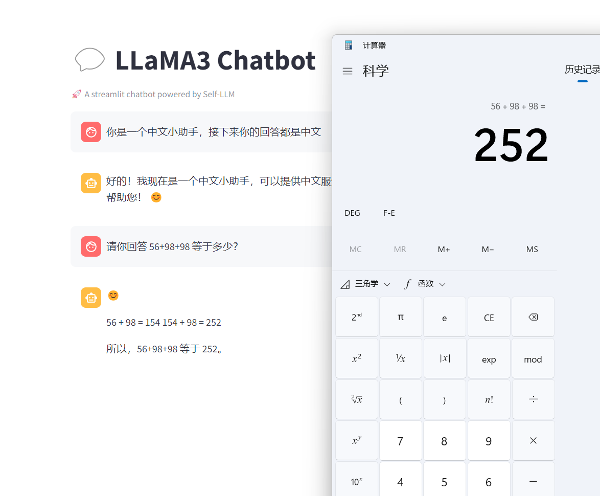

# LLaMA3-8B-Instruct WebDemo deployment

## Environment preparation

Rent a 3090 or other 24G graphics card machine in the autodl platform. As shown in the figure below, select the image `PyTorch-->2.1.0-->3.10(ubuntu20.04)-->12.1`


Next, open JupyterLab on the server you just rented, and open the terminal in it to start environment configuration, model download and run demo.

pip changes the source to speed up downloading and installing dependent packages

```shell
# Upgrade pip
python -m pip install --upgrade pip
# Change the pypi source to speed up library installation
pip config set global.index-url https://pypi.tuna.tsinghua.edu.cn/simple

pip install modelscope==1.11.0
pip install langchain==0.1.15
pip install "transformers>=4.40.0" accelerate tiktoken einops scipy transformers_stream_generator==0.1.16
pip install streamlit
``` 
> Considering that some students may encounter some problems in configuring the environment, we have prepared an environment image of LLaMA3 on the AutoDL platform, which is applicable to all deployment environments of this repository. Click the link below and create an Autodl example directly.
> ***https://www.codewithgpu.com/i/datawhalechina/self-llm/self-llm-LLaMA3***

## Model download

Use the snapshot_download function in modelscope to download the model. The first parameter is the model name, and the parameter cache_dir is the download path of the model.

Create a new model_download.py file in the /root/autodl-tmp path and enter the following content in it. Remember to save the file after pasting the code, as shown in the figure below. And run `python /root/autodl-tmp/model_download.py` to execute the download. The model size is 15 GB, and it takes about 2 minutes to download the model.```python 
import torch
from modelscope import snapshot_download, AutoModel, AutoTokenizer
import os

model_dir = snapshot_download('LLM-Research/Meta-Llama-3-8B-Instruct', cache_dir='/root/autodl-tmp', revision='master')
```

## Code preparation

Create a new file `chatBot.py` in the `/root/autodl-tmp` path and enter the following content in it. Remember to save the file after pasting the code. The following code has very detailed comments. If you have any questions, please raise an issue.

```python
from transformers import AutoTokenizer, AutoModelForCausalLM
import torch
import streamlit as st

# Create a title and a link in the sidebar
with st.sidebar:
st.markdown("##LLaMA3 LLM")
"[Open Source Large Model Usage Guide self-llm](https://github.com/datawhalechina/self-llm.git)"

# Create a title and a subtitle
st.title("💬 LLaMA3 Chatbot")
st.caption("🚀 A streamlit chatbot powered by Self-LLM")

# Define the model path
mode_name_or_path = '/root/autodl-tmp/LLM-Research/Meta-Llama-3-8B-Instruct'

# Define a function to get the model and tokenizer
@st.cache_resource
def get_model():
# Get the tokenizer from the pre-trained model
tokenizer = AutoTokenizer.from_pretrained(mode_name_or_path, trust_remote_code=True)
tokenizer.pad_token = tokenizer.eos_token# Get the model from the pre-trained model and set the model parameters
model = AutoModelForCausalLM.from_pretrained(mode_name_or_path, torch_dtype=torch.bfloat16).cuda()

return tokenizer, model

def bulid_input(prompt, history=[]):
system_format='<|begin_of_text|><|start_header_id|>system<|end_header_id|>\n\n{content}<|eot_id|>'
user_format='<|start_header_id|>user<|end_header_id|>\n\n{content}<|eot_id|>'
assistant_format='<|start_header_id|>assistant<|end_header_id|>\n\n{content}<|eot_id|>\n'
history.append({'role':'user','content':prompt})
prompt_str = ''
# Splice historical dialogue
for item in history:
if item['role']=='user':
prompt_str+=user_format.format(content=item['content'])
else:
prompt_str+=assistant_format.format(content=item['content'])
return prompt_str + '<|start_header_id|>assistant<|end_header_id|>\n\n'

# Load LLaMA3 model and tokenizer
tokenizer, model = get_model()

# If there is no "messages" in session_state, create a list containing default messages
if "messages" not in st.session_state:st.session_state["messages"] = []

# Traverse all messages in session_state and display them on the chat interface
for msg in st.session_state.messages:
st.chat_message(msg["role"]).write(msg["content"])

# If the user enters content in the chat input box, do the following
if prompt := st.chat_input():

# Display the user's input on the chat interface
st.chat_message("user").write(prompt)

# Build input
input_str = bulid_input(prompt=prompt, history=st.session_state["messages"])
input_ids = tokenizer.encode(input_str, add_special_tokens=False, return_tensors='pt').cuda()
outputs = model.generate(
input_ids=input_ids, max_new_tokens=512, do_sample=True,
top_p=0.9, temperature=0.5, repetition_penalty=1.1, eos_token_id=tokenizer.encode('<|eot_id|>')[0]
)
outputs = outputs.tolist()[0][len(input_ids[0]):]
response = tokenizer.decode(outputs)
response = response.strip().replace('<|eot_id|>', "").replace('<|start_header_id|>assistant<|end_header_id|>\n\n', '').strip()

# Add the output of the model to the messages list in session_state
# st.session_state.messages.append({"role": "user", "content": prompt})
st.session_state.messages.append({"role": "assistant", "content": response})
# Display the output of the model on the chat interface
st.chat_message("assistant").write(response)
print(st.session_state)
```

## Run demo

Run the following command in the terminal to start the streamlit service, and map the port to the local according to the instructions of `autodl`, then open the link http://localhost:6006/ in the browser to see the chat interface.

```bash
streamlit run /root/autodl-tmp/chatBot.py --server.address 127.0.0.1 --server.port 6006
```

As shown below, it can be seen that LLaMA3 has its own thinking chain. It should be that there is a cot format data set directly in the data set during training. LLaMA3 is very powerful!

