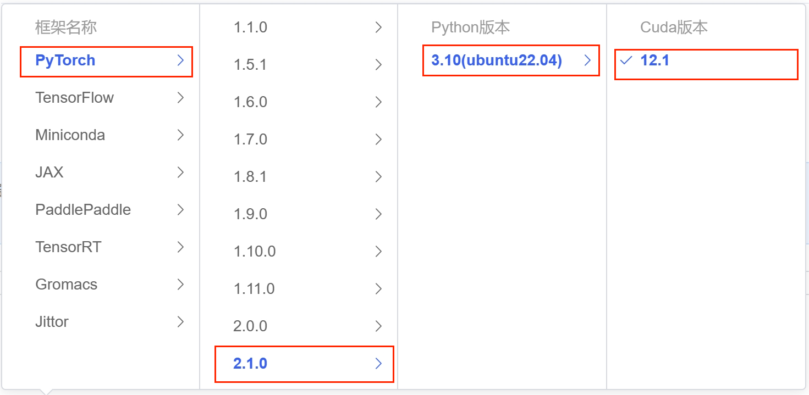

# MiniCPM-2B-chat FastApi deployment call

## MiniCPM-2B-chat introduction

MiniCPM is a series of large end-side models jointly open-sourced by Mianbi Intelligence and the Natural Language Processing Laboratory of Tsinghua University. The main language model MiniCPM-2B has only 2.4 billion (2.4B) non-word embedding parameters.

After SFT, MiniCPM is similar to Mistral-7B (with better Chinese, mathematics, and coding capabilities) on the public comprehensive evaluation set, and its overall performance exceeds Llama2-13B, MPT-30B, Falcon-40B and other models.
After DPO, MiniCPM-2B also surpassed many representative open source large models such as Llama2-70B-Chat, Vicuna-33B, Mistral-7B-Instruct-v0.1, and Zephyr-7B-alpha on the current evaluation set MTBench, which is closest to user experience.
Based on MiniCPM-2B, the end-side multimodal large model MiniCPM-V is built. The overall performance is the best among the models of the same scale, surpassing the existing multimodal large models built based on Phi-2, and achieving performance comparable to or even better than 9.6B Qwen-VL-Chat on some evaluation sets.
AfterAfter Int4 quantization, MiniCPM can be deployed on mobile phones for inference, and the streaming output speed is slightly higher than the human speaking speed. MiniCPM-V also directly runs through the deployment of multimodal large models on mobile phones.
A 1080/2080 can be used for efficient parameter fine-tuning, and a 3090/4090 can be used for full parameter fine-tuning. One machine can continuously train MiniCPM, and the secondary development cost is low.

## Environment preparation
Rent a **single card 3090 or other 24G** graphics card machine in the autodl platform. As shown in the figure below, select PyTorch-->2.1.0-->3.10(ubuntu22.04)-->12.1
Next, open the JupyterLab of the server just rented, image and open the terminal in it to start environment configuration, model download and run demonstration. 


Next, open the JupyterLab server you just rented, and open the terminal to start environment configuration, model download, and run the demo.

pip source change and install dependent packages

```shell
# Upgrade pip
python -m pip install --upgrade pip
# Change the pypi source to accelerate library installation
pip config set global.index-urlhttps://pypi.tuna.tsinghua.edu.cn/simple
pip install modelscope transformers sentencepiece accelerate fastapi uvicorn requests streamlit

MAX_JOBS=8 pip install flash-attn --no-build-isolation
```

> Note: flash-attn installation will be slow, about ten minutes.

## Model download

Use the `snapshot_download` function in `modelscope` to download the model. The first parameter is the model name, and the parameter `cache_dir` is the download path of the model.

Create a new `download.py` file in the `/root/autodl-tmp` path and enter the following content in it. Remember to save the file after pasting the code, as shown in the figure below. And run `python /root/autodl-tmp/download.py` to download. The model size is 10 GB, and it takes about 5~10 minutes to download the model

```python
import torch
from modelscope import snapshot_download, AutoModel, AutoTokenizer
import os
model_dir = snapshot_download('OpenBMB/MiniCPM-2B-sft-fp32', cache_dir='/root/autodl-tmp', revision='master')
```

## Code preparation

Create a new api.py file in the /root/autodl-tmp path and enter the following content in it. Remember to save the file after pasting the code. The following code has very detailed comments. If you have any questions, please raise an issue.
```python
from fastapi import FastAPI, Request
from transformers import AutoTokenizer, AutoModelForCausalLM, GenerationConfig
import uvicorn
import json
import datetime
import torch

# Set device parameters
DEVICE = "cuda" # Use CUDADEVICE_ID = "0" # CUDA device ID, empty if not set
CUDA_DEVICE = f"{DEVICE}:{DEVICE_ID}" if DEVICE_ID else DEVICE # Combine CUDA device information

# Clean up GPU memory function
def torch_gc():
if torch.cuda.is_available(): # Check if CUDA is available
with torch.cuda.device(CUDA_DEVICE): # Specify CUDA device
torch.cuda.empty_cache() # Clear CUDA cache
torch.cuda.ipc_collect() # Collect CUDA memory fragments

# Create FastAPI application
app = FastAPI()

# Endpoint to handle POST requests
@app.post("/")
async def create_item(request: Request):
global model, tokenizer # Declare global variables for use of models and tokenizers inside functionsTokenizer
json_post_raw = await request.json() # Get JSON data for POST request
json_post = json.dumps(json_post_raw) # Convert JSON data to string
json_post_list = json.loads(json_post) # Convert string to Python object
prompt = json_post_list.get('prompt') # Get input prompt in request

# Build input and set generation parameters, temperature, top_p value and repetition_penalty (repetition penalty factor), etc., which can be modified
responds, history = model.chat(tokenizer, prompt, temperature=0.5, top_p=0.8, repetition_penalty=1.02)
now = datetime.datetime.now() # Get current time
time = now.strftime("%Y-%m-%d %H:%M:%S") # Format the time as a string
# Build the response JSON
answer = {
"response": responds,
"status": 200,
"time": time
}
# Build log information
log = "[" + time + "] " + '", prompt:"' + prompt + '", response:"' + repr(responds) + '"'
print(log) # Print log
torch_gc() # Perform GPU memory cleanup
return answer # Return response

# Main function entry
if __name__ == '__main__':
torch.manual_seed(0) # Set the random seed to ensure the reproducibility of the results
# Define the model path
path = '/root/autodl-tmp/OpenBMB/MiniCPM-2B-sft-fp32'
# Load the tokenizer from the model path,tokenizer = AutoTokenizer.from_pretrained(path)
# Load the model from the model path, set it to use bfloat16 precision to optimize performance, and deploy the model to a CUDA-supported GPU, trust_remote_code=True allows loading remote code
model = AutoModelForCausalLM.from_pretrained(path, torch_dtype=torch.bfloat16, device_map='cuda', trust_remote_code=True)

model.eval() # Set the model to evaluation mode
# Start FastAPI application
# Use port 6006 to map the autodl port to the local, so that the api can be used locally
uvicorn.run(app, host='0.0.0.0', port=6006, workers=1) # Start the application on the specified port and host
```

## Api deployment

Enter the following command in the terminal to start the api service
```
cd /root/autodl-tmp
python api.py
```
After loading is complete, the following message appears, indicating success.


By default, it is deployed on port 6006 and can be called through the POST method. It can be called using curl. It is recommended that max_length be 100. If it is too much, the video memory will be exhausted. If it is too little, the answer output will be incomplete, as shown below:
```shell
curl -X POST "http://127.0.0.1:6006" \
-H 'Content-Type: application/json' \
-d '{"prompt": "Which mountain is the highest in Shandong Province? Is it higher or lower than Huangshan? What is the difference?"}'
```

You can also use the requests library in python to call it, as shown below:
```python
import requests
import json

def get_completion(prompt):
headers = {'Content-Type': 'application/json'}
data = {"prompt": prompt,"max_length":512}
response = requests.post(url='http://127.0.0.1:6006', headers=headers, data=json.dumps(data))
return response.json()['response']

if __name__ == '__main__':
print(get_completion("Which mountain is the highest in Shandong Province? Is it higher or lower than Huangshan? How much difference?"))
```
The return value is as follows: