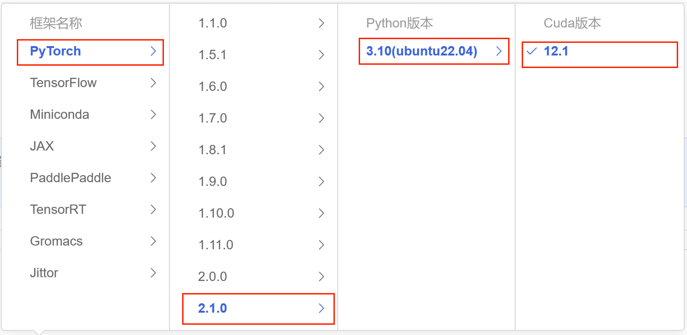
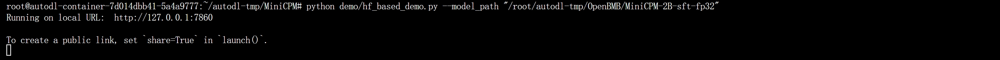
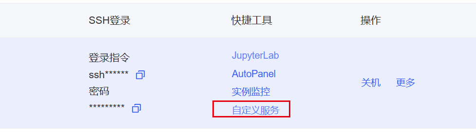
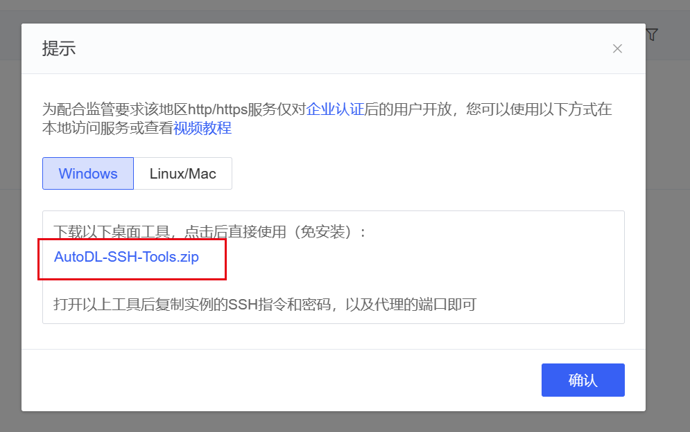
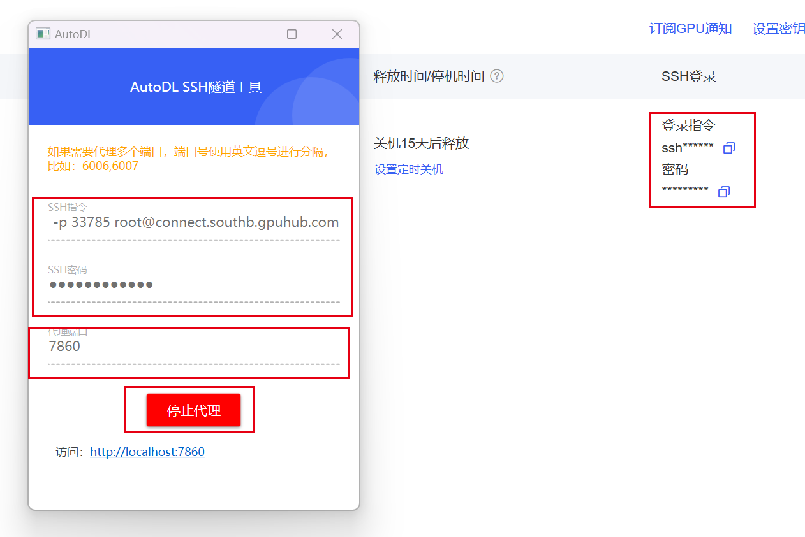
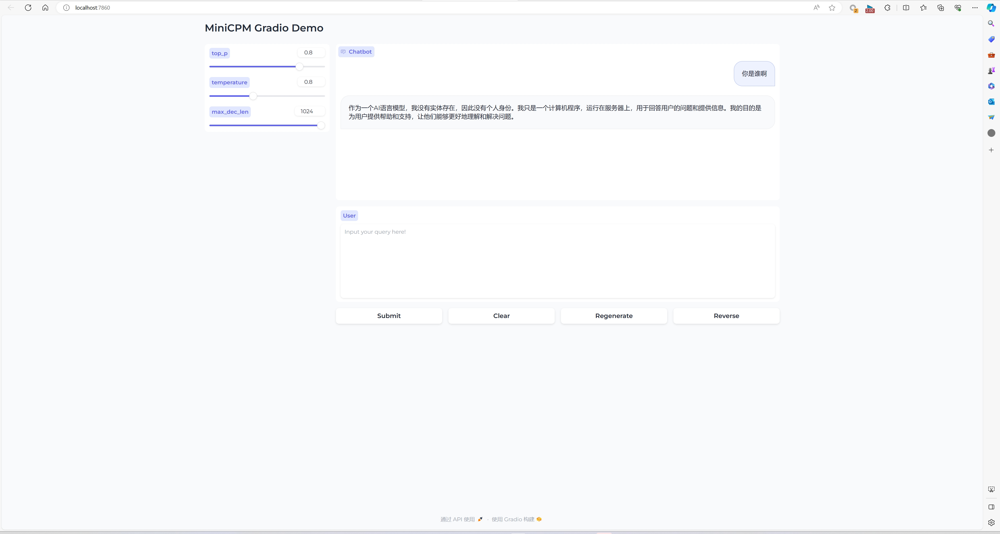

# MiniCPM-2B-chat WebDemo deployment

## MiniCPM-2B-chat introduction

MiniCPM is a series of large end-side models jointly open-sourced by Mianbi Intelligence and the Natural Language Processing Laboratory of Tsinghua University. The main language model MiniCPM-2B has only 2.4 billion (2.4B) non-word embedding parameters.

After SFT, MiniCPM is similar to Mistral-7B (with better Chinese, mathematics, and coding capabilities) on the public comprehensive evaluation set, and its overall performance exceeds Llama2-13B, MPT-30B, Falcon-40B and other models.
After DPO, MiniCPM-2B also surpassed many representative open source large models such as Llama2-70B-Chat, Vicuna-33B, Mistral-7B-Instruct-v0.1, and Zephyr-7B-alpha on the current evaluation set MTBench, which is closest to user experience.
Based on MiniCPM-2B, the end-side multimodal large model MiniCPM-V is built. The overall performance is the best among the models of the same scale, surpassing the existing multimodal large models built based on Phi-2, and achieving performance comparable to or even better than 9.6B Qwen-VL-Chat on some evaluation sets.
After Int4 After quantization, MiniCPM can be deployed on mobile phones for inference, and the streaming output speed is slightly higher than the speed of human speech. MiniCPM-V also directly runs through the deployment of multimodal large models on mobile phones.
A 1080/2080 can be used for efficient parameter fine-tuning, and a 3090/4090 can be used for full parameter fine-tuning. One machine can continuously train MiniCPM, and the secondary development cost is low.

## Environment preparation
Rent a **single card 3090 or other 24G** graphics card machine in the autodl platform. As shown in the figure below, select PyTorch-->2.1.0-->3.10(ubuntu22.04)-->12.1
Next, open the JupyterLab of the server just rented, image and open the terminal in it to start environment configuration, model download and run demonstration. 


Next, open the JupyterLab server you just rented, and open the terminal to start environment configuration, model download, and run the demo.

First, clone the code and open the academic image acceleration that comes with the autodl platform. For detailed usage of academic image acceleration, please see: https://www.autodl.com/docs/network_turbo/

You can complete academic image acceleration and code clone by executing the following code directly in the terminaland pip source change and installation of dependent packages

```shell
# Because it involves accessing github, it is best to open the academic mirror of autodl to accelerate
source /etc/network_turbo
# Upgrade pip
python -m pip install --upgrade pip
# Change the pypi source to accelerate the installation of the library
pip config set global.index-url https://pypi.tuna.tsinghua.edu.cn/simple
pip install modelscope transformers sentencepiece accelerate gradio

MAX_JOBS=8 pip install flash-attn --no-build-isolation

# clone project code
git clone https://github.com/OpenBMB/MiniCPM.git
# Switch to the project path
cd MiniCPM
```

> Note: flash-attn installation will be slow, about ten minutes.

## Model download

Use `snapsho in `modelscope`The `t_download` function downloads the model. The first parameter is the model name, and the parameter `cache_dir` is the download path of the model.

Create a new `download.py` file in the `/root/autodl-tmp` path and enter the following content in it. Remember to save the file after pasting the code, as shown in the figure below. And run `python /root/autodl-tmp/download.py` to download. The model size is 10 GB. It takes about 5 to 10 minutes to download the model.

```python
import torch
from modelscope import snapshot_download, AutoModel, AutoTokenizer
import os
model_dir = snapshot_download('OpenBMB/MiniCPM-2B-sft-fp32', cache_dir='/root/autodl-tmp', revision='master')
```

### Web Demo Run
Enter the code directory, run the demo startup script, and fill in the downloaded model directory after the --model_name_or_path parameter
```shell
# Start Demo, fill in the model directory just downloaded in the model_path parameter
python demo/hf_based_demo.py --model_path "/root/autodl-tmp/OpenBMB/MiniCPM-2B-sft-fp32"
```
After successful startup, the terminal displays as follows:

## Set up proxy access
Find the custom service on the Autodl container instance page and download the corresponding proxy tool


Start the proxy tool, copy the corresponding ssh command and password, set the proxy port to 7860, and click Start Proxy

After the proxy is successful, click the link below to access web-demo
