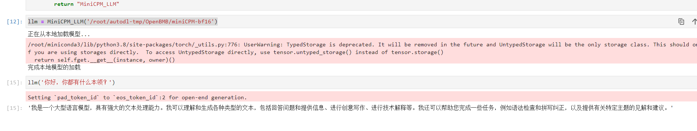

# MiniCPM-2B-chat transformers deployment call

## MiniCPM-2B-chat introduction

MiniCPM is a series of large end-side models jointly open-sourced by Mianbi Intelligence and the Natural Language Processing Laboratory of Tsinghua University. The main language model MiniCPM-2B has only 2.4 billion (2.4B) non-word embedding parameters.

After SFT, MiniCPM is similar to Mistral-7B (with better Chinese, mathematics, and coding capabilities) on the public comprehensive evaluation set, and its overall performance exceeds Llama2-13B, MPT-30B, Falcon-40B and other models.
After DPO, MiniCPM-2B also surpassed many representative open source large models such as Llama2-70B-Chat, Vicuna-33B, Mistral-7B-Instruct-v0.1, and Zephyr-7B-alpha on the current evaluation set MTBench, which is closest to user experience.
Based on MiniCPM-2B, the end-side multimodal large model MiniCPM-V is built. The overall performance is the best among the models of the same scale, surpassing the existing multimodal large models built based on Phi-2, and achieving performance comparable to or even better than the 9.6B Qwen-VL-Chat on some evaluation sets..
After Int4 quantization, MiniCPM can be deployed on mobile phones for inference, and the streaming output speed is slightly higher than the speed of human speech. MiniCPM-V also directly runs through the deployment of multimodal large models on mobile phones.
A 1080/2080 can be used for efficient parameter fine-tuning, and a 3090/4090 can be used for full parameter fine-tuning. One machine can continuously train MiniCPM, and the secondary development cost is low.

## Environment preparation
Rent a **single card 3090 or other 24G** graphics card machine in the autodl platform. As shown in the figure below, select PyTorch-->2.1.0-->3.10(ubuntu22.04)-->12.1
Next, open the JupyterLab of the server just rented, image and open the terminal in it to start environment configuration, model download and run demonstration. 


Next, open the JupyterLab server you just rented, and open the terminal to start environment configuration, model download, and run the demo.

pip source change and install dependent packages

```shell
# Upgrade pip
python -m pip install --upgrade pip
# Change the pypi source to speed up the installation of the library
pip config set global.index-url https://pypi.tuna.tsinghua.edu.cn/simple
pip install modelscope transformers sentencepiece accelerate langchain

MAX_JOBS=8 pip install flash-attn --no-build-isolation
```

> Note: flash-attn installation will be slow, about ten minutes.

## Model download

Use the `snapshot_download` function in `modelscope` to download the model. The first parameter is the model name, and the parameter `cache_dir` is the download path of the model.

Create a new `download.py` file in the `/root/autodl-tmp` path and enter the following content in it. Remember to save the file after pasting the code, as shown in the figure below. And run `python /root/autodl-tmp/download.py` to download. The model size is 10 GB, and it takes about 5~10 minutes to download the model.

```python
import torch
from modelscope import snapshot_download, AutoModel, AutoTokenizer
import os
model_dir = snapshot_download('OpenBMB/MiniCPM-2B-sft-fp32', cache_dir='/root/autodl-tmp', revision='master')
```

## Code preparation

To build LLM applications conveniently, we need to customize an LLM class based on the locally deployed MiniCPM-2B-chat and connect MiniCPM-2B-chat to the LangChain framework. After completing the customized LLM class, the LangChain interface can be called in a completely consistent manner without considering the inconsistency of the underlying model call.

Customizing the LLM class based on the locally deployed MiniCPM-2B-chat is not complicated. We only need to inherit a subclass from the LangChain.llms.base.LLM class and rewrite the constructor and _call function:

```python
from langchain.llms.base import LLM
from typing import Any, List, Optional
from langchain.callbacks.manager import CallbackManagerForLLMRun
from transformers import AutoTokenizer, AutoModelForCausalLM, GenerationConfig
import torch

class MiniCPM_LLM(LLM):
# Customize LLM class based on local InternLM
tokenizer : AutoTokenizer = None
model: AutoModelForCausalLM = None

def __init__(self, model_path :str):
# model_path: InternLM model path
# Initialize model from local
super().__init__()
print("Loading model from local...")
self.tokenizer = AutoTokenizer.from_pretrained(model_path, trust_remote_code=True)
self.model = AutoModelForCausalLM.from_pretrained(model_path, trust_remote_code=True,torch_dtype=torch.bfloat16, device_map="auto")
self.model = self.model.eval()
print("Complete loading of local model")

def _call(self, prompt : str, stop: Optional[List[str]] = None,
run_manager: Optional[CallbackManagerForLLMRun] = None,
**kwargs: Any):
# Get output through model
responds, history = self.model.chat(self.tokenizer, prompt, temperature=0.5, top_p=0.8, repetition_penalty=1.02)
return responds

@property
def _llm_type(self) -> str:
return "MiniCPM_LLM"
```

## Call

Then you can use it like any other langchain large model function.

```python
llm = MiniCPM_LLM('/root/autodl-tmp/OpenBMB/MiniCPM-2B-sft-fp32')

llm('Hello')
```

As shown below:

