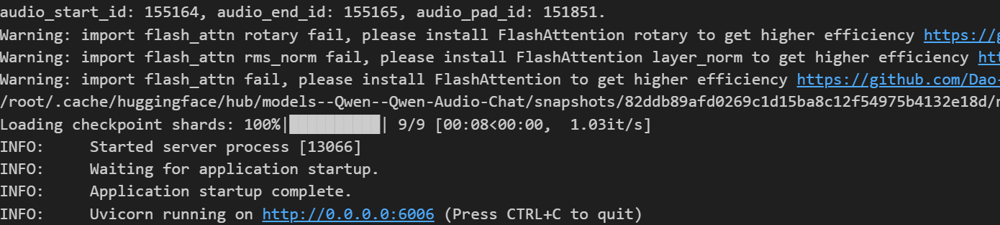
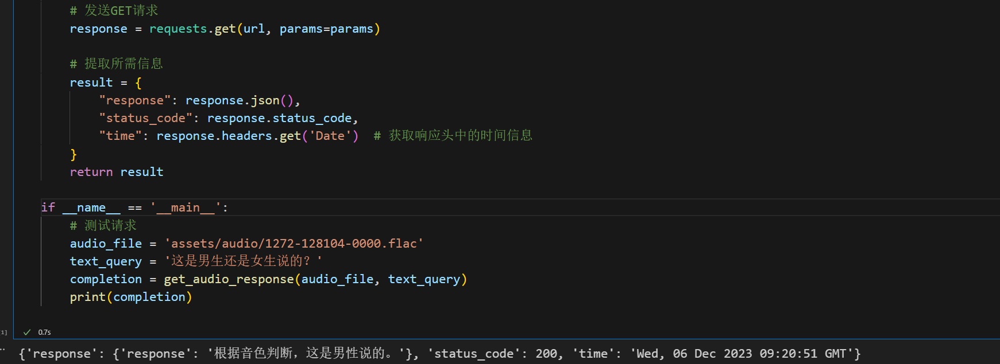

# Qwen-Audio-chat FastApi deployment call

## Qwen-Audio introduction

**Qwen-Audio** is a large-scale audio language model developed by Alibaba Cloud. Qwen-Audio can take a variety of audio (including speaker voice, natural sound, music, singing) and text as input, and output text.

## Environment preparation

Rent a 3090 or other 24G graphics card machine on the autodl platform. As shown in the figure below, select PyTorch-->2.0.0-->3.8(ubuntu20.04)-->11.8 (versions above 11.3 are acceptable)
Next, open the JupyterLab image of the server you just rented, and open the terminal in it to start environment configuration, model download, and run the demonstration. 

pip source change and install dependent packages

```bash
# Upgrade pip
python -m pip install --upgrade pip
# Change pypi source to accelerate library installation
pip config set global.index-url https://pypi.tuna.tsinghua.edu.cn/simple

pip install modelscope==1.9.5

pip install accelerate
pip install tiktoken
pip install einops
pip install transformers_stream_generator==0.0.4
pip install scipy
pip install torchvision
pip install pillow
pip install tensorboard
pip install matplotlib
pip install transformers==4.32.0
pip install gradio==3.39.0
pip install nest_asyncio
```

## Model download

Use the snapshot_download function in modelscope to download the model. The first parameter is the model name, and the parameter cache_dir is the download path of the model.

Create a new download.py file in the /root/autodl-tmp path and enter the following content in it. Remember to save the file after pasting the code,As shown below. And run python /root/autodl-tmp/download.py to download. The model size is 20 GB. It takes about 10 to 20 minutes to download the model.

```python
import torch
from modelscope import snapshot_download, AutoModel, AutoTokenizer
from modelscope import GenerationConfig
model_dir = snapshot_download('qwen/Qwen-Audio-Chat', cache_dir='/root/autodl-tmp', revision='master')
```

Test audio download

~~~bash
wget -O /root/autodl-tmp/1272-128104-0000.flac https://github.com/QwenLM/Qwen-Audio/raw/main/assets/audio/1272-128104-0000.flac
~~~

## Code preparation

Under the /root/autodl-tmp pathCreate a new api.py file and enter the following content in it. Remember to save the file after pasting the code. The code below is very well commented. If you don’t understand anything, please raise an issue.
```python
from fastapi import FastAPI, Request, File, UploadFile, Query
from transformers import AutoTokenizer, AutoModelForCausalLM, GenerationConfig
import uvicorn
import json
import datetime
import torch
import os
import nest_asyncio
nest_asyncio.apply()

# Set device parameters
DEVICE = "cuda" # Use CUDA
DEVICE_ID = "0" # CUDA device ID, empty if not set
CUDA_DEVICE = f"{DEVICE}:{DEVICE_ID}" if DEVICE_ID else DEVICE # Combine CUDA device information

# Clear GPU memory function
def torch_gc():
if torch.cuda.is_available(): # Check if CUDA is available
with torch.cuda.device(CUDA_DEVICE): # Specify CUDA device
torch.cuda.empty_cache() # Clear CUDA cache
torch.cuda.ipc_collect() # Collect CUDA memory fragments

# Create FastAPI application
app = FastAPI()

# Endpoint for handling POST requests
@app.post("/audio/")
async def create_audio_item(file: UploadFile = File(...)):
global model, tokenizer # Use global variables
# Save audio file to temporary path
temp_file_path = f"temp/{file.filename}"
with open(temp_file_path, 'wb') as f:
f.write(file.file.read())
file.file.close()

# 1st dialogue turn
query = tokenizer.from_list_format([
{'audio': temp_file_path}, # Use the saved temporary audio file path
{'text': 'what does the person say?'},
])
response, history = model.chat(tokenizer, query=query, history=None)

# Clean up temporary files
os.remove(temp_file_path)

now = datetime.datetime.now() # Get the current time
time = now.strftime("%Y-%m-%d %H:%M:%S") # Format the time as a string
# Build the response JSON
answer = {
"response": response,
"status": 200,
"time": time
}
print(f"[{time}] Response: {response}") # Print log
torch_gc() # Perform GPU memory cleanup
return answer

@app.get("/test-audio/")
def test_audio(audio_file_path: str = Query('/root/autodl-tmp/1272-128104-0000.flac', alias='audio'),
text_query: str = Query('what does the person say?', alias='text')):
"""
Test audio interface, users can specify audio file path and text query
:param audio_file_path: audio file path
:param text_query: text query content
"""

# Use model and tokenizer to process audio and text
query= tokenizer.from_list_format([
{'audio': audio_file_path},
{'text': text_query},
])
response, history = model.chat(tokenizer, query=query, history=None)

return {"response": response}

# Main function entry
if __name__ == '__main__':
mode_name_or_path = '/root/autodl-tmp/qwen/Qwen-Audio-Chat'
# Load pre-trained tokenizer and model
tokenizer = AutoTokenizer.from_pretrained(mode_name_or_path, trust_remote_code=True)
model = AutoModelForCausalLM.from_pretrained(mode_name_or_path, trust_remote_code=True,torch_dtype=torch.bfloat16, device_map="auto")
model.generation_config = GenerationConfig.from_pretrained(mode_name_or_path)
model.generation_config.pad_token_id = model.generation_config.eos_token_id
model.eval() # Set the model to evaluation mode
# Start FastAPI application
# Use port 6006 to map the autodl port to the local, so that the api can be used locally
uvicorn.run(app, host='0.0.0.0', port=6006, workers=1) # Start the application on the specified port and host
```

## Api deployment

Enter the following command in the terminal to start the api service
```
cd /root/autodl-tmp
python api.py
```
After loading, the following information appears, indicating success.


By default, it is deployed on port 6006 and can be called through the POST method. You can use curl to call it, as shown below:
```bash
curl http://127.0.0.1:6006/test-audio/
```
You can also use the requests library in python to call it, as shown below:
```python
import requests

def get_audio_response(audio_file_path, text_query):
# Set the URL of the API
url = 'http://127.0.0.1:6006/test-audio/'

# Set the parameters of the audio file path and text query
params = {
'audio': audio_file_path, # Audio file path
'text': text_query # Text query
}

# Send a GET request
response = requests.get(url, params=params)# Extract required information
result = {
"response": response.json(),
"status_code": response.status_code,
"time": response.headers.get('Date') # Get time information in the response header
}
return result

if __name__ == '__main__':
# Test request
audio_file = '/root/autodl-tmp/1272-128104-0000.flac'
text_query = 'Is this a boy or a girl saying this? '
completion = get_audio_response(audio_file, text_query)
print(completion)
```
The return value is as follows:

```text
{
'response': {'response': 'Based on the tone, this is a man saying this. '},
'status_code': 200, 
'time': 'Wed, 06 Dec 2023 09:20:51 GMT' } ``` 