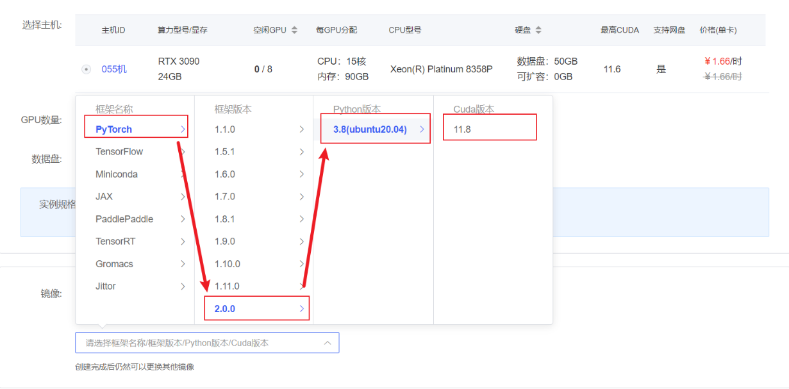
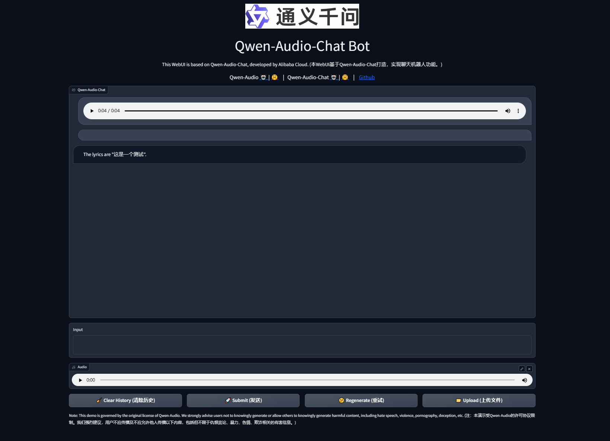

# Qwen-Audio-chat WebDemo deployment

## Qwen-Audio introduction

**Qwen-Audio** is a large-scale audio language model developed by Alibaba Cloud. Qwen-Audio can take a variety of audio (including speaker voice, natural sound, music, singing) and text as input, and output text.

## Environment preparation
Rent a 3090 or other 24G graphics card machine on the autodl platform. As shown in the figure below, select PyTorch-->2.0.0-->3.8(ubuntu20.04)-->11.8 (versions above 11.3 are acceptable)
Next, open the JupyterLab image of the server you just rented, and open the terminal in it to start environment configuration, model download, and run the demonstration. 

Pip source change and installation of dependent packages

```bash
# Upgrade pip
python -m pip install --upgrade pip
# Change pypi source to accelerate library installation
pip config set global.index-url https://pypi.tuna.tsinghua.edu.cn/simple

pip install modelscope==1.9.5

pip install accelerate
pip install tiktoken
pip install einops
pip install transformers_stream_generator==0.0.4
pip install scipy
pip install torchvision
pip install pillow
pip install tensorboard
pip install matplotlib
pip install transformers==4.32.0
pip install gradio==3.39.0
pip install nest_asyncio
```
## Model download
Use the snapshot_download function in modelscope to download the model. The first parameter is the model name, and the parameter cache_dir is the download path of the model.

Create a new download.py file in the /root/autodl-tmp path and enter the following content in it. Remember to save the file after pasting the code, as shown in the figure below.And run python /root/autodl-tmp/download.py to download. The model size is 20 GB. It takes about 10 to 20 minutes to download the model.

```python
import torch
from modelscope import snapshot_download, AutoModel, AutoTokenizer
from modelscope import GenerationConfig
model_dir = snapshot_download('qwen/Qwen-Audio-Chat', cache_dir='/root/autodl-tmp', revision='master')
```

## Code preparation

Create a new file `chatBot.py` in the `/root/autodl-tmp` path and enter the following content in it. Remember to save the file after pasting the code. The following code has very detailed comments. If you have any questions, please raise an issue.

```python
# Copyright (c) Alibaba Cloud.
#
# This source code is licensed underthe license found in the # LICENSE file in the root directory of this source tree. """A simple web interactive chat demo based on gradio.""" from argparse import ArgumentParser from pathlib import Path import copy import gradio as gr import os import re import secrets import tempfile from transformers import AutoModelForCausalLM, AutoTokenizer from transformers.generation import GenerationConfig from pydub import AudioSegment # DEFAULT_CKPT_PATH = 'Qwen/Qwen-Audio-Chat' DEFAULT_CKPT_PATH = "/root/autodl-tmp/qwen/Qwen-Audio-Chat" def _get_args(): parser = ArgumentParser() parser.add_argument("-c", "--checkpoint-path", type=str, default=DEFAULT_CKPT_PATH, help="Checkpoint name or path, default to %(default)r") parser.add_argument("--cpu-only", action="store_true", help="Run demo with CPU only") parser.add_argument(" --share", action="store_true", default=False, help="Create a publicly shareable link for the interface.") parser.add_argument("--inbrowser", action="store_true", default=False, help="Automatically launch the interface in a new tab on the default browser.") parser.add_argument("--server-port" , type=int, default=8000, help="Demo server port.") parser.add_argument("--server-name", type=str, default="127.0.0.1", help="Demo server name." ) args = parser.parse_args() return args def _load_model_tokenizer(args):tokenizer = AutoTokenizer.from_pretrained( args.checkpoint_path, trust_remote_code=True, resume_download=True, ) if args.cpu_only: device_map = "cpu" else: device_map = "cuda" model = AutoModelForCausalLM.from_pretrained( args.checkpoint_path, device_map=device_map, trust_remote_code=True, resume_download=True, ).eval() model.generation_config = GenerationConfig.from_pretrained( args.checkpoint_path, trust_remote_code=True, resume_download=True, ) return model, tokenizer def _parse_text(text): lines = text.split("\n") lines = [line for line in lines if line != ""] count = 0 for i , line in enumerate(lines): if "```" in line: count += 1 items = line.split("`") if count % 2 == 1: lines[i] = f'<pre>< code class="language-{items[-1]}">' else: lines[i] = f"<br></code></pre>" else: if i > 0: if count % 2 == 1: line = line.replace("`", r"\`") line = line.replace("<", "&lt;") line = line. replace(">", "&gt;") line = line.replace(" ", "&nbsp;") line = line.replace("*", "&ast;") line = line.replace("_", "&lowbar;") line = line.replace("-", "&#45;") line = line.replace(".", "&#46;")line = line.replace("!", "&#33;") line = line.replace("(", "&#40;") line = line.replace(")", "&#41;" ) line = line.replace("$", "&#36;") lines[i] = "<br>" + line text = "".join(lines) return text def _launch_demo(args, model, tokenizer) : uploaded_file_dir = os.environ.get("GRADIO_TEMP_DIR") or str( Path(tempfile.gettempdir()) / "gradio" ) def predict(_chatbot, task_history):query = task_history[-1][0] print("User: " + _parse_text(query)) history_cp = copy.deepcopy(task_history) full_response = "" history_filter = [] audio_idx = 1 pre = "" global last_audio for i, (q, a) in enumerate(history_cp): if isinstance(q, (tuple, list)): last_audio = q[0] q = f'Audio {audio_idx}: <audio>{q[0]}</audio >' pre += q + '\n' audio_idx += 1else: pre += q history_filter.append((pre, a)) pre = "" history, message = history_filter[:-1], history_filter[-1][0] response, history = model.chat(tokenizer, message , history=history) ts_pattern = r"<\|\d{1,2}\.\d+\|>" all_time_stamps = re.findall(ts_pattern, response) print(response) if (len(all_time_stamps) > 0) and (len(all_time_stamps) % 2 ==0) and last_audio: ts_float =[ float(t.replace("<|","").replace("|>","")) for t in all_time_stamps] ts_float_pair = [ts_float[i:i + 2] for i in range(0, len(all_time_stamps),2)] # Read the audio file format = os.path.splitext(last_audio)[-1].replace(".","") audio_file = AudioSegment.from_file(last_audio, format=format) chat_response_t = response.replace("<|", "").replace("|>", "") chat_response = chat_response_t temp_dir = secrets.token_hex(20)temp_dir = Path(uploaded_file_dir) / temp_dir
temp_dir.mkdir(exist_ok=True, parents=True)
# Capture audio file
for pair in ts_float_pair:
audio_clip = audio_file[pair[0] * 1000: pair[1] * 1000]
# Save audio file
name = f"tmp{secrets.token_hex(5)}.{format}"
filename = temp_dir / name
audio_clip.export(filename, format=format)
_chatbot[-1] = (_parse_text(query), chat_response)_chatbot.append((None, (str(filename),))) else: _chatbot[-1] = (_parse_text(query), response) full_response = _parse_text(response) task_history[-1] = (query, full_response) print ("Qwen-Audio-Chat: " + _parse_text(full_response)) return _chatbot def regenerate(_chatbot, task_history): if not task_history: return _chatbot item = task_history[-1] if item[1] is None: return _chatbottask_history[-1] = (item[0], None) chatbot_item = _chatbot.pop(-1) if chatbot_item[0] is None: _chatbot[-1] = (_chatbot[-1][0], None) else : _chatbot.append((chatbot_item[0], None)) return predict(_chatbot, task_history) def add_text(history, task_history, text): history = history + [(_parse_text(text), None)] task_history = task_history + [ (text, None)] return history, task_history, "" def add_file(history, task_history, file): history = history + [((file.name,), None)] task_history = task_history + [((file.name,), None)] return history, task_history def add_mic(history, task_history, file): if file is None: return history, task_history os.rename(file, file + '.wav') print("add_mic file:", file) print("add_mic history:", history) print("add_mic task_history :", task_history) # history = history + [((file.name,), None)] # task_history = task_history + [((file.name,), None)] task_history = task_history + [((file + '.wav',), None)] history = history + [(( file + '.wav',), None)] print("task_history", task_history) return history, task_history def reset_user_input(): return gr.update(value="") def reset_state(task_history): task_history.clear() return [] with gr.Blocks() as demo: gr.Markdown("""\ <p align="center"><p>""") ## todo
gr.Markdown("""<center><font size=8>Qwen-Audio-Chat Bot</center>""")
gr.Markdown(
"""\
<center><font size=3>This WebUI is based on Qwen-Audio-Chat, developed by Alibaba Cloud. \
(This WebUI is based on Qwen-Audio-Chat to implement chatbot functions.)</center>""")
gr.Markdown("""\
<center><font size=4>Qwen-Audio <a href="https://modelscope.cn/models/qwen/Qwen-Audio/summary">🤖 </a> | <a href="https://huggingface.co/Qwen/Qwen-Audio">🤗</a>&nbsp ｜ Qwen-Audio-Chat <a href="https://modelscope.cn/models/ qwen/Qwen-Audio-Chat/summary">🤖 </a> | <a href="https://huggingface.co/Qwen/Qwen-Audio-Chat">🤗</a>&nbsp ｜ &nbsp<a href ="https://github.com/QwenLM/Qwen-Audio">Github</a></center>""") chatbot = gr.Chatbot(label='Qwen-Audio-Chat', elem_classes="control -height", height=750) query = gr.Textbox(lines=2, label='Input') task_history = gr.State([])mic = gr.Audio(source="microphone", type="filepath") with gr.Row(): empty_bin = gr.Button("🧹 Clear History") submit_btn = gr.Button("🚀 Submit (Send)") regen_btn = gr.Button("🤔️ Regenerate (Retry)") addfile_btn = gr.UploadButton("📁 Upload (Upload file)", file_types=["audio"]) mic.change(add_mic, [ chatbot, task_history, mic], [chatbot, task_history]) submit_btn.click(add_text, [chatbot, task_history, query], [chatbot, task_history]).then( predict, [chatbot, task_history], [chatbot], show_progress=True ) submit_btn.click(reset_user_input, [], [query]) empty_bin.click(reset_state, [task_history], [chatbot], show_progress =True) regen_btn.click(regenerate, [chatbot, task_history], [chatbot], show_progress=True) addfile_btn.upload(add_file, [chatbot, task_history, addfile_btn], [chatbot, task_history], show_progress=True) gr.Markdown ("""\ <font size=2>Note: This demo is governed by the original license of Qwen-Audio. \
We strongly advise users not to knowingly generate or allow others to knowingly generate harmful content, \
including hate speech, violence, pornography, deception, etc. \
(Note: This demonstration is subject to the license agreement of Qwen-Audio. We strongly advise users not to disseminate or allow others to disseminate the following content, \
including but not limited to harmful information related to hate speech, violence, pornography, and fraud.)""")

demo.queue().launch(
share=args.share,
inbrowser=args.inbrowser,
server_port=args.server_port,
server_name=args.server_name,
file_directories=["/tmp/"]
)

def main():
args = _get_args()

model, tokenizer = _load_model_tokenizer(args)

_launch_demo(args, model, tokenizer)

if __name__ == '__main__':
main()

```

## Run demo

Run the following command in the terminal to start the streamlit service, map the port to the local according to the instructions of `autodl`, and then open the link http://localhost:6006/ in the browser to see the chat interface.

```bash
streamlit run /root/autodl-tmp/chatBot.py --server.address 127.0.0.1 --server.port 6006
```

As shown below:

