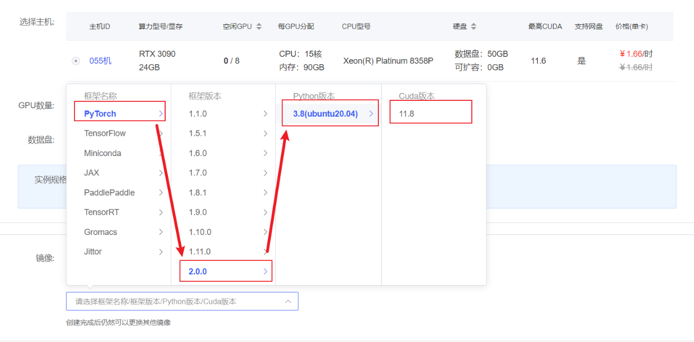

# Qwen-7B-hat Transformers deployment call
## Environment preparation
Rent a 3090 or other 24G video memory graphics card machine in the autodl platform. As shown in the figure below, select PyTorch-->2.0.0-->3.8(ubuntu20.04)-->11.8

Next, open JupyterLab on the server you just rented, and open the terminal in it to start environment configuration, model download and run demo.

pip change source and install dependent packages
```
# Upgrade pip
python -m pip install --upgrade pip
# Change pypi source to accelerate library installation
pip config set global.index-url https://pypi.tuna.tsinghua.edu.cn/simple

pip install modelscope==1.9.5
pip install "transformers>=4.32.0" accelerate tiktoken einops scipy transformers_stream_generator==0.0.4 peft deepspeed
```
## Model download
Use the snapshot_download function in modelscope to download the model. The first parameter is the model name, and the parameter cache_dir is the download path of the model.

Create a new download.py file in the /root/autodl-tmp path and enter the following content in it. Remember to save the file after pasting the code, as shown in the figure below. And run python /root/autodl-tmp/download.py to download. The model size is 15 GB. It takes about 10~20 minutes to download the model.
```
import torch
from modelscope import snapshot_download, AutoModel, AutoTokenizer
from modelscope import GenerationConfig
model_dir = snapshot_download('qwen/Qwen-7B-Chat', cache_dir='/root/autodl-tmp', revision='v1.1.4')
```
## Code preparation
Create a new trans.py file in the /root/autodl-tmp path and save it inEnter the following in 
```
import torch
from transformers import AutoTokenizer, AutoModelForCausalLM, GenerationConfig

model_dir = '/root/autodl-tmp/qwen/Qwen-7B-Chat'
tokenizer = AutoTokenizer.from_pretrained(model_dir, trust_remote_code=True)
model = AutoModelForCausalLM.from_pretrained(model_dir, device_map="auto", trust_remote_code=True).eval()
# Specify hyperparameters for generation
model.generation_config = GenerationConfig.from_pretrained(model_dir, trust_remote_code=True) # You can specify different generation lengths, top_p and other related hyperparameters

#1st dialogue turn
response, history = model.chat(tokenizer, "Hello", history=None)
print(response)
# Hello! I'm glad to help you.

# 2nd dialogue turn
response, history = model.chat(tokenizer, "Tell me a story about a young man who struggled to start a business and finally succeeded.", history=history)
print(response)
# This is a story about a young man who struggled to start a business and finally succeeded.
# The protagonist of the story is Li Ming. He comes from an ordinary family. His parents are ordinary workers. Since he was a child, Li Ming has set a goal: to become a successful entrepreneur.
# In order to achieve this goal, Li Ming studied hard and was admitted to university. During his college years, he actively participated in various entrepreneurial competitions and won many awards. He also used his spare time to do internships and accumulated valuable experience.
# After graduation, Li Ming decided to start his own entrepreneurial journey. He began to look for investment opportunities, but was rejected many times. However, he did not give up. He continued to work hard, constantly improving his entrepreneurial plan, and looking for new investment opportunities.
# Finally, Li Ming successfully obtained an investment, started his own entrepreneurial journey. He founded a technology company that focuses on developing new software. Under his leadership, the company developed rapidly and became a successful technology company.
# Li Ming's success is not accidental. He is diligent, tenacious, adventurous, and constantly learning and improving himself. His success also proves that as long as you work hard, anyone can succeed.

# The third round of dialogue 3rd dialogue turn
response, history = model.chat(tokenizer, "Give this story a title", history=history)
print(response)
# "Struggle for Entrepreneurship: A Young Man's Path to Success"
```
Then run the following command in the terminal:
```
cd /root/autodl-tmp
python trans.py
```
After loading, you can see the dialogue answer generated by the model. (You need to wait patiently!)
