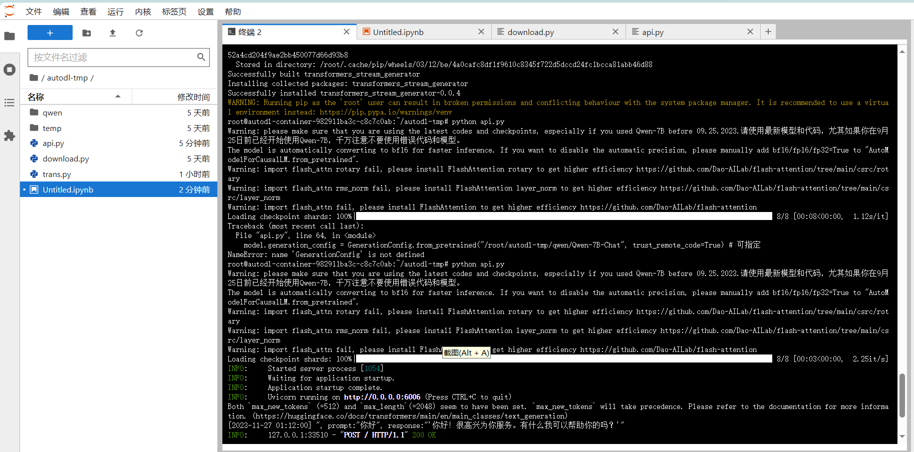
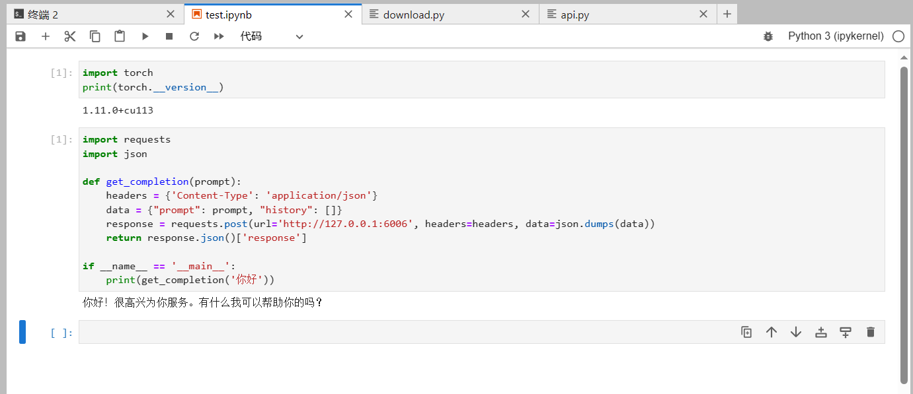

# Qwen-7B-Chat FastApi deployment call

## Environment preparation
Rent a 3090 or other 24G video memory graphics card machine in the autodl platform. As shown in the figure below, select PyTorch-->2.0.0-->3.8(ubuntu20.04)-->11.8 (versions above 11.3 are acceptable)
Next, open JupyterLab on the server you just rented, image and open the terminal in it to start environment configuration, model download and run demonstration. 

pip source change and installation of dependent packages
```
# Upgrade pip
python -m pip install --upgrade pip
# Change pypi source to accelerate library installation
pip config set global.index-url https://pypi.tuna.tsinghua.edu.cn/simple

pip install fastapi==0.104.1
pip install uvicorn==0.24.0.post1
pip install requests==2.25.1
pip install modelscope==1.9.5
pip install transformers==4.35.2
pip install streamlit==1.24.0
pip install sentencepiece==0.1.99
pip install accelerate==0.24.1
pip install transformers_stream_generator==0.0.4
```
## Model download
Use the snapshot_download function in modelscope to download the model. The first parameter is the model name, and the parameter cache_dir is the download path of the model.

Create a new download.py file in the /root/autodl-tmp path and enter the following content in it. Remember to save the file after pasting the code, as shown in the figure below. And run python /root/autodl-tmp/download.py to download. The model size is 15 GB. It takes about 10 to 20 minutes to download the model.

```
import torch
from modelscope import snapshot_download, AutoModel, AutoTokenizer
from modelscope import GenerationConfig
model_dir = snapshot_download('qwen/Qwen-7B-Chat', cache_dir='/root/autodl-tmp', revision='v1.1.4')
```
## Code preparation
Create a new api.py file in the /root/autodl-tmp path and enter the following content in it. Remember to save the file after pasting the code. The following code has very detailed comments. If you have any questions, please raise an issue.
```
from fastapi import FastAPI, Request
from transformers import AutoTokenizer, AutoModelForCausalLM, GenerationConfig
import uvicorn
import json
import datetime
import torch

# Set device parameters
DEVICE = "cuda" # Use CUDA
DEVICE_ID = "0" # CUDA device ID, empty if not set
CUDA_DEVICE = f"{DEVICE}:{DEVICE_ID}"if DEVICE_ID else DEVICE # Combine CUDA device information

# Clean up GPU memory function
def torch_gc():
if torch.cuda.is_available(): # Check if CUDA is available
with torch.cuda.device(CUDA_DEVICE): # Specify CUDA device
torch.cuda.empty_cache() # Clear CUDA cache
torch.cuda.ipc_collect() # Collect CUDA memory fragments

# Create FastAPI application
app = FastAPI()

# Endpoint for handling POST requests
@app.post("/")
async def create_item(request: Request):
global model, tokenizer # Declare global variables to use models and tokenizers inside functions
json_post_raw = await request.json() # Get JSON data for POST request
json_post = json.dumps(json_post_raw) # Convert JSON data to a string
json_post_list = json.loads(json_post) # Convert a string to a Python object
prompt = json_post_list.get('prompt') # Get the prompt in the request
history = json_post_list.get('history') # Get the history in the request
max_length = json_post_list.get('max_length') # Get the maximum length in the request
top_p = json_post_list.get('top_p') # Get the top_p parameter in the request
temperature = json_post_list.get('temperature') # Get the temperature parameter in the request
# Call the model for dialogue generation
response, history = model.chat(
tokenizer,
prompt,history=history,
max_length=max_length if max_length else 2048, # If the maximum length is not provided, 2048 is used by default
top_p=top_p if top_p else 0.7, # If the top_p parameter is not provided, 0.7 is used by default
temperature=temperature if temperature else 0.95 # If the temperature parameter is not provided, 0.95 is used by default
)
now = datetime.datetime.now() # Get the current time
time = now.strftime("%Y-%m-%d %H:%M:%S") # Format the time as a string
# Build response JSON
answer = {
"response": response,
"history": history,
"status": 200,
"time": time
}
# Build log informationlog = "[" + time + "] " + '", prompt:"' + prompt + '", response:"' + repr(response) + '"'
print(log) # print log
torch_gc() # perform GPU memory cleanup
return answer # return response

# main function entry
if __name__ == '__main__':
# load pre-trained tokenizer and model
tokenizer = AutoTokenizer.from_pretrained("/root/autodl-tmp/qwen/Qwen-7B-Chat", trust_remote_code=True)
model = AutoModelForCausalLM.from_pretrained("/root/autodl-tmp/qwen/Qwen-7B-Chat", device_map="auto", trust_remote_code=True).eval()
model.generation_config =GenerationConfig.from_pretrained("/root/autodl-tmp/qwen/Qwen-7B-Chat", trust_remote_code=True) # Specifiable
model.eval() # Set the model to evaluation mode
# Start FastAPI application
# Use port 6006 to map the autodl port to the local, so that the api can be used locally
uvicorn.run(app, host='0.0.0.0', port=6006, workers=1) # Start the application on the specified port and host
```
## Api deployment
Enter the following command in the terminal to start the api service
```
cd /root/autodl-tmp
python api.py
```
After loading, the following information appears, indicating success.


By default, it is deployed on port 6006 and can be called via the POST method. You can use curl to call it, as shown below:
```
curl -X POST "http://127.0.0.1:6006" \
-H 'Content-Type: application/json' \
-d '{"prompt": "你好", "history": []}'
```
You can also use the requests library in Python to call it, as follows:
```
import requests
import json

def get_completion(prompt):
headers = {'Content-Type': 'application/json'}
data = {"prompt": prompt, "history": []}
response = requests.post(url='http://127.0.0.1:6006', headers=headers, data=json.dumps(data))
return response.json()['response']

if __name__ == '__main__':
print(get_completion('你好'))
```
The return value is as follows:

```json
{
"response":"Hello! I'm glad to serve youService. Is there anything I can help you with? ",
"history":[["Hello","Hello! I am glad to serve you. Is there anything I can help you with? "]],
"status":200,
"time":"2023-11-26 1:14:20"
}
```
