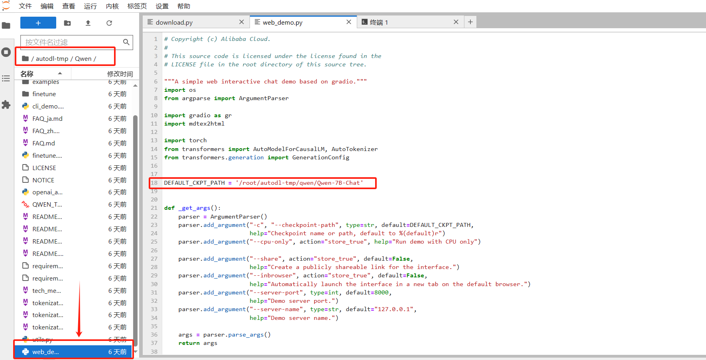
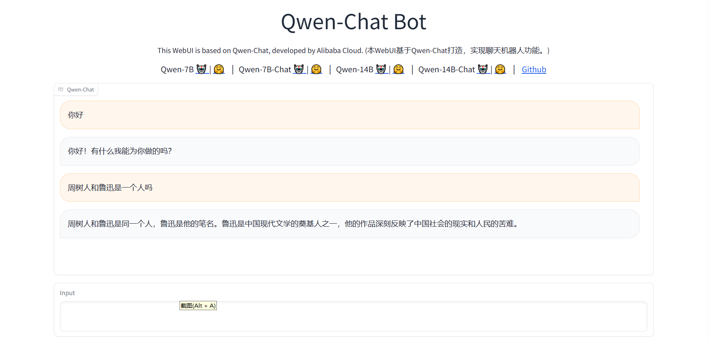

# Qwen-7B-Chat WebDemo
## Environment preparation
Rent a 3090 or other 24G graphics card machine on the autodl platform. As shown in the figure below, select PyTorch-->2.0.0-->3.8(ubuntu20.04)-->11.8

Next, open JupyterLab on the server you just rented, and open the terminal in it to start environment configuration, model download and run demo.

pip change source and install dependent packages
```
# Upgrade pip
python -m pip install --upgrade pip
# Change pypi source to accelerate library installation
pip config set global.index-url https://pypi.tuna.tsinghua.edu.cn/simple>

pip install modelscope==1.9.5
pip install "transformers>=4.32.0" accelerate tiktoken einops scipy transformers_stream_generator==0.0.4 peft deepspeed
```
##Model download
Use the snapshot_download function in modelscope to download the model. The first parameter is the model name, and the parameter cache_dir is the download path of the model.

Create a new download.py file in the /root/autodl-tmp path and enter the following content in it. Remember to save the file after pasting the code, as shown in the figure below. And run python /root/autodl-tmp/download.py to download. The model size is 15 GB. It takes about 10~20 minutes to download the model.
```
import torch
from modelscope import snapshot_download, AutoModel, AutoTokenizer
from modelscope import GenerationConfig
model_dir = snapshot_download('qwen/Qwen-7B-Chat', cache_dir='/root/autodl-tmp', revision='v1.1.4')
```
## Code preparation
First, clone the code and open the academic image acceleration that comes with the autodl platform. For detailed use of academic image acceleration, please see:https://www.autodl.com/docs/network_turbo/
```
source /etc/network_turbo
```
Then switch the path and clone the code.
```
cd /root/autodl-tmp
git clone https://github.com/QwenLM/Qwen.git
```
Switch the commit version to keep it consistent with the tutorial commit version, so that you can reproduce it better.
```
cd Qwen
git checkout 981c89b2a95676a4f98e94218c192c095bed5364
```
Finally, cancel the image acceleration, because the acceleration may have a certain impact on the normal network, avoiding trouble in the subsequent download of other models.
```
unset http_proxy && unset https_proxy
```
Modify the code path and replace the model in line 13 of /root/autodl-tmp/Qwen/web_demo.py with the local /root/autodl-tmp/qwen/Qwen-7B-Chat.

## Demo run
Execute the followingInstall the dependency package with the command:
```
cd /root/autodl-tmp/Qwen
pip install -r requirements.txt
pip install -r requirements_web_demo.txt
```
Run the following command to start the inference service
```
cd /root/autodl-tmp/Qwen
python web_demo.py --server-port 6006
```
Map the autodl port to the local http://localhost:6006 to see the demo interface.

Note: The model will be loaded only after the http://localhost:6006 page is opened in the browser, as shown in the following figure:
