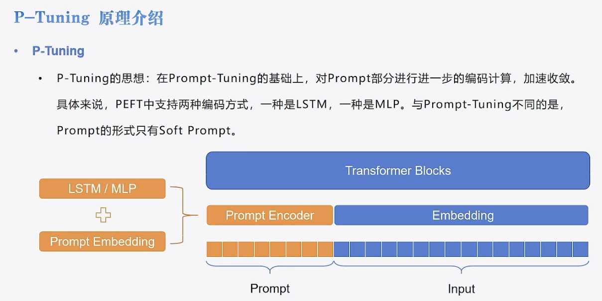

# 05-Qwen-7B-Chat Ptuning fine-tuning

## Ptuning principle
Refer to [transformers-code](https://github.com/zyds/transformers-code)

Data loading and model configuration are consistent with [LoRa](./04-Qwen-7B-Chat%20Lora%20fine-tuning.md). Here are the details of Ptuning:
The basic principle is to freeze all parameters of the main model, add a short prompt before the training data, and then train the embedding layer of the prompt. In Ptuning, there is only soft prompt, which is automatically learned and does not need to be set manually.
- In `Prompt-tuning`, just add a `Prompt Embedding` in front.
- In Ptuning, it is replaced with `Prompt Encoder`, and `LSTM/MLP+Embedding` is added.



## Ptuning PEFT module 
- `PromptEncoderReparameterizationType` determines whether to use LSTM or MLP
- The adjustable parameters are: `num_virtual_tokens`, `encoder_reparameterization_type`, `encoder_dropout`, `encoder_num_layers`, `encoder_hidden_size`
- Note that `encoder_num_layers` sets the number of layers, but the number of layers set by MLP is fixed to 2. This parameter is only valid for LSTM.

```python
from peft import PromptEncoderConfig, TaskType, get_peft_model, PromptEncoderReparameterizationType

config = PromptEncoderConfig(task_type=TaskType.CAUSAL_LM, num_virtual_tokens=10,
encoder_reparameterization_type=PromptEncoderReparameterizationType.MLP,
encoder_dropout=0.1, encoder_num_layers=5, encoder_hidden_size=1024) config ''' PromptEncoderConfig(peft_type=<PeftType.P_TUNING: 'P_TUNING'>, auto_mapping=None, base_model_name_or_path=None, revision=None, task_type=<TaskType.CAUSAL_LM: ' CAUSAL_LM'>, inference_mode=False, num_virtual_tokens=10, token_dim=None, num_transformer_submodules=None, num_attention_heads=None, num_layers=None, encoder_reparameterization_type=<PromptEncoderReparameterizationType.MLP: 'MLP'>, encoder_hidden_size=1024, encoder_num_layers=5, encoder_dropout=0.1)
'''
```

Other visible directories [fine-tuning script] (./05-Qwen-7B-Chat%20Ptuning%20fine-tuning.py)