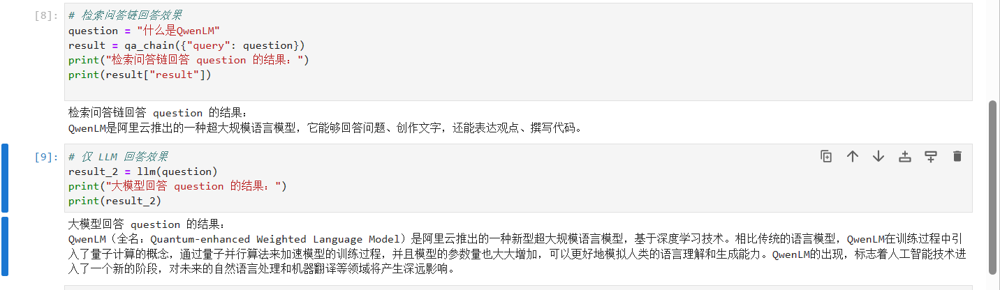
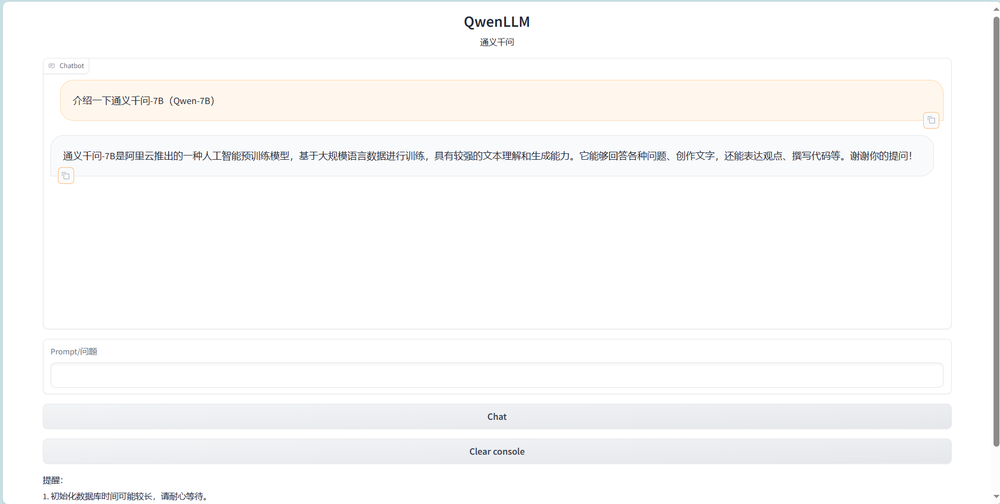

# Qwen-7B-Chat connects to langchain to build a knowledge base assistant
## Environment preparation
Rent a 3090 or other 24G graphics card machine on the autodl platform. As shown in the figure below, select PyTorch-->2.0.0-->3.8(ubuntu20.04)-->11.8

Next, open JupyterLab on the server you just rented, and open the terminal in it to start environment configuration, model download and run demo.

pip change source and install dependent packages

```shell
# Upgrade pip
python -m pip install --upgrade pip
# Change pypi source to accelerate library installation
pip config set global.index-url https://pypi.tuna.tsinghua.edu.cn/simple

pip install modelscope==1.9.5
pip install "transformers>=4.32.0" accelerate tiktoken einops scipy transformers_stream_generator==0.0.4 peftdeepspeed
pip install -U huggingface_hub
```
## Model download

After completing the Qwen-7B-chat deployment, we also need to install the following dependency packages.
Please copy and paste the following command in the terminal and press Enter to run:

```shell
pip install langchain==0.0.292
pip install gradio==4.4.0
pip install chromadb==0.4.15
pip install sentence-transformers==2.2.2
pip install unstructured==0.10.30
pip install markdown==3.3.7
```
At the same time, we also need to use the open source word vector model [Sentence Transformer](https://huggingface.co/sentence-transformers/paraphrase-multilingual-MiniLM-L12-v2) 

Here, use the huggingface image to download to the local /root/autodl-tmp/embedding_model, you can also choose other ways to download

Create a download.py file in the /root/autodl-tmp path and enter the following content in it. Remember to save the file after pasting the code, as shown in the figure below. And run python /root/autodl-tmp/download.py to execute the download.

```python
import os
# Set environment variables
os.environ['HF_ENDPOINT'] = 'https://hf-mirror.com'
# Download model
os.system('huggingface-cli download --resume-download sentence-transformers/paraphrase-multilingual-MiniLM-L12-v2 --local-dir /root/autodl-tmp/embedding_model')
```

Use the `snapshot_download` function in `modelscope` to download the model. The first parameter is the model name, and the parameter `cache_dir` is the download path of the model.

Create a `download` function in the `/root/autodl-tmp` path.py` file and enter the following content in it. Remember to save the file after pasting the code, as shown in the figure below. And run `python /root/autodl-tmp/download.py` to download. The model size is 15 GB, and it takes about 10~20 minutes to download the model.

~~~python
import torch
from modelscope import snapshot_download, AutoModel, AutoTokenizer
import os
model_dir = snapshot_download('qwen/Qwen-7B-Chat', cache_dir='/root/autodl-tmp', revision='master')
~~~

## Knowledge base construction

We use the following two open source repositories as the source of the knowledge base

- [qwen-7B-Chat](https://www.modelscope.cn/models/qwen/Qwen-7B-Chat)

- [QwenLM](https://github.com/QwenLM/Qwen.git)

First, we need to clone the above remote open source repository to the local, which can be used as followsRun the following command:

```shell
# Enter the database disk
cd /root/autodl-tmp
# Enable academic resource acceleration
source /etc/network_turbo
# Clone the open source repository
git clone https://github.com/QwenLM/Qwen.git
# Disable academic resource acceleration
unset http_proxy && unset https_proxy
```

Next, for the convenience of corpus processing, we will use all the markdown and txt files in the above repository as sample corpora. Note that you can also select the code files to add to the knowledge base, but you need to perform additional processing on the code file format.

First, we find all the file paths that meet the conditions in the above warehouse. We define a function that will recursively specify the folder path and return all the file paths that meet the conditions (i.e., files with the suffix .md or .txt):

```python
import os
def get_files(dir_path):
# args: dir_path, target folder path
file_list = []
for filepath, dirnames, filenamesames in os.walk(dir_path):
# os.walk function will recursively traverse the specified folder
for filename in filenames:
# Determine whether the file type meets the requirements by the suffix name
if filename.endswith(".md"):
# If it meets the requirements, add its absolute path to the result list
file_list.append(os.path.join(filepath, filename))
elif filename.endswith(".txt"):
file_list.append(os.path.join(filepath, filename))
return file_list
```

After getting all the target file paths, we can use the FileLoader object provided by LangChain to load the target file and get the plain text content parsed from the target file. Since different types of files require different FileLoader, we determine the target file type and call the corresponding type of FileLoader in a targeted manner. At the same time, call the load method of the FileLoader object to get the loaded plain text object:

```python
from tqdm import tqdm
from langchain.document_loaders import UnstructuredFileLoader
from langchain.document_loaders import UnstructuredMarkdownLoader

def get_text(dir_path):
# args: dir_path, target folder path
# First call the function defined above to get the target file path list
file_lst = get_files(dir_path)
# docs stores the loaded plain text object
docs = []
# Traverse all target files
for one_file in tqdm(file_lst):
file_type = one_file.split('.')[-1]if file_type == 'md':
loader = UnstructuredMarkdownLoader(one_file)
elif file_type == 'txt':
loader = UnstructuredFileLoader(one_file)
else:
# If the file does not meet the conditions, skip directly
continue
docs.extend(loader.load())
return docs
```

Using the above function, we get docs as a list corresponding to a plain text object. After getting the list, we can introduce it into the LangChain framework to build a vector database. To build a vector database from plain text objects, we need to first divide the text into blocks, and then vectorize the text blocks.

LangChain provides a variety of text block tools. Here we use a string recursive splitter and select a block size of 500 and a block overlap length of 150:

```python
from langchain.text_splitter import RecursiveCharacterTextSplitter

text_splitter = RecursiveCharacterTextSplitter(
chunk_size=500, chunk_overlap=150)
split_docs = text_splitter.split_documents(docs)
```
Then we use the open source word vector model [Sentence Transformer](https://huggingface.co/sentence-transformers/paraphrase-multilingual-MiniLM-L12-v2) to vectorize text

LangChain provides an interface for directly introducing models from the HuggingFace open source community for vectorization:
```python
from langchain.embeddings.huggingface import HuggingFaceEmbeddings

embeddings = HuggingFaceEmbeddings(model_name="/root/autodl-tmp/embedding_model")
```
At the same time, we choose Chroma as the vector database. Based on the documents after segmentation and the open source vectorization model loaded above, the corpus is loaded into the vector database under the specified path:
```python
from langchain.vectorstores import Chroma

# Define the persistence path
persist_directory = 'data_base/vector_db/chroma'
# Load the database
vectordb = Chroma.from_documents(
documents=split_docs,
embedding=embeddings,
persist_directory=persist_directory # Allows us to save the persist_directory directory to disk
)
# Persist the loaded vector database to disk
vectordb.persist()
```

Integrate the above code together to build a script for the knowledge base:

```python
# First import the required third-party libraries
from langchain.document_loaders importUnstructuredFileLoader
from langchain.document_loaders import UnstructuredMarkdownLoader
from langchain.text_splitter import RecursiveCharacterTextSplitter
from langchain.vectorstores import Chroma
from langchain.embeddings.huggingface import HuggingFaceEmbeddings
from tqdm import tqdm
import os

# Get file path function
def get_files(dir_path):
# args: dir_path, target folder path
file_list = []
for filepath, dirnames, filenames in os.walk(dir_path):
# os.walk function will recursively traverse the specified folder
for filename in filenames:
# Determine whether the file type meets the requirements by the suffix
if filename.endswith(".md"):
# If it meets the requirements, add its absolute path to the result list
file_list.append(os.path.join(filepath, filename))
elif filename.endswith(".txt"):
file_list.append(os.path.join(filepath, filename))
return file_list

# Load file function
def get_text(dir_path):
# args: dir_path, target folder path
# First call the function defined above to get the target file path list
file_lst = get_files(dir_path)
# docs stores the plain text object after loading
docs = []
# Traverse all target filesfor one_file in tqdm(file_lst):
file_type = one_file.split('.')[-1]
if file_type == 'md':
loader = UnstructuredMarkdownLoader(one_file)
elif file_type == 'txt':
loader = UnstructuredFileLoader(one_file)
else:
# If the file does not meet the conditions, skip directly
continue
docs.extend(loader.load())
return docs

# Target folder
tar_dir = [
"/root/autodl-tmp/qwen",
"/root/autodl-tmp/Qwen",
]

# Load target file
docs = []
for dir_path in tar_dir:
docs.extend(get_text(dir_path))

# Split text into chunks
text_splitter = RecursiveCharacterTextSplitter(
chunk_size=500, chunk_overlap=150)
split_docs = text_splitter.split_documents(docs)

# Load open source word vector model
embeddings = HuggingFaceEmbeddings(model_name="/root/autodl-tmp/embedding_model")

# Build vector database
# Define persistence path
persist_directory = 'data_base/vector_db/chroma'
# Load database
vectordb = Chroma.from_documents(
documents=split_docs,
embedding=embeddings,
persist_directory=persist_directory # Allows us to persist_directory directory to disk
)
# Persist the loaded vector database to disk
vectordb.persist()
```

Run the above script to build a persistent vector database locally, and then directly import the database without repeated construction.

## QwenLM connected to LangChain

To build LLM applications conveniently, we need to customize an LLM class based on the locally deployed QwenLM and connect QwenLM to the LangChain framework. After completing the customized LLM class, the LangChain interface can be called in a completely consistent manner without considering the inconsistency of the underlying model call.

Customizing the LLM class based on the locally deployed QwenLM is not complicated. We only need to inherit a subclass from the LangChain.llms.base.LLM class and rewrite the constructor and _call function:

```python
from langchain.llms.base import LLM
from typing import Any, List, Optional
from langchain.callbacks.manager import CallbackManagerForLLMRun
fromtransformers import AutoTokenizer, AutoModelForCausalLM, GenerationConfig

class QwenLM(LLM):
# Customize LLM class based on local Qwen
tokenizer : AutoTokenizer = None
model: AutoModelForCausalLM = None

def __init__(self, model_path :str):
# model_path: Qwen model path
# Initialize model from local
super().__init__()
print("Loading model from local...")
model_dir = '/root/autodl-tmp/qwen/Qwen-7B-Chat'
self.tokenizer = AutoTokenizer.from_pretrained(model_dir, trust_remote_code=True)self.model = AutoModelForCausalLM.from_pretrained(model_dir, device_map="auto", trust_remote_code=True).eval()
# Specify hyperparameters for generation
self.model.generation_config = GenerationConfig.from_pretrained(model_dir, trust_remote_code=True) # You can specify different generation lengths, top_p and other related hyperparameters
print("Complete loading of local model")

def _call(self, prompt : str, stop: Optional[List[str]] = None,
run_manager: Optional[CallbackManagerForLLMRun] = None,
**kwargs: Any):# Rewrite the call function
response, history = self.model.chat(self.tokenizer, prompt , history=[])
return response

@property
def _llm_type(self) -> str:
return "QwenLM"
```

In the above class definition, we rewrite the constructor and _call function respectively: for the constructor, we load the locally deployed Qwen model at the beginning of the object instantiation, so as to avoid the long time of reloading the model for each call; the _call function is the core function of the LLM class, LangChain will call this function to call LLM, in which we call the chat method of the instantiated model to call the model and return the call result.

In the overall project, we encapsulate the above code as LLM.py, and then directly introduce the custom LLM class from this file.

## Build a retrieval question and answer chain

LangChain encapsulates the entire RAG process by providing a retrieval question and answer chain object. That is, we can call a LangChainThe provided RetrievalQA object can easily complete the whole process of retrieval enhanced question answering by filling in the built database and custom LLM as parameters during initialization. LangChain will automatically complete the whole process of searching based on user questions, obtaining relevant documents, splicing into appropriate prompts and handing them over to LLM for question answering.

First, we need to import the vector database built above. We can directly load the built database through Chroma and the word vector model defined above:

```python
from langchain.vectorstores import Chroma
from langchain.embeddings.huggingface import HuggingFaceEmbeddings
import os

# Define Embeddings
embeddings = HuggingFaceEmbeddings(model_name="/root/autodl-tmp/embedding_model")

# Vector database persistence path
persist_directory = 'data_base/vector_db/chroma'

# Load database
vectordb = Chroma(
persist_directory=persist_directory, 
embedding_function=embeddings
)
```

The vectordb object obtained by the above code is the vector database object we have built. This object can perform semantic vector retrieval for the user's query and obtain knowledge fragments related to the user's question.

Next, we instantiate a custom LLM object based on QwenLM:

```python
from LLM import QwenLM
llm = QwenLM(model_path = "/root/autodl-tmp/qwen")
llm.predict("Who are you")
```
To build a retrieval question and answer chain, you also need to build a Prompt Template. The Template is actually based on a string with variables. After the retrieval, LangChain will fill the retrieved relevant document fragments into the Template variables, thereby realizing the construction of a Prompt with knowledge. We can instantiate such a Template object based on the Template base class of LangChain:

```pythonfrom langchain.prompts import PromptTemplate

# The Prompt template we constructed
template = """Use the following context to answer the final question. If you don't know the answer, just say you don't know, don't try to make up an answer. Try to make your answer brief and to the point. Always say "Thanks for your question! ”.
{context}
Question: {question}
Useful answer: """

# Call LangChain's method to instantiate a Template object, which contains two variables, context and question. When actually called, these two variables will be filled with the retrieved document fragment and the user's question
QA_CHAIN_PROMPT = PromptTemplate(input_variables=["context","question"],template=template)
```

Finally, you can call the retrieval question and answer chain constructor provided by LangChain to build a Qwen-based retrieval question and answer chain based on our custom LLM, Prompt Template and vector knowledge base:

```python
from langchain.chainsimport RetrievalQA

qa_chain = RetrievalQA.from_chain_type(llm,retriever=vectordb.as_retriever(),return_source_documents=True,chain_type_kwargs={"prompt":QA_CHAIN_PROMPT})
```
The obtained qa_chain object can realize our core function, that is, the professional knowledge base assistant based on the QwenLM model. We can compare the Q&A effect of this retrieval Q&A chain and pure LLM:
```python
question = "What is QwenLM"
result = qa_chain({"query": question})
print("The result of searching the Q&A chain to answer question:")
print(result["result"])

# Only LLM answer effect
result_2 = llm(question)
print("The result of answering question with the large model:")
print(result_2)
```


As you can see, usingThe answers generated by the retrieval question and answer chain are closer to the content in the knowledge base.

## Deploy WebDemo

After completing the above core functions, we can deploy it to a web page based on the Gradio framework to build a small Demo for easy testing and use.

First, we encapsulate the above code content into a function that returns the constructed retrieval question and answer chain object, and call this function to get the retrieval question and answer chain object as soon as Gradio is started. The object is then used directly for question and answer dialogue to avoid repeated loading of the model:

```python
# Import necessary libraries
import gradio as gr
from langchain.vectorstores import Chroma
from langchain.embeddings.huggingface import HuggingFaceEmbeddings
import os
from LLM import QwenLM
from langchain.prompts import PromptTemplate

def load_chain():
# Load the question and answer chain
# Define Embeddings
embeddings = HuggingFaceEmbeddings(model_name="/root/autodl-tmp/embedding_model")

# Vector database persistence path
persist_directory = 'data_base/vector_db/chroma'

# Load the database
vectordb = Chroma(
persist_directory=persist_directory, # Allows us to save the persist_directory directory to disk
embedding_function=embeddings
)

llm = QwenLM(model_path = "/root/autodl-tmp/qwen")

template = """Use the following context to answer the last question. If you don't know the answer, say you don't know, don't try to make up an answer. Try to make your answer concise and to the point. Always say "Thanks for your question!" at the end of your answer.
{context}
Question: {question}
Useful answers: """

QA_CHAIN_PROMPT = PromptTemplate(input_variables=["context","question"], template=template) # Run chain from langchain.chains import RetrievalQA qa_chain = RetrievalQA.from_chain_type(llm, retriever=vectordb.as_retriever(), return_source_documents=True, chain_type_kwargs ={"prompt":QA_CHAIN_PROMPT}) return qa_chain ``` Then we define a class, this class is responsible for loading and storing the retrieval question and answer chain, and responding to the action of calling the retrieval question and answer chain to answer in the Web interface:

```python
class Model_center():
"""
Store the object of the question and answer Chain 
"""
def __init__(self):
self.chain = load_chain()

def qa_chain_self_answer(self, question: str, chat_history: list = []):
"""
Call the question and answer chain without history to answer
"""
if question == None or len(question) < 1:
return "", chat_history
try:
chat_history.append(
(question, self.chain({"query": question})["result"]))return "", chat_history
except Exception as e:
return e, chat_history

def clear_history(self):
self.chain.clear_history()
```

Then we just need to instantiate a web interface and bind the click action to the answer method of the above class according to the Gradio framework usage method:

```python
import gradio as gr
model_center = Model_center()

block = gr.Blocks()
with block as demo:
with gr.Row(equal_height=True):
with gr.Column(scale=15):
gr.Markdown("""<h1><center>QwenLM</center></h1>
<center>通义千问</center>""")
# gr.Image(value=LOGO_PATH, scale=1, min_width=10,show_label=False, show_download_button=False)

with gr.Row():
with gr.Column(scale=4):
chatbot = gr.Chatbot(height=450, show_copy_button=True)
# Create a text box component for input prompt.
msg = gr.Textbox(label="Prompt/问题")

with gr.Row():
# Create a submit button.
db_wo_his_btn = gr.Button("Chat")
with gr.Row():
# Create a clear button to clear the chatbot groupclear = gr.ClearButton(
components=[chatbot], value="Clear console")

# Set the button's click event. When clicked, call the qa_chain_self_answer function defined above, pass in the user's message and chat history, and then update the text box and chatbot components.
db_wo_his_btn.click(model_center.qa_chain_self_answer, inputs=[msg, chatbot], outputs=[msg, chatbot])

# Clear the chat history stored in the backend after clicking
clear.click(model_center.clear_history)
gr.Markdown("""Reminder: <br>
1. It may take a long time to initialize the database, please be patient.
2. If an exception occurs during use, it will be displayed in the text input box, please don't panic.<br>
""")
# threads to consume the request
gr.close_all()
# Start a new Gradio application, set the share function to True, and use the environment variable PORT1 to specify the server port.
# demo.launch(share=True, server_port=int(os.environ['PORT1']))
# Start directly
demo.launch()
```

By encapsulating the above code into a run_gradio.py script, you can directly run the command python run_gradio.py in the terminal to start the Web Demo of the knowledge base assistant locally. It will run on port 7860 by default. Use a deployment method similar to mapping the server port to the local port to access it:

