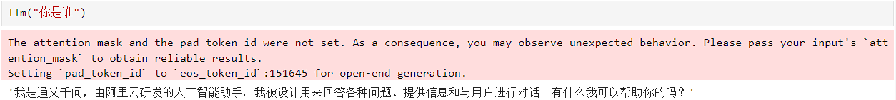

# Qwen1.5-7B-Chat connects to LangChain to build a knowledge base assistant 

## Environment preparation 

Rent a 3090 or other 24G graphics card machine on the autodl platform. As shown in the figure below, select PyTorch-->2.0.0-->3.8(ubuntu20.04)-->11.8 


Next, open JupyterLab on the server you just rented, and open the terminal to start environment configuration, model download and run demo.

pip changes the source to speed up downloading and installing dependent packages

```shell
# Upgrade pip
python -m pip install --upgrade pip
# Change the pypi source to speed up library installation
pip config set global.index-url https://pypi.tuna.tsinghua.edu.cn/simple

pip install modelscope==1.11.0
pip install langchain==0.1.15
pip install "transformers>=4.37.0" accelerate tiktoken einops scipy transformers_stream_generator==0.0.4 peft deepspeed
pip install -U huggingface_hub
``` 

> Considering that some students may encounter some problems in configuring the environment, we have prepared an environment image of Qwen1.5 on the AutoDL platform, which is applicable to all deployment environments of this warehouse except Qwen-GPTQ and vllm. Click the link below and create an Autodl example directly.
> ***https://www.codewithgpu.com/i/datawhalechina/self-llm/self-llm-Qwen1.5***

## Model download

Use the snapshot_download function in modelscope to download the model. The first parameter is the model name, and the parameter cache_dir is the download path of the model.

Create a new model_download.py file in the /root/autodl-tmp path and enter the following content in it. Remember to save the file after pasting the code, as shown in the figure below. And run `python /root/autodl-tmp/model_download.py`Execute the download. The model size is 14 GB. It takes about 2 minutes to download the model.

```python 

import torch
from modelscope import snapshot_download, AutoModel, AutoTokenizer
import os
model_dir = snapshot_download('qwen/Qwen1.5-7B-Chat', cache_dir='/root/autodl-tmp', revision='master')
```

## Code preparation

To build LLM applications conveniently, we need to customize an LLM class based on the locally deployed Qwen2-LM and connect Qwen2 to the LangChain framework. After completing the customized LLM class, the LangChain interface can be called in a completely consistent way without considering the inconsistency of the underlying model call.

The custom LLM class based on the local deployment of Qwen2 is not complicated. We only need to inherit a subclass from the LangChain.llms.base.LLM class and rewrite the constructor and _call function:

```python
from langchain.llms.base.LLMlms.base import LLM
from typing import Any, List, Optional
from langchain.callbacks.manager import CallbackManagerForLLMRun
from transformers import AutoTokenizer, AutoModelForCausalLM, GenerationConfig, LlamaTokenizerFast
import torch

class Qwen2_LLM(LLM):
# Customize LLM class based on local Qwen2
tokenizer: AutoTokenizer = None
model: AutoModelForCausalLM = None

def __init__(self, mode_name_or_path :str):

super().__init__()
print("Loading model from local...")
self.tokenizer =AutoTokenizer.from_pretrained(mode_name_or_path, use_fast=False) self.model = AutoModelForCausalLM.from_pretrained(mode_name_or_path, torch_dtype=torch.bfloat16, device_map="auto") self.model.generation_config = GenerationConfig.from_pretrained(mode_name_or_path) print("Complete local model Loading") def _call(self, prompt : str, stop: Optional[List[str]] = None, run_manager: Optional[CallbackManagerForLLMRun] = None, **kwargs: Any): messages = [{"role": "user", "content": prompt }] input_ids = self.tokenizer.apply_chat_template(messages, tokenize=False, add_generation_prompt=True) model_inputs = self.tokenizer([input_ids], return_tensors=" pt").to('cuda') generated_ids = self.model.generate(model_inputs.input_ids,max_new_tokens=512) generated_ids = [ output_ids[len(input_ids):] for input_ids, output_ids in zip(model_inputs.input_ids, generated_ids) ] response = self.tokenizer.batch_decode(generated_ids, skip_special_tokens=True)[0]

return response
@property
def _llm_type(self) -> str:
return "Qwen2_LLM"
```

In the above class definition, we rewrite the constructor and _call function respectively: for the constructor, we load the locally deployed Qwen2 model at the beginning of the object instantiation, so as to avoid the long time of reloading the model for each call; the _call function is the core function of the LLM class, which LangChain will call to call LLM. In this function, we call the generate method of the instantiated model to call the model and return the call result.

In the overall project, we encapsulate the above code as LLM.py, and then directly introduce the custom LLM class from this file.

## Call

Then you can use it like any other langchain large model function.

```python
from LLM import Qwen2_LLM
llm = Qwen2_LLM(mode_name_or_path = "/root/autodl-tmp/qwen/Qwen1.5-7B-Chat")
llm("Who are you")
```

