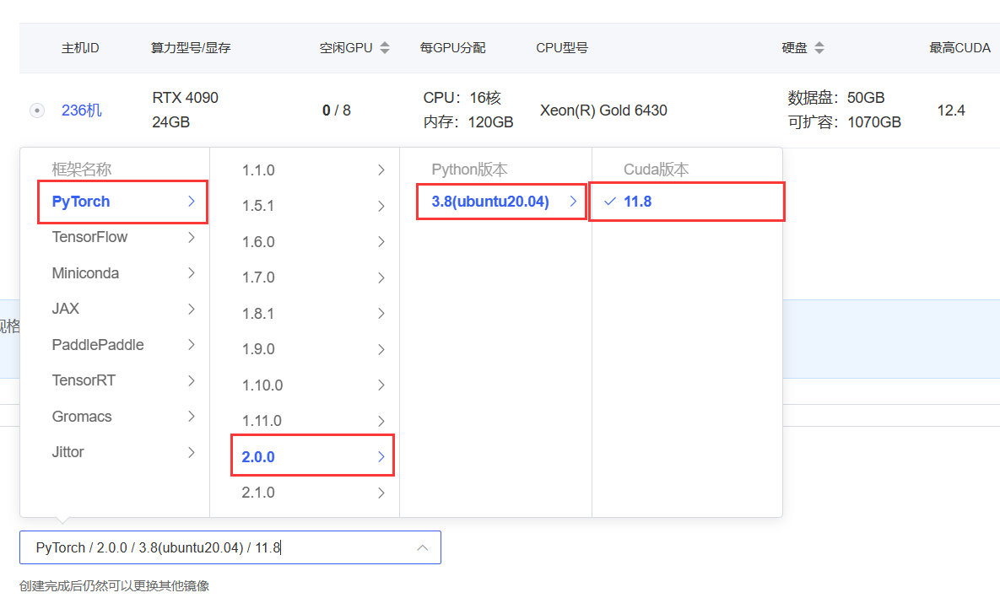
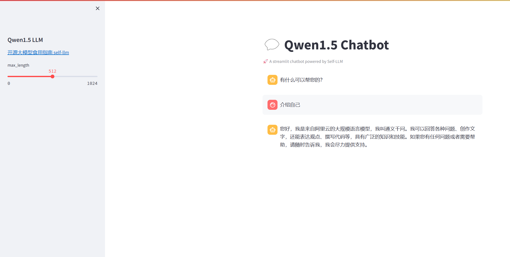

# Qwen1.5-7B-Chat-GPTQ-Int4 deployment environment

## Description

Qwen1.5-72b version has three versions: BF16, INT8, and INT4. The performance of the three versions is similar. Since the BF16 version requires 144GB of video memory, ordinary users forget to stop, while the INT4 version only needs 48GB for inference, creating opportunities for local deployment for ordinary users. (It is recommended to use a machine with 4×24G video memory)

However, since Qwen1.5-72B-Chat-GPTQ-Int4 uses GPTQ quantization technology, it has strict requirements on the environment and requires more complex environment preparation steps.

Here is an environment preparation tutorial. This tutorial takes *Qwen1.5-7B-Chat-GPTQ-Int4* as an example, and is also applicable to *GPTQ-Int4* versions of other sizes.

## Environment preparation

### Platform and cuda part

Rent a 4090 or other 24G video memory graphics card machine in the autodl platform. As shown in the figure below, select PyTorch-->2.0.0-->3.8(ubuntu20.04)-->11.8 (strictly follow the cuda11.8 version)
Next, open JupyterLab on the server you just rented, and open the terminal in it to start environment configuration.



Description:
- Make sure the graphics card driver supports cuda11.8
- The process **needs to strictly meet the version correspondence of nvcc-pytorch-GPTQ**, otherwise GPTQ cannot be compiled successfully.

(For the reason, see the Quantization section of [Qwen library](https://github.com/QwenLM/Qwen?tab=readme-ov-file). Since the GPTQ tool requires a strict correspondence between cuda and torch, and due to the bugs that may be caused by recent upgrades, we chose cuda11.8 for safety reasons, and installed the corresponding torch according to the torch2.1 required by the qwen library, and then used the GPTQ source code to build to ensure the correct operation of cuda.)

Ensure that nvcc can work properly:
```shell
nvcc -V
# Check the output. If it is Cuda compilation tools, release 11.8, skip the platform and cuda parts
```
---
If cuda11.8 cannot be selected due to the subsequent environment update of Autodl, you can **build the cuda11.8** environment by yourself in the following way. This method has been tested.
```shell
# Download and install the driver
wget https://developer.download.nvidia.com/compute/cuda/11.8.0/local_installers/cuda_11.8.0_520.61.05_linux.run

# Check cudatoolkit and install
sudo sh cuda_11.8.0_520.61.05_linux.run

# Add nvcc environment variables
vim ~/.bashrc 

# Add the following two lines
export PATH=/usr/local/cuda-11.8/bin:$PATH
export LD_LIBRARY_PATH=/usr/local/cuda-11.8/lib64:$LD_LIBRARY_PATH

# Reload
source ~/.bashrc 
nvcc -V 
```
--- 

### Virtual environment configuration
Since the torch in the base environment may not meet the requirements, create a virtual environment.
```shell
# Create a virtual environment
conda create -n qwen python==3.10

# Install the specified version of pytorch
pip install torch==2.1.1 torchvision==0.16.1 torchaudio==2.1.1 --index-url https://download.pytorch.org/whl/cu118

# Install dependencies required by Qwen1.5
pip install accelerate tiktoken einops transformers_stream_generator==0.0.4 scipy optimum peft transformers streamlit modelscope
```

Install GPTQ from source code (auto-gptq>=0.5.1), otherwise it is very easy for GPTQ to fail to use cuda
```shell
# Install GPTQ library required for quantization from source code
pip install "git+https://github.com/PanQiWei/AutoGPTQ.git@v0.7.1"

```
See [Qwen library](https://github.com/QwenLM/Qwen?tab=readme-ov-file)Quantization section description:

> Note: The pre-compiled `auto-gptq` packages strongly depend on the version of `torch` and its CUDA version. Moreover, due to recent update, 
> you may also encounter unsupported version errors from `transformers`, `optimum`, or `peft`.
> We recommend using the latest versions meeting the following requirements:
> - torch==2.1 auto-gptq>=0.5.1 transformers>=4.35.0 optimum>=1.14.0 peft>=0.6.1
> - torch>=2.0,<2.1 auto-gptq<0.5.0 transformers<4.35.0 optimum<1.14.0 peft>=0.5.0,<0.6.0

At this point, the environment is ready.

## Model download
Use the snapshot_download function in modelscope to download the model. FirstThe first parameter is the model name, and the parameter cache_dir is the model download path.

Create a new download.py file in the /root/autodl-tmp path and enter the following content in it. Remember to save the file after pasting the code, as shown in the figure below. And run python /root/autodl-tmp/download.py to execute the download. It takes about 2 minutes to download the model.

```
import torch
from modelscope import snapshot_download, AutoModel, AutoTokenizer
from modelscope import GenerationConfig
model_dir = snapshot_download('qwen/Qwen1.5-7B-Chat-GPTQ-Int4', cache_dir='/root/autodl-tmp', revision='master')
```
Note: After downloading, you need to confirm the name of the downloaded Qwen1.5-7B-Chat-GPTQ-Int4 file. It may cause subsequent bugs due to incorrect decoding problems.
## Code preparation

Create a new `c in the `/root/autodl-tmp` pathhatBot.py` file and enter the following content in it. Remember to save the file after pasting the code. The code below has very detailed comments. If you don't understand anything, please raise an issue.

```python
# Import the required libraries
from transformers import AutoTokenizer, AutoModelForCausalLM, GenerationConfig
import torch
import streamlit as st

# Create a title and a link in the sidebar
with st.sidebar:
st.markdown("## Qwen1.5 LLM")
"[Open Source Large Model Eating Guide self-llm](https://github.com/datawhalechina/self-llm.git)"
# Create a slider for selecting the maximum length, ranging from 0 to 1024, with a default value of 512
max_length = st.slider("max_length", 0, 1024, 512, step=1)

# Create a title and a subtitle
st.title("💬 Qwen1.5 Chatbot")
st.caption("🚀 A streamlit chatbot powered by Self-LLM")

# Define model path
mode_name_or_path = '/root/autodl-tmp/qwen/Qwen1.5-7B-Chat-GPTQ-Int4'

# Define a function to get the model and tokenizer
@st.cache_resource
def get_model():
# Get tokenizer from pre-trained model
tokenizer = AutoTokenizer.from_pretrained(mode_name_or_path, use_fast=False)
# Get the model from the pre-trained model and set the model parameters. Pay special attention to torch_dtype being auto, otherwise the data type sent to the device will be inconsistent
model = AutoModelForCausalLM.from_pretrained(mode_name_or_path, torch_dtype="auto", device_map="auto")

return tokenizer, model

# Load the model and tokenizer of Qwen1.5-4B-Chat
tokenizer, model = get_model()

# If there is no "messages" in session_state, create a list containing default messages
if "messages" not in st.session_state:
st.session_state["messages"] = [{"role": "assistant", "content": "How can I help you?"}]

# Traverse all messages in session_state and display them on the chat interface
for msg in st.session_state.messages:
st.chat_message(msg["role"]).write(msg["content"])

# If the user enters content in the chat input box, do the following
if prompt := st.chat_input():
# Add the user's input to the messages list in session_state
st.session_state.messages.append({"role": "user", "content": prompt}) # Display the user's input on the chat interface st.chat_message("user").write(prompt) # Build input input_ids = tokenizer.apply_chat_template (st.session_state.messages,tokenize=False,add_generation_prompt=True) model_inputs = tokenizer([input_ids], return_tensors="pt").to('cuda') generated_ids = model.generate(model_inputs.input_ids, max_new_tokens=512) generated_ids = [ output_ids[len(input_ids):] for input_ids, output_ids in zip(model_inputs.input_ids, generated_ids)
]
response = tokenizer.batch_decode(generated_ids, skip_special_tokens=True)[0]
# Add the output of the model to the messages list in session_state
st.session_state.messages.append({"role": "assistant", "content": response})
# Display the output of the model on the chat interface
st.chat_message("assistant").write(response)
# print(st.session_state)
```

## Run demo

Run the following command in the terminal to start the streamlit service, map the port to the local according to the instructions of `autodl`, and then open the link http://localhost:6006/ in the browser to see the chat interface.

```bash
streamlit run /root/autodl-tmp/chatBot.py --server.address 127.0.0.1 --server.port 6006
```
Final result:

