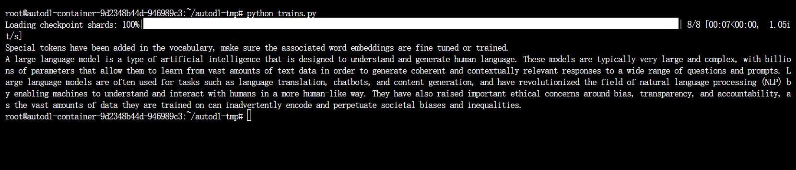

# Qwen1.5-MoE-chat Transformers deployment call
## Qwen1.5-MoE-chat introduction
Qwen1.5-MoE-chat uses only 2.7B activation parameters, achieving the same capabilities as the most advanced 7B models such as Mistral 7B and Qwen1.5-7B models. Compared with Qwen1.5-7B, the training cost of Qwen1.5-MoE-A2.7B is reduced by 75%, and the inference speed is increased to 1.74 times.

Compared with the Mixtral-MoE model, Qwen1.5-MoE has the following improvements in model structure: using finegrained experts, using the existing Qwen1.8B initialization model, and using new routing mechanisms such as shared experts and routing experts.

For a complete introduction, please refer to the official blog: [Qwen1.5-MoE: 1/3 of the activation parameters achieve the performance of a 7B model](https://qwenlm.github.io/zh/blog/qwen-moe/)

## Talk about video memory calculation
The considerations for video memory calculation will vary with different model types and tasks

The Transformers deployment call here is an inference task, so only model parameters, KV Cache, intermediate results and input data need to be considered.The model here is a MoE model, considering the complete model parameters (14.3B); using bf16 loading, and considering the intermediate results, input data and KV Cache, it is about `2x1.2x14.3` video memory requirements, so we will choose dual cards with a total of 48G video memory later

For a more complete video memory calculation, refer to this blog: [[Transformer Basic Series] Manual Video Memory Occupancy](https://zhuanlan.zhihu.com/p/648924115)
## Environment Preparation
Rent a **dual card 3090 and other 24G (total 48G) video memory** machine on the autodl platform, as shown in the figure below, select PyTorch-->2.1.0-->3.10(ubuntu22.04)-->12.1
Next, open the JupyterLab of the server just rented, image and open the terminal in it to start environment configuration, model download and run demonstration. 

pip source change and install dependent packages
```shell
# Because it involves accessing github, it is best to open the academic mirror acceleration of autodl
source /etc/network_turbo
# Upgrade pip
python -m pip install --upgrade pip
#Replace the pypi source to accelerate the installation of the library
pip config set global.index-url https://pypi.tuna.tsinghua.edu.cn/simple
# Install the new version containing qwen1.5-moe from the github repository of transformers
pip install git+https://github.com/huggingface/transformers
# Install the required python packages
pip install modelscope sentencepiece accelerate fastapi uvicorn requests streamlit transformers_stream_generator
# Install flash-attention
pip install https://github.com/Dao-AILab/flash-attention/releases/download/v2.4.2/flash_attn-2.4.2+cu122torch2.1cxx11abiFALSE-cp310-cp310-linux_x86_64.whl
```
## Model download
Use ModelScope to download the model
```python
import torch
from modelscope import snapshot_download, AutoModel, AutoTokenizer
import os
model_dir = snapshot_download('qwen/Qwen1.5-MoE-A2.7B-Chat', cache_dir='/root/autodl-tmp', revision='master')
```
## Code preparation
Create a new trains.py file in the /root/autodl-tmp path and enter the following content in it
```python
import torch # Import the torch library for deep learning related operations
from transformers import AutoTokenizer, AutoModelForCausalLM, GenerationConfig # The three classes are used to load the tokenizer, load the causal language model, and load the generation configuration respectively

# Set the model path to the model path just downloaded
model_name = "/root/autodl-tmp/qwen/Qwen1.5-MoE-A2.7B-Chat"

# Load the language model, set the data type to bfloat16, i.e. mixed precision format, to optimize performance and reduce video memory usage, set the inference device to `auto` to automatically select the best device for inference, if no GPU is available, it may fall back to the CPU
model = AutoModelForCausalLM.from_pretrained(model_name, torch_dtype=torch.bfloat16, device_map="auto")

# Load the tokenizer
tokenizer = AutoTokenizer.from_pretrained(model_name)

# Define the input string
prompt = "Give me a short introduction to large language model."
messages = [
{"role": "system", "content": "You are a helpful assistant."},
{"role": "user", "content": prompt}
]
# Use tokenizerThe apply_chat_template method of the tokenizer processes messages and converts the format
text = tokenizer.apply_chat_template(
messages,
tokenize=False,
add_generation_prompt=True # Add generation prompt before the message
)
# Convert the text in the text variable to the format of the model input, specifying the returned tensor as a PyTorch tensor ("pt")
model_inputs = tokenizer([text], return_tensors="pt").to(device)
# Use the generate method of the model to generate text
generated_ids = model.generate(
model_inputs.input_ids,
max_new_tokens=512
)
# Extract the newly generated tokens in addition to the original input from the generated ID
generated_ids = [
output_ids[len(input_ids):] for input_ids, output_ids in zip(model_inputs.input_ids, generated_ids)
]
# Use the batch_decode method of the tokenizer to convert the generated token ID back to text
response = tokenizer.batch_decode(generated_ids, skip_special_tokens=True)[0]
# Display the generated answer
print(response)
```
The running result is shown in the figure below. The model generates the result corresponding to the prompt in the code:

