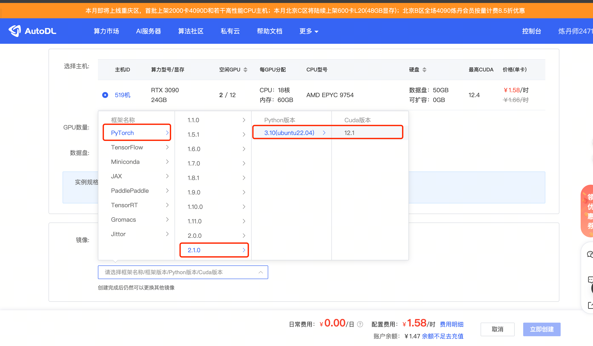
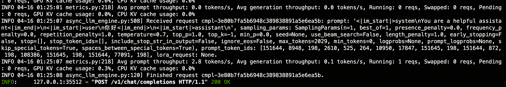

# Qwen1.5-7B-Chat vLLM deployment call

## vLLM Introduction
The vLLM framework is an efficient large language model (LLM) **reasoning and deployment service system**, with the following features:

- **Efficient memory management**: Through the PagedAttention algorithm, vLLM achieves efficient management of KV cache, reduces memory waste, and optimizes the operation efficiency of the model.

- **High throughput**: vLLM supports asynchronous processing and continuous batch processing requests, significantly improves the throughput of model reasoning, and accelerates text generation and processing speed.

- **Ease of use**: vLLM seamlessly integrates with the HuggingFace model, supports a variety of popular large language models, and simplifies the process of model deployment and reasoning. Compatible with OpenAI's API server.

- **Distributed reasoning**: The framework supports distributed reasoning in a multi-GPU environment, and improves the ability to process large models through model parallel strategies and efficient data communication.

- **Open Source**: vLLM is open source and has active community support, which facilitates developers to contribute and improve, and jointly promote technological development.

## Environment Preparation 
Rent a 3090 or other 24G graphics card machine in the Autodl platform, as shown in the following figure, select PyTorch-->2.1.0-->3.10(ubuntu22.04)-->12.1

Next, open JupyterLab on the server you just rented, and open the terminal to start environment configuration, model download and run the demonstration. 



pip changes the source to speed up downloading and installing dependent packages

```shell
# Upgrade pip
python -m pip install --upgrade pip
# Change pypi source to speed up library installation
pip config set global.index-url https://pypi.tuna.tsinghua.edu.cn/simple

pip install modelscope==1.11.0
pip install openai==1.17.1
pip install torch==2.1.2+cu121
pip install tqdm==4.64.1
pip install transformers==4.39.3
pip install flash-attn==2.5.7 --no-build-isolation
pip install vllm==0.4.0.post1
``` 

Directly installing vLLM will install CUDA 12.1 version.
```shell
pip install vllm
```

If we need to install vLLM in the CUDA 11.8 environment, we can use the following command to specify the vLLM version and python version to download.
```shell
export VLLM_VERSION=0.4.0
export PYTHON_VERSION=38
pip install https://github.com/vllm-project/vllm/releases/download/v${VLLM_VERSION}/vllm-${VLLM_VERSION}+cu118-cp${PYTHON_VERSION}-cp${PYTHON_VERSION}-manylinux1_x86_64.whl --extra-index-url https://download.pytorch.org/whl/cu118
```

> Considering that some students may encounter some problems in configuring the environment, we have prepared a vLLM environment image on the AutoDL platform.The image is suitable for any deployment environment that requires vLLM. Click the link below and create an AutoDL example directly. (vLLM has high requirements for the torch version, and the higher the version, the more complete the model support and the better the effect, so create a new image.)
> ***https://www.codewithgpu.com/i/datawhalechina/self-llm/self-llm-vllm***

## Model download

Use the snapshot_download function in modelscope to download the model. The first parameter is the model name, and the parameter cache_dir is the download path of the model.

Create a new model_download.py file in the /root/autodl-tmp path and enter the following content in it. Please save the file in time after pasting the code, as shown in the figure below. And run `python /root/autodl-tmp/model_download.py` to execute the download. The model size is 14GB, and it takes about 2 minutes to download the model.

```python
import torch
from modelscope import snapshot_download, AutoModel, AutoTokenizer
import os
model_dir = snapshot_download('qwen/Qwen1.5-7B-Chat', cache_dir='/root/autodl-tmp', revision='master')
``` 

## Code preparation 

### python file
Create a new vllm_model.py file in the /root/autodl-tmp path and enter the following content in it. Please save the file in time after pasting the code. The following code has very detailed comments. If you don't understand it, please raise an issue. 

First, import the LLM and SamplingParams classes from the vLLM library. The `LLM` class is the main class for running offline inference using the vLLM engine. The `SamplingParams` class specifies the parameters of the sampling process, which is used to control and adjust the randomness and diversity of the generated text.

vLLM provides a very convenient encapsulation. We can directly pass in the model name or model path without manually initializing the model and tokenizer.

We can use this demo to get familiar with the use of the vLLM engine. The commented content can enrich the model's capabilities, but it is not necessary. You can choose as needed.

```pythonfrom vllm import LLM, SamplingParams
from transformers import AutoTokenizer
import os
import json

# When automatically downloading the model, specify to use modelscope. If not set, it will be downloaded from huggingface
# os.environ['VLLM_USE_MODELSCOPE']='True'

def get_completion(prompts, model, tokenizer=None, max_tokens=512, temperature=0.8, top_p=0.95, max_model_len=2048):
# Create sampling parameters. temperature controls the diversity of generated text, and top_p controls the probability of core sampling
sampling_params = SamplingParams(temperature=temperature, top_p=top_p, max_tokens=max_tokens)
# Initialize the vLLM inference engine
llm = LLM(model=model, tokenizer=tokenizer, max_model_len=max_model_len)
outputs = llm.generate(prompts, sampling_params)
return outputs

if __name__ == "__main__": 
# Initialize vLLM inference engine
model='/root/autodl-tmp/qwen/Qwen1.5-7B-Chat' # Specify model path
# model="Qwen/Qwen1.5-MoE-A2.7B-Chat" # Specify model name, automatically download model
tokenizer = None
# tokenizer = AutoTokenizer.from_pretrained(model, use_fast=False) # Load the tokenizer and pass in the vLLM model, but it is not necessary.

text = ["Tell me about large language models.",
"Tell me how to become stronger."]
# messages = [
#{"role": "system", "content": "You are a useful assistant."},
# {"role": "user", "content": prompt}
# ]
# Message as a chat template, not necessary.
# text = tokenizer.apply_chat_template(
# messages,
# tokenize=False,
# add_generation_prompt=True
# )

outputs = get_completion(text, model, tokenizer=tokenizer, max_tokens=512, temperature=1, top_p=1, max_model_len=2048)

# Output is a list of RequestOutput objects containing prompt, generated text, and other information.
# Print the output.
for output in outputs:
prompt = output.prompt
generated_text = output.outputs[0].text
print(f"Prompt: {prompt!r}, Generated text: {generated_text!r}")

```


### Create a server compatible with the OpenAI API interface

Qwen is compatible with the OpenAI API protocol, so we can directly use vLLM to create an OpenAI API server. vLLM is very convenient for deploying servers that implement the OpenAI API protocol. By default, the server will be started at http://localhost:8000. The server currently hosts one model at a time and implements the list model, completions, and chat completions ports.

- Completions: is a basic text generation task, where the model generates a piece of text after a given prompt. This type of task is usually used to generate articles, stories, emails, etc.
- Chat completions: is a dialogue-oriented task, where the model needs to understand and generate dialogue. This type of taskUsually used to build chatbots or dialogue systems.

When creating a server, we can specify parameters such as model name, model path, chat template, etc.

- The --host and --port parameters specify the address.

- The --model parameter specifies the model name.

- The --chat-template parameter specifies the chat template.

- The --served-model-name specifies the name of the service model.

- The --max-model-len specifies the maximum length of the model.

`--max-model-len=2048` is specified here because the maximum length of the Qwen1.5-7B-Chat model is too long, 32768, which causes vLLM to consume too many resources when initializing the KV cache.

```bash
python -m vllm.entrypoints.openai.api_server --model /root/autodl-tmp/qwen/Qwen1.5-7B-Chat --served-model-name Qwen1.5-7B-Chat --max-model-len=2048
```

1. View the current model list through the curl command.
```bash
curl http://localhost:8000/v1/models
```

The returned value is as follows:
```json
{"object":"list","data":[{"id":"Qwen1.5-7B-Chat","object":"model","created":1713201531,"owned_by":"vllm","root":"Qwen1.5-7B-Chat","parent":null,"permission":[{"id":"modelperm-b676428b47cb4ca19187876663da5eb3","obj ect":"model_permission","created":1713201531,"allow_create_engine":false,"allow_sampling":true,"allow_logprobs":true,"allow_search_indices":false,"allow_view":true,"allow_fine_tuning":false,"organization":"*","group":null,"is_blocking":false}]}]} ```2. Use the curl command to test the OpenAI Completions API.
```bash
curl http://localhost:8000/v1/completions \
-H "Content-Type: application/json" \
-d '{
"model": "Qwen1.5-7B-Chat",
"prompt": "你好",
"max_tokens": 7,
"temperature": 0
}'
```

The return value is as follows:
```json
{"id":"cmpl-ca4722e3c92a4e578da8f1f8fe378b35","object":"text_completion","created":1713201551,"model":"Qwen1.5-7B-Chat","choices":[{"index":0,"text":",I have a problem that I need help solving","logprobs":null,"finish_reason":"length","stop_reason":null}],"usage":{"prompt_tokens":1,"total_tokens":8,"completion_tokens":7}}
```

You can also use python scripts to request OpenAI Completions API.
```python
from openai import OpenAI
client = OpenAI(
base_url="http://localhost:8000/v1",
api_key="token-abc123", # Just set it, just to pass the interface parameter verification
)

completion = client.chat.completions.create(
model="Qwen1.5-7B-Chat",
messages=[
{"role": "user", "content": "Hello"}
]
)

print(completion.choices[0].message)
```
The return value is as follows:
```
ChatCompletionMessage(content='Hello! What can I do?Can you help me? ', role='assistant', function_call=None, tool_calls=None)
```

3. Test the OpenAI Chat Completions API with the curl command.
```bash
curl http://localhost:8000/v1/chat/completions \
-H "Content-Type: application/json" \
-d '{
"model": "Qwen1.5-7B-Chat",
"messages": [
{"role": "system", "content": "You are a helpful assistant."},
{"role": "user", "content": "Hello"}
]
}'
```

The return value is as follows:
```json
{"id":"cmpl-6f002a1ddfa2420e83808032ed912809","object":"chat.completion","created":1713201596,"model":"Qwen1.5-7B-Chat","choices":[{"index":0,"message":{"role":"assistant","content":"Hello! I am glad to help you. Do you have any questions or need advice?"},"logprobs":null,"finish_reason":"stop","stop_reason":null}],"usage":{"prompt_tokens":20,"total_tokens":36,"completion_tokens":16}}
```

You can also use python scripts to request the OpenAI Chat Completions API.

```python
from openai import OpenAI
openai_api_key = "EMPTY" # Just set it, just to pass the interface parameter verification
openai_api_base = "http://localhost:8000/v1"

client = OpenAI(
api_key=openai_api_key,
base_url=openai_api_base,
)
chat_outputs = client.chat.completions.create(
model="Qwen1.5-7B-Chat",
messages=[
{"role": "system", "content": "You are a helpful assistant."},
{"role": "user", "content": "你好"},
]
)
print(chat_outputs)
```

The return value is as follows:
```
ChatCompletion(id='cmpl-1889c8c4e11240e3a6cab367b26d32b5', choices=[Choice(finish_reason='stop', index=0, logprobs=None, message=ChatCompletionMessage(content='Hello! I am glad to help you. Do you have any questions or need advice?', role='assistant', function_call=None, tool_calls=None), stop_reason=None)], created=1713201854, model='Qwen1.5-7B-Chat', object='chat.completion', system_fingerprint=None, usage=CompletionUsage(completion_tokens=17, prompt_tokens=20, total_tokens=37))
```

The API backend will also print some logs and statistics when processing requests.


## Speed ​​test

Since vLLM is an efficient large-scale language model inference and deployment service system, let's test the model generation speed. See how big the gap is with the original speed. Here we directly use the benchmark_throughput.py script that comes with vLLM for testing. You can put the benchmark_throughput.py script in the current folder under /root/autodl-tmp/. Or you can[Download the script](https://github.com/vllm-project/vllm/blob/main/benchmarks/benchmark_throughput.py) by yourself.

Here are some parameter descriptions of the benchmark_throughput.py script:
- --model The parameter specifies the model path or name.
- --backend The inference backend, which can be vllm, hf, and mii. The distribution corresponds to vLLM, HuggingFace, and Mii inference backends.
- --input-len Input length
- --output-len Output length
- --num-prompts Number of prompts generated
- --seed 2024 Random seed
- --dtype float16 Floating point precision
- --max-model-len Maximum model length
- --hf_max_batch_size Maximum batch size of the transformers library (only valid for the hf inference backend and required)
- --dataset Dataset path. (Data will be automatically generated if not set)

Test the speed of vLLM:
```bash
python benchmark_throughput.py \
--model /root/autodl-tmp/qwen/Qwen1.5-7B-Chat \
--backend vllm \
--input-len 64 \
--output-len 128 \
--num-prompts 25 \
--seed 2024 \
--dtype float16 \
--max-model-len 512
```
The results are as follows:
```
Throughput: 6.34 requests/s, 1216.34 tokens/s
```
Test the speed of the original method (using hunggingface's transformers library):
```bash
python benchmark_throughput.py \
--model /root/autodl-tmp/qwen/Qwen1.5-7B-Chat \
--backend hf \
--input-len 64 \
--output-len 128 \
--num-prompts 25 \
--seed 2024 \
--dtype float16 \
--hf-max-batch-size 25
```
The results are as follows:
```
Throughput: 4.03 requests/s, 773.74 tokens/s
```

Comparing the speed of the two, in this test, the speed of vLLM is about **50%** faster than the original speed (this test is relatively casual and is only for reference in this case, not for other cases).
| Reasoning Framework | Throughput | tokens/s |
| :---: | :---: | :---: |
| vllm | 6.34 requests/s | 1216.34 tokens/s |
| hf | 4.03 requests/s | 773.74 tokens/s |
| diff | 57.32% | 57.10% |