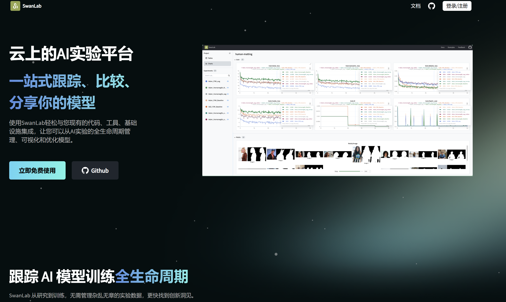
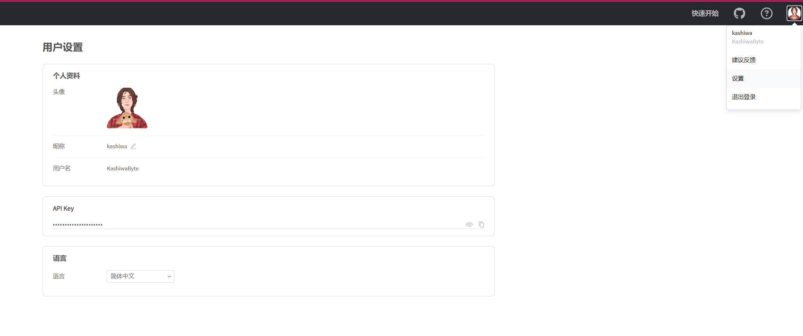
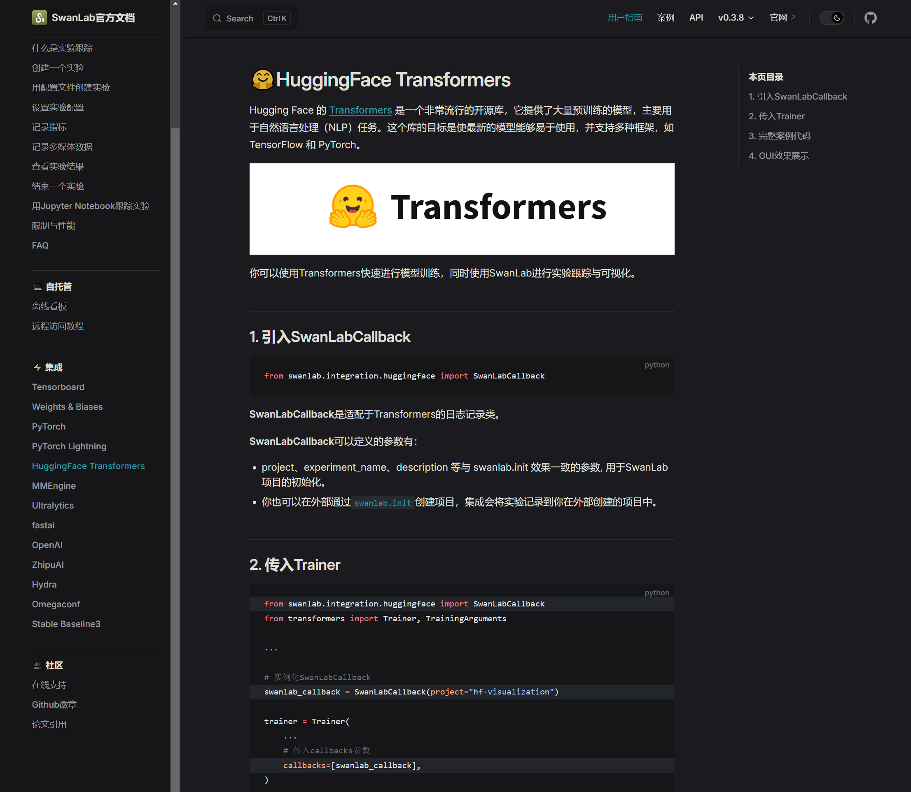
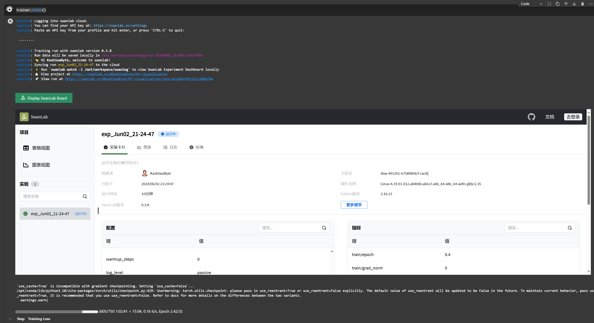
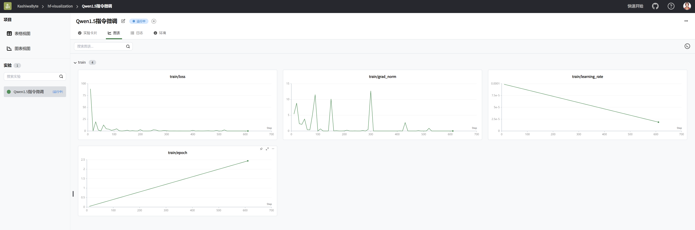

# Qwen1.5-7B-chat Lora fine-tuning access to SwanLab experiment management platform

In this section, we will add model experiment management tools based on the previous fine-tuning training to realize the detection of experimental training. Briefly introduce how to fine-tune the Qwen1.5-7B-chat model with Lora based on frameworks such as swanlab, transformers, and peft. Lora is an efficient fine-tuning method. For a deeper understanding of its principles, please refer to the blog: [Zhihu | Lora in a simple way](https://zhuanlan.zhihu.com/p/650197598).

SwanLab is an open source, lightweight AI experiment tracking tool that provides a platform for tracking, comparing, and collaborating experiments. For details, please refer to [SwanLab official documentation](https://docs.swanlab.cn/zh/guide_cloud/general/what-is-swanlab.html)

This tutorial will also provide you with a [nodebook](./08-Qwen1.5-7B-chat%20Lora fine-tuning access experiment management.ipynb) file in the same directory to help you learn better.

## Environment configuration

After completing the basic environment configuration and local model deployment, you also need to install aSome third-party libraries, you can use the following command:

```bash
python -m pip install --upgrade pip
# Change the pypi source to accelerate the installation of the library
pip config set global.index-url https://pypi.tuna.tsinghua.edu.cn/simple

pip install modelscope==1.9.5
pip install "transformers>=4.37.0"
pip install streamlit==1.24.0
pip install sentencepiece==0.1.99
pip install accelerate==0.24.1
pip install transformers_stream_generator==0.0.4
pip install datasets==2.18.0
pip install peft==0.10.0

MAX_JOBS=8 pip install flash-attn --no-build-isolation
```
> Considering that some students may encounter some problems in configuring the environment, IWe have prepared an environment image of Qwen1.5 on the AutoDL platform, which is applicable to all deployment environments of this repository except Qwen-GPTQ and vllm. Click the link below and create an Autodl example directly.
> ***https://www.codewithgpu.com/i/datawhalechina/self-llm/self-llm-Qwen1.5***

> Note: flash-attn installation will be slow, and it will take about ten minutes.

In this tutorial, we will place the fine-tuning dataset in the root directory [/dataset](../dataset/huanhuan.json).

## Instruction set construction

LLM fine-tuning generally refers to the instruction fine-tuning process. The so-called instruction fine-tuning means that the fine-tuning data we use is in the form of:

```json
{
"instruction":"Answer the following user question and only output the answer.",
"input":"What is 1+1?",
"output":"2"
}
```

Among them, `instruction` is the user instruction, telling the model the task it needs to complete; `input` is the user input, which is the input content required to complete the user instruction; `output` is the output that the model should give.

That is, our core training goalIt is to enable the model to understand and follow user instructions. Therefore, when constructing the instruction set, we should build the task instruction set specifically for our target task. For example, in this section, we use the [Chat-甄嬛](https://github.com/KMnO4-zx/huanhuan-chat) project co-opened by the author as an example. Our goal is to build a personalized LLM that can simulate the conversation style of 甄嬛, so the instructions we construct are as follows:

```json
{
"instruction": "Who are you?",
"input":"",
"output":"My father is Zhen Yuandao, Shaoqing of Dali Temple."

}
```

All the instruction data sets we constructed are in the root directory.

## Data formatting

The data trained by `Lora` needs to be formatted and encoded before being input to the model for training. Students who are familiar with the `Pytorch` model training process will know that we generally need to encode the input text as input_ids and the output text as `labels`. The results after encoding are all multi-dimensional vectors. We first define a preprocessing function, which is used to encode the input and output text of each sample and return an encoded dictionary:

```python
def process_func(example):
MAX_LENGTH = 384 # Llama tokenizer will split a Chinese character into multiple tokens, so it is necessary to relax some maximum lengths to ensure data integrity
input_ids, attention_mask, labels = [], [], []
instruction = tokenizer(f"<|im_start|>system\nNow you have to play the role of the woman beside the emperor--Zhen Huan<|im_end|>\n<|im_start|>user\n{example['instruction'] + example['input']}<|im_end|>\n<|im_start|>assistant\n", add_special_tokens=False) # add_special_tokens does not add special_tokens at the beginning
response = tokenizer(f"{example['output']}", add_special_tokens=False)
input_ids = instruction["input_ids"] + responsesponse["input_ids"] + [tokenizer.pad_token_id]
attention_mask = instruction["attention_mask"] + response["attention_mask"] + [1] # Because we also need to pay attention to eos token, we add 1
labels = [-100] * len(instruction["input_ids"]) + response["input_ids"] + [tokenizer.pad_token_id] 
if len(input_ids) > MAX_LENGTH: # Do a truncation
input_ids = input_ids[:MAX_LENGTH]
attention_mask = attention_mask[:MAX_LENGTH]
labels = labels[:MAX_LENGTH]
return {
"input_ids": input_ids,
"attention_mask": attention_mask,
"labels": labels
}
```

`Qwen1.5` uses the following `Prompt Template` format:

```text
<|im_start|>system
You are a helpful assistant.<|im_end|>
<|im_start|>user
Who are you?<|im_end|>
<|im_start|>assistant
I am a helpful assistant.<|im_end|>
```

## Load tokenizer and half-precision model

The model is loaded in half-precision form. If your graphics card is relatively new, you can load it in `torch.bfolat` form. For custom models, be sure to specify the `trust_remote_code` parameter as `True`.

```python
tokenizer = AutoTokenizer.from_pretrained('./qwen/Qwen1.5-7B-Chat/', use_fast=False, trust_remote_code=True)

model = AutoModelForCausalLM.from_pretrained('./qwen/Qwen1.5-7B-Chat/', device_map="auto",torch_dtype=torch.bfloat16)
```

## Define LoraConfig

Many parameters can be set in the `LoraConfig` class, but there are not many main parameters. I will briefly explain them. Students who are interested can directly look at the source code.

- `task_type`: model type
- `target_modules`: the name of the model layer to be trained, mainly the layer of the `attention` part. Different models have different names for the corresponding layers. You can pass in an array, a string, or a regular expression.
- `r`: the rank of `lora`, see `Lora` principle for details
- `lora_alpha`: `Lora alaph`, see `Lora` principle for specific functions

What is the scaling of `Lora`? Of course it is not `r` (rank), the scaling is `lora_alpha/r`, and the scaling in this `LoraConfig` is 4 times.

```python
config = LoraConfig(
task_type=TaskType.CAUSAL_LM,target_modules=["q_proj", "k_proj", "v_proj", "o_proj", "gate_proj", "up_proj", "down_proj"],
inference_mode=False, # Training mode
r=8, # Lora rank
lora_alpha=32, # Lora alaph, see Lora principle for specific functions
lora_dropout=0.1# Dropout ratio
)
```

## Customize TrainingArguments parameters

The source code of the `TrainingArguments` class also introduces the specific functions of each parameter. Of course, you can explore it yourself. Here are a few commonly used ones.

- `output_dir`: output path of the model
- `per_device_train_batch_size`: As the name suggests `batch_size`
- `gradient_accumulation_steps`: gradient accumulation. If your video memory is small, you can set `batch_size` to a smaller value to increase the gradient accumulation.
- `logging_steps`: how many steps, output once `log`
- `num_train_epochs`: as the name implies `epoch`
- `gradient_checkpointing`: gradient check, once this is turned on, the model must execute `model.enable_input_require_grads()`, you can explore this principle by yourself, I won’t go into details here.

```python
args = TrainingArguments(
output_dir="./output/DeepSeek",
per_device_train_batch_size=4,
gradient_accumulation_steps=4,
logging_steps=10,
num_train_epochs=3,
save_steps=100,
learning_rate=1e-4,
save_on_each_node=True,
gradient_checkpointing=True
)
```

## Using SwanLab to implement model experiment management
After configuring the parameters, we recommend using the model experiment management toolTo record the training status of the experiment, so that we don't need to stay in front of the server command line and stare at the printed results.

[SwanLab](https://swanlab.cn/) is an efficient and easy-to-use model experiment management python library, which can easily record our training tasks and provide visual analysis charts.



The use process of SwanLab is also very simple, just three steps:

First, we need to download the SwanLab library through the following command

```
pip install swanlab
```

Then we need to go to SwanLab's official website to register an account (register through your mobile phone, very convenient)

Then enter our personal settings interface to obtain the API-Key (this is the key to uploading our data to the cloud)



Currently, SwanLab has integrated more than a dozen mainstream open source frameworks, allowing us to easily implement logging with a few lines of code. By consulting its official documentation, we can find that SwanLab currently supports Transformers Trainer.



## Training with Trainer
After introducing SwanLab, we only need to instantiate a callback class and pass it into Trainer to implement the experimental tracking of fine-tuning training

```python
from swanlab.integration.huggingface import SwanLabCallback

swanlab_callback = SwanLabCallback(project="hf-visualization")

trainer = Trainer(
model=model,
args=args,
train_dataset=tokenized_id,
data_collator=DataCollatorForSeq2Seq(tokenizer=tokenizer, padding=True),
callbacks=[swanlab_callback],
)

trainer.train()
```

After the training starts, we will be asked to enter the SwanLab API-key. We only need to enter the API key we obtained in the personal settings interface.API-key.

## Check the progress of training
SwanLab currently supports opening the dashboard directly in the Jupyter interface to easily understand the training situation.



Of course, you can also log in to the official website directly and view it under our personal account.


## Load lora weight reasoning

After training, you can use the following method to load `lora` weights for reasoning:

```python
from transformers import AutoModelForCausalLM, AutoTokenizer
import torch
from peft import PeftModel

mode_path = './qwen/Qwen1.5-7B-Chat/'
lora_path = 'lora_path'

# Load tokenizer
tokenizer = AutoTokenizer.from_pretrained(mode_path)

# Load model
model = AutoModelForCausalLM.from_pretrained(mode_path, device_map="auto",torch_dtype=torch.bfloat16)

# Load lora weights
model = PeftModel.from_pretrained(model, model_id=lora_path, config=config)

prompt = "Who are you?"

messages = [
{"role": "system", "content": "Now you have to play the role of the woman next to the emperor--Zhen Huan"},
{"role": "user", "content": prompt}
]

text = tokenizer.apply_chat_template(messages, tokenize=False, add_generation_prompt=True)

model_inputs = tokenizer([text], return_tensors="pt").to('cuda')

generated_ids = model.generate(
model_inputs.input_ids, max_new_tokens=512 ) generated_ids = [ output_ids[len(input_ids):] for input_ids, output_ids in zip(model_inputs.input_ids, generated_ids) ] response = tokenizer.batch_decode(generated_ids, skip_special_tokens=True)[0] print( response) ```