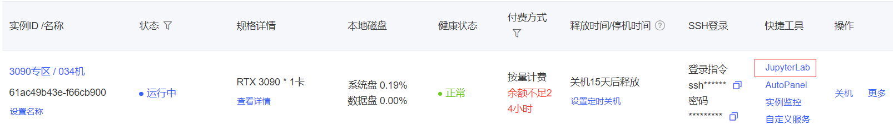
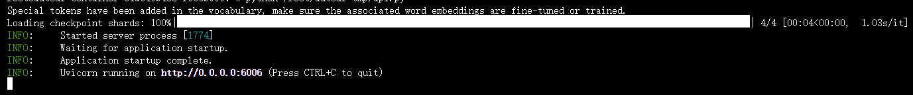
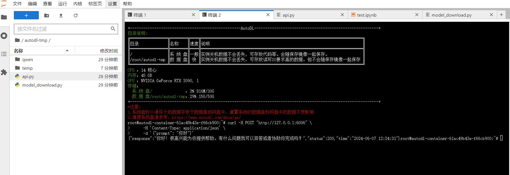
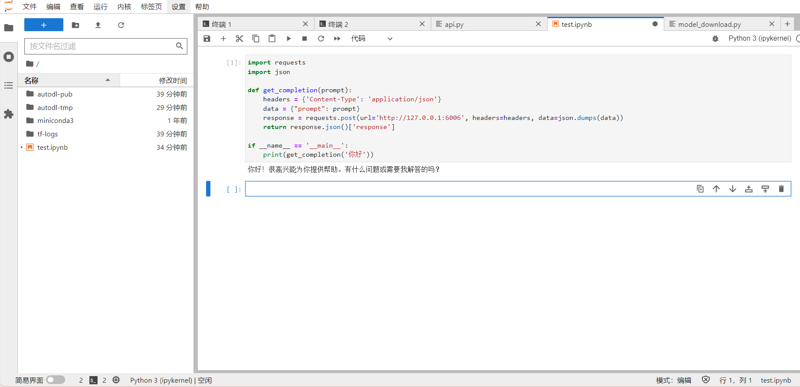

# Qwen2-7B-Instruct FastApi deployment call

## Environment preparation

Rent an RTX 3090/24G graphics card machine in the Autodl platform. As shown in the figure below, select PyTorch-->2.1.0-->3.10(ubuntu20.04)-->12.1 (versions above 11.3 are acceptable).


Next, we open JupyterLab on the server we just rented, as shown in the figure below, and then open the terminal in it to start environment configuration, model download, and run the demonstration. 

<!--  -->

pip source change to speed up downloading and installing dependent packages

```shell
# Upgrade pip
python -m pip install --upgrade pip
# Change pypi source to speed up library installation
pip config set global.index-url https://pypi.tuna.tsinghua.edu.cn/simple

pip install fastapi==0.104.1
pip install uvicorn==0.24.0.post1
pip install requests==2.25.1
pip install modelscope==1.11.0
pip install transformers==4.41.0
pip install streamlit==1.24.0
pip install sentencepiece==0.1.99
pip install accelerate==0.24.1
pip install transformers_stream_generator==0.0.4

``` 

> Considering that some students may encounter some problems in configuring the environment, we have prepared an environment image of Qwen2 on the AutoDL platform, which is applicable to all deployment environments of this warehouse except Qwen-GPTQ and vllm. Click the link below and create an Autodl example directly.
> ***https://www.codewithgpu.com/i/datawhalechina/self-llm/Qwen2***

## Model download 

Use snapshot_d in modelscopeThe ownload function downloads the model. The first parameter is the model name, and the parameter cache_dir is the model download path.

Create a new model_download.py file in the /root/autodl-tmp path and enter the following content in it. Please save the file in time after pasting the code, as shown in the figure below. And run `python /root/autodl-tmp/model_download.py` to execute the download. The model size is 15GB, and it takes about 5 minutes to download the model.

```python
import torch
from modelscope import snapshot_download, AutoModel, AutoTokenizer
import os
model_dir = snapshot_download('qwen/Qwen2-7B-Instruct', cache_dir='/root/autodl-tmp', revision='master')
``` 

## Code preparation 

Create a new api.py file in the /root/autodl-tmp path and enter the following content in it. Please save the file in time after pasting the code.
AutoDL open port configuration methodThe method is written in the General-Setting directory of this project. Please refer to this document for the first use. The configuration method is shown in the figure below.

The following code has very detailed comments. If you have any questions, please raise an issue. 

```python
from fastapi import FastAPI, Request
from transformers import AutoTokenizer, AutoModelForCausalLM, GenerationConfig
import uvicorn
import json
import datetime
import torch

# Set device parameters
DEVICE = "cuda" # Use CUDA
DEVICE_ID = "0" # CUDA device ID, empty if not set
CUDA_DEVICE = f"{DEVICE}:{DEVICE_ID}" if DEVICE_ID else DEVICE # Combine CUDA device information

# Clear GPU memory function
def torch_gc():
if torch.cuda.is_available(): # Check if CUDA is available
with torch.cuda.device(CUDA_DEVICE): # Specify CUDA device
torch.cuda.empty_cache() # Clear CUDA cache
torch.cuda.ipc_collect() # Collect CUDA memory fragments

# Create FastAPI application
app = FastAPI()

# Endpoint for handling POST requests
@app.post("/")
async def create_item(request: Request):
global model, tokenizer # Declare global variables to use models and tokenizers inside functions
json_post_raw = await request.json() # Get JSON data for POST request
json_post = json.dumps(json_post_raw) # Convert JSON data to string
json_post_list = json.loads(json_post) # Convert a string to a Python object
prompt = json_post_list.get('prompt') # Get the prompt in the request
messages = [
{"role": "system", "content": "You are a helpful assistant."},
{"role": "user", "content": prompt}
]
# Call the model for dialogue generation
input_ids = tokenizer.apply_chat_template(messages,tokenize=False,add_generation_prompt=True)
model_inputs = tokenizer([input_ids], return_tensors="pt").to('cuda')
generated_ids = model.generate(model_inputs.input_ids,max_new_tokens=512)
generated_ids = [
output_ids[len(input_ids):] for input_ids, output_ids in zip(model_inputs.input_ids, generated_ids)
]
response = tokenizer.batch_decode(generated_ids, skip_special_tokens=True)[0]
now = datetime.datetime.now() # Get the current time
time = now.strftime("%Y-%m-%d %H:%M:%S") # Format the time as a string
# Build response JSON
answer = {
"response": response,
"status": 200,
"time": time
}
# Build log information
log = "[" + time + "] " + '", prompt:"' + prompt + '", response:"' + repr(response) + '"'
print(log) # print log
torch_gc() # perform GPU memory cleanup
return answer # return response

# main function entry
if __name__ == '__main__':
# load pre-trained tokenizer and model
model_name_or_path = '/root/autodl-tmp/qwen/Qwen2-7B-Instruct'
tokenizer = AutoTokenizer.from_pretrained(model_name_or_path, use_fast=False)
model = AutoModelForCausalLM.from_pretrained(model_name_or_path, device_map="auto", torch_dtype=torch.bfloat16)

# start FastAPI application
# use port 6006 to map the autodl port to the local, so as to use the api locally
uvicorn.run(app, host='0.0.0.0', port=6006, workers=1) # Start the application on the specified port and host
``` 

## Api deployment 

Enter the following command in the terminal to start the api service: 

```shell 
cd /root/autodl-tmp
python api.py

python /root/autodl-tmp/api.py
``` 

```shell
python /root/autodl-tmp/api.py
``` 

After loading, the following information appears, indicating success.



By default, it is deployed on port 6006 and can be called via the POST method. You can use curl to call it, as shown below: 

```shell
curl -X POST "http://127.0.0.1:6006" \
-H 'Content-Type: application/json' \
-d '{"prompt": "Hello"}'
``` 


You can also use the request in pythonts library is called as follows:

```python
import requests
import json

def get_completion(prompt):
headers = {'Content-Type': 'application/json'}
data = {"prompt": prompt}
response = requests.post(url='http://127.0.0.1:6006', headers=headers, data=json.dumps(data))
return response.json()['response']

if __name__ == '__main__':
print(get_completion('Hello'))
```

The return value is as follows:

```json
{"response":"Hello! I'm glad to help you. Do you have any questions I can answer or assist you in completing?","status":200,"time":"2024-06-07 12:24:31"}
```

