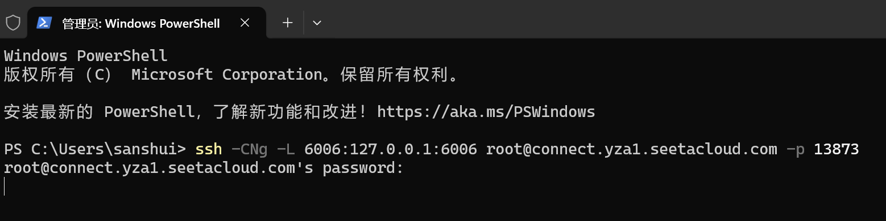

# Qwen2-7B-Instruct WebDemo deployment

## Environment preparation

Rent an RTX 3090/24G graphics card machine in the Autodl platform. As shown in the figure below, select PyTorch-->2.1.0-->3.10(ubuntu20.04)-->12.1 (versions above 11.3 are acceptable).


Next, we open JupyterLab on the server we just rented, as shown in the figure below, and then open the terminal to start environment configuration, model download, and run the demonstration.


pip changes the source to speed up the download and installation of dependent packages

```
# Upgrade pip
python -m pip install --upgrade pip
# Change the pypi source to speed up the installation of the library
pip config set global.index-url https://pypi.tuna.tsinghua.edu.cn/simple

pip install modelscope==1.9.5
pip install "transformers>=4.37.0"
pip install streamlit==1.24.0
pip install sentencepiece==0.1.99
pip install accelerate==0.24.1
pip install transformers_stream_generator==0.0.4
```

> Considering that some students may encounter some problems in configuring the environment, we have prepared an environment image of Qwen2 on the AutoDL platform, which is applicable to all deployment environments of this warehouse except Qwen-GPTQ and vllm. Click the link below and create an Autodl example directly.
> ***https://www.codewithgpu.com/i/datawhalechina/self-llm/Qwen2***

The terminal after deployment is as follows


## Model download

Use the snapshot_download function in modelscope to download the model. The first parameter is the model name, and the parameter cache_dir is the download path of the model.Download path.

Create a new download.py file in the /root/autodl-tmp path and enter the following content in it. Remember to save the file after pasting the code, as shown in the figure below.


The download.py code is as follows

```
import torch
from modelscope import snapshot_download, AutoModel, AutoTokenizer
from modelscope import GenerationConfig
model_dir = snapshot_download('qwen/Qwen2-7B-Chat', cache_dir='/root/autodl-tmp', revision='master')
```

After saving, run python /root/autodl-tmp/download.py in the terminal to execute the download. It takes some time to download the model.

```
python /root/autodl-tmp/download.py 
```


## Code preparation

Create a new file `chatBot.py` in the `/root/autodl-tmp` path and enter the following content in it. Remember to save the file after pasting the code. The following code has very detailed comments. If you have any questions, please raise an issue.


chatBot.py code is as follows

```
# Import required libraries
from transformers import AutoTokenizer, AutoModelForCausalLM, GenerationConfig
import torch
import streamlit as st

# Create a title and a link in the sidebar
with st.sidebar:
st.markdown("## Qwen2 LLM")
"[Open Source Large Model Usage Guide self-llm](https://github.com/datawhalechina/self-llm.git)"
# Create a slider to select the maximum length, ranging from 0 to 1024, with a default value of 512
max_length = st.slider("max_length", 0, 1024, 512, step=1)

# Create a title and a subtitle
st.title("💬 Qwen2 Chatbot")
st.caption("🚀 A streamlit chatbot powered by Self-LLM")

# Define the model path
mode_name_or_path = '/root/autodl-tmp/qwen/Qwen2-7B-Chat'

# Define a function to get the model and tokenizer
@st.cache_resource
def get_model():
# Get the tokenizer from the pre-trained model
tokenizer = AutoTokenizer.from_pretrained(mode_name_or_path, use_fast=False)
# Get the model from the pre-trained model and set the model parameters
model = AutoModelForCausalLM.from_pretrained(mode_name_or_path, torch_dtype=torch.bfloat16, device_map="auto")

return tokenizer, model

# Load the model and tokenizer of Qwen2-7B-Chat
tokenizer, model = get_model()

# If there is no "messages" in session_state, create a list containing default messages
if "messages" not in st.session_state:
st.session_state["messages"] = [{"role": "assistant", "content": "What can I do for you?"}]

# Traverse all messages in session_state and display them on the chat interface
for msg in st.session_state.messages:
st.chat_message(msg["role"]).write(msg["content"])

#If the user enters something in the chat input box, do the following
if prompt := st.chat_input():
# Add the user's input to the messages list in session_state
st.session_state.messages.append({"role": "user", "content": prompt})
# Display the user's input on the chat interface
st.chat_message("user").write(prompt)

# Build input
input_ids = tokenizer.apply_chat_template(st.session_state.messages,tokenize=False,add_generation_prompt=True)
model_inputs = tokenizer([input_ids], return_tensors="pt").to('cuda')
generated_ids = model.generate(model_inputs.input_ids, max_new_tokens=512)
generated_ids = [
output_ids[len(input_ids):] for input_ids, output_ids in zip(model_inputs.input_ids, generated_ids)
]
response = tokenizer.batch_decode(generated_ids, skip_special_tokens=True)[0]
# Add the output of the model to the messages list in session_state
st.session_state.messages.append({"role": "assistant", "content": response})
# Display the output of the model on the chat interface
st.chat_message("assistant").write(response)
# print(st.session_state)
```

## Run demo

Run the following command in the terminal to start streamlitService

```
streamlit run /root/autodl-tmp/chatBot.py --server.address 127.0.0.1 --server.port 6006
```

Click Custom Service


Click on Linux


Then win+R to open PowerShell


Enter ssh and password, press Enter to do this



Open the link in the browser http://localhost:6006/, you can see the chat interface. The running effect is as follows: