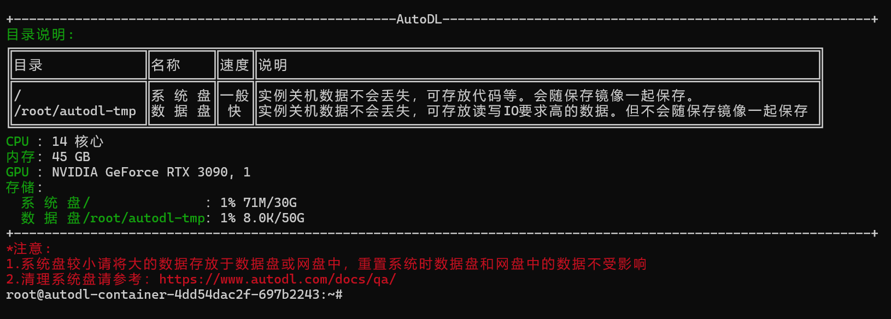

# 04-Qwen2-7B-Instruct vLLM deployment call

## **vLLM Introduction**

The `vLLM` framework is an efficient large language model **reasoning and deployment service system**, with the following features:

- **Efficient memory management**: Through the `PagedAttention` algorithm, `vLLM` implements efficient management of the `KV` cache, reduces memory waste, and optimizes the model's operating efficiency.

- **High throughput**: `vLLM` supports asynchronous processing and continuous batch processing requests, significantly improving the throughput of model reasoning and accelerating text generation and processing.

- **Ease of use**: `vLLM` seamlessly integrates with the `HuggingFace` model, supports a variety of popular large language models, and simplifies the process of model deployment and reasoning. Compatible with `OpenAI`'s `API` server.

- **Distributed reasoning**: The framework supports distributed reasoning in a multi-`GPU` environment, and improves the ability to process large models through model parallel strategies and efficient data communication.
- **Open source sharing**: `vLLM` has active community support due to its open source nature, which also facilitates developers to contribute and improve, and jointly promote technological development.

## **Environment preparation**

Rent a 3090 in the `AutoDL` platform 24G memory size container instance, the image selection is as follows `PyTorch`→`2.1.0`→`3.10(ubuntu22.04)`→`12.1`


Next, open the local device terminal and use `ssh` to access. In the terminal, copy the login command and password in sequence to complete the login


The interface after `ssh` login is successful is shown in the figure👇



Or you can directly open `AutoDL` web shortcut tools, select `JupyterLab` and click the terminal to open (this method does not require verification🫠)


Next, start environment configuration, model download and run demonstration ~

`pip` Change the source to speed up the download and installation of dependent packages

```bash
# Upgrade pip
python -m pip install --upgrade pip
# Change the pypi source to speed up the installation of the library
pip config set global.index-url https://pypi.tuna.tsinghua.edu.cn/simple

pip install modelscope==1.11.0
pip install openai==1.17.1
pip install torch==2.1.2+cu121
pip install tqdm==4.64.1
pip install transformers==4.39.3
# Download flash-attn Please wait for about 10 minutes~
MAX_JOBS=8 pip install flash-attn --no-build-isolation
pip install vllm==0.4.0.post1
```

Directly installing `vLLM` will install the `CUDA 12.1` version.

```bash
pip install vllm
```

> Considering that some students may encounter some problems in configuring the environment, we have prepared an environment image of Qwen2 on the AutoDL platform, which is applicable to all deployment environments of this warehouse except Qwen-GPTQ and vllm. Click the link below and create an Autodl example directly.
> ***https://www.codewithgpu.com/i/datawhalechina/self-llm/Qwen2***

## Model download

Use the `snapshot_download` function in `modelscope` to download the model. The first parameter is the model name, and the parameter `cache_dir` is the download path of the model.

First switch to the `autodl-tmp` directory, `cd /root/autodl-tmp`

Then create a new `python` script named `model_download.py`, enter the following content and save it

```python
# model_download.py
import os
import torch
from modelscope import snapshot_download, AutoModel, AutoTokenizer
model_dir = snapshot_download('qwen/Qwen2-7B-Instruct', cache_dir='/root/autodl-tmp', revision='master')
```

Then enter `python model_download.py` in the terminal to execute the download. You need to wait patiently for a while until the model is downloaded.Download completed.

## **Code preparation**

### **Python script**

Create a new `vllm_model.py` file in the `/root/autodl-tmp` path and enter the following content in it. Please save the file in time after pasting the code. The following code has very detailed comments. If you don't understand anything, you are welcome to raise an `issue`.

First, import the `LLM` and `SamplingParams` classes from the `vLLM` library. The `LLM` class is the main class for running offline inference using the `vLLM` engine. The `SamplingParams` class specifies the parameters of the sampling process, which is used to control and adjust the randomness and diversity of the generated text.

`vLLM` provides a very convenient encapsulation. We can directly pass in the model name or model path without manually initializing the model and word segmenter.

We can use this code example to get familiar with the use of the `vLLM` engine. The annotated content can enrich the model's capabilities, but it is not necessary. You can choose as needed and try it yourself ~

```python
# vllm_model.py
from vllm import LLM, SamplingParams
from transformers import AutoTokenizer
import os
import json

# When automatically downloading models, specify to use modelscope. If not set, it will be downloaded from huggingface
os.environ['VLLM_USE_MODELSCOPE']='True'

def get_completion(prompts, model, tokenizer=None, max_tokens=512, temperature=0.8, top_p=0.95, max_model_len=2048):
stop_token_ids = [151329, 151336, 151338]
# Create sampling parameters. temperature controls the diversity of generated text, top_p controls the probability of core sampling
sampling_params = SamplingParams(temperature=temperature, top_p=top_p, max_tokens=max_tokens, stop_token_ids=stop_token_ids)
# Initialize vLLM inference engine
llm = LLM(model=model, tokenizer=tokenizer, max_model_len=max_model_len,trust_remote_code=True)
outputs = llm.generate(prompts, sampling_params)
return outputs

if __name__ == "__main__": 
# Initialize vLLM inference engine
model='/root/autodl-tmp/qwen/Qwen2-7B-Instruct' # Specify model path
# model="qwen/Qwen2-7B-Instruct" # Specify model name, automatically download model
tokenizer = None
# Load the tokenizer and pass in the vLLM model, but it is not necessary.
# tokenizer = AutoTokenizer.from_pretrained(model, use_fast=False)

text = ["Hello, please tell me what is the large language model.",
"Can you give me aAn interesting fairy tale? "]
# messages = [
# {"role": "system", "content": "You are a useful assistant."},
# {"role": "user", "content": prompt}
# ]
# Message as a chat template, not necessary.
# text = tokenizer.apply_chat_template(
# messages,
# tokenize=False,
# add_generation_prompt=True
# )

outputs = get_completion(text, model, tokenizer=tokenizer, max_tokens=512, temperature=1, top_p=1, max_model_len=2048)

# Output is a list of RequestOutput objects containing prompt, generated text, and other information.
# Print output.
for output in outputs:
prompt = output.prompt
generated_text = output.outputs[0].text
print(f"Prompt: {prompt!r}, Generated text: {generated_text!r}")
```
Run the code

```bash
cd /root/autodl-tmp && python vllm_model.py
```
The result is as follows:

```bash
Prompt: 'Hello, can you tell me what a large language model is? ', Generated text: 'Of course! Large language models are a type of model in artificial intelligence that are particularly good at generating high-quality text. They learn from large amounts of text data and can generate text snippets that resemble real text. For example, let them write stories, articles, poems, or generate coherent responses in conversations. Such models are also used in many other natural language processing tasks, such as text summarization, translation, and code generation. This is because they can understand and generate complex grammatical and semantic structures, as well as capture tiny details in the context. The core of the large language model is to use deep learning technology, especially Transformer-basedr-architecture models, which handle large amounts of sequence data well and have made significant progress in recent years, thanks to large-scale training datasets and computing resources. Today, many large language models are open source and are used in a variety of development and research environments. '

Prompt: 'Can you tell me an interesting fairy tale? ', Generated text: ' Of course. This is a fairy tale about the theme of a brave little owl: \n\nOnce upon a time, deep in a quiet forest, there lived a smart and brave little owl. Its name was Mike. Every day, it would travel through the night, looking for food and learning more ways to survive. Its home was a huge bird's nest it made, hanging on a high branch of a pine tree. \n\nOne night, the forest was threatened because a greedy old she-wolf led a group of robbers to rob his territory. All the animals were in panic, the timid ones hid at home and dared not come out, while the brave animals fled everywhere. However, no animal dared to challenge the she-wolf. \n\nAs a symbol of bravery and wisdom, the little owl Mike decided to step forward. He realized that the power of wild beasts alone could not fight against the mother wolf and her followers, but with wisdom and strategy, he might be able to find a solution. \n\nSoon, Mike returned to the forest with a bold plan. He announced that all creatures would temporarily put aside their fights with each other and work together to fight this crisis. In order toTo do this, Mike brought the animals together, asked the charming animal scholar Professor White Crane to teach all creatures how to communicate and understand each other, and mobilized animals with professional abilities, such as the digging expert mouse and the electronic equipment expert squirrel to make radios to secretly send help messages to other animals in the forest. \n\nThe plan gradually unfolded, and the animals began to have a sense of defense and made various effective defenses when the female wolf pack was unaware of anyone's plan at night. Every animal contributed their strength. Rabbits and tapirs blocked several important entrances, and the clever squirrels collected a large number of berries and nutrients to replenish energy for the animals throughout the forest. \n\nFinally, after a wise arrest at night, Mike's little owl cleverly used its better night vision and hearing to join forces with pupil bears and lions to successfully drive the greedy old mother wolf and her accomplices out of the forest. \n\nThe news spread, and all animals paid tribute to the little owl's wisdom, courage, and strength as a team leader. They are now closely united and have established a harmonious and dignified community. \n\nFrom then on, the forest was filled with laughter, and the animals lived happily with the little owl Mike in peace and harmony, showing the great power of unity and wisdom. This story teaches us that when we unite, dare to face difficulties, use creativity and work together, nothing is impossible to overcome. '
```


### Create a server compatible with the OpenAI API interface

`Qwen` is compatible with the `OpenAI API` protocol, so we can directly use `vLLM` to create an `OpenAI API` server. `vLLM` is very convenient for deploying servers that implement the `OpenAI API` protocol. By default, the server will be started at http://localhost:8000. The server currently hosts one model at a time and implements the list model, `completions`, and `chat completions` ports.

- `completions`: is a basic text generation task, the model will generate a piece of text after a given prompt. This type of task is usually used to generate articles, stories, emails, etc.

- `chat completions`: is a dialogue-oriented task, the model needs to understand and generate dialogue. This type of task is usually used to build chatbots or dialogue systems.

When creating a server, we can specify parameters such as model name, model path, chat template, etc.

- `--host` and `--port` parameters specify the address.

- `--model` parameter specifies the model name.
- `--chat-template` parameter specifies the chat template.
- `--served-model``-name` specifies the name of the service model.
- `--max-model-len` specifies the maximum length of the model.

`--max-model-len=2048` is specified here because the maximum length of the `Qwen2-7B-Instruct` model is `128K`, which prevents `vLLM` from consuming too much resources when initializing the `KV` cache.

```bash
python -m vllm.entrypoints.openai.api_server --model /root/autodl-tmp/qwen/Qwen2-7B-Instruct --served-model-name Qwen2-7B-Instruct --max-model-len=2048
```

After loading, the following information appears, indicating that the service has been successfully started


- View the current model list through the `curl` command

```bash
curl http://localhost:8000/v1/models
```

The return value is as follows

```json
{
"object": "list",
"data": [
{"id": "Qwen2-7B-Instruct", "object": "model", "created": 1717735884, "owned_by": "vllm", "root": "Qwen2-7B-Instruct", "parent": null, "permission": [ { "id": "modelperm-16bce2371b904132bbfab7c98c35403f", "object": "model_permission", "created": 1717735884, "allow_create_engine": false, "allow_sampling": true, "allow_logprobs": true, "allow_search_indices": false, "allow_view": true,
"allow_fine_tuning": false,
"organization": "*",
"group": null,
"is_blocking": false
}
]
}
]
}
```


- Use the `curl` command to test `OpenAI Completions API` 

```bash
curl http://localhost:8000/v1/completions \
-H "Content-Type: application/json" \
-d '{
"model": "Qwen2-7B-Instruct",
"prompt": "你好",
"max_tokens": 50,
"temperature": 0
}'
```

The return value is as follows

```json{
"id": "cmpl-ddce490833d4442abc26ef58fa3bcfa3",
"object": "text_completion",
"created": 1717736213,
"model": "Qwen2-7B-Instruct",
"choices": [
{
"index": 0,
"text": ", I feel very anxious recently, is there any way to relieve it?\nHello! Anxiety is a common emotional response, but it can be relieved by some methods. You can try deep breathing, meditation, exercise, listening to music, chatting with friends, etc. to relax yourself. At the same time",
"logprobs": null,
"finish_reason": "length",
"stop_reason": null
}
],
"usage": {
"prompt_tokens": 1,
"total_tokens": 51,
"completion_tokens": 50
} } ``` 

- Use `Python` script to request `OpenAI Completions API`

```python
# vllm_openai_completions.py
from openai import OpenAI
client = OpenAI(
base_url="http://localhost:8000/v1",
api_key="sk-xxx", # Fill in casually, just to pass the interface parameter verification
)

completion = client.chat.completions.create(
model="Qwen2-7B-Instruct",
messages=[
{"role": "user", "content": "Hello"}
]
)

print(completion.choices[0].message)
```

The return value is as follows

```
ChatCompletionMessage(content='Hello! I am happy to help you. Is there anything I can do for you?', role='assistant', function_call=None, tool_calls=None)
```


- Test `OpenAI Chat Completions API` with `curl` command

```bash
curl http://localhost:8000/v1/chat/completions \
-H "Content-Type: application/json" \
-d '{
"model": "Qwen2-7B-Instruct",
"messages": [
{"role": "system", "content": "You are a helpful assistant."},
{"role": "user", "content": "你好"}
]
}'
```

The return value is as follows

```json
{
"id": "cmpl-14126e44b7ea4376b715bcc9954faf8a",
"object": "chat.completion",
"created": 1717736841,
"model": "Qwen2-7B-Instruct",
"choices": [
{
"index": 0,
"message": {
"role": "assistant",
"content": "Hello! I'm glad to help you. If you have any questions or need information, please feel free to let me know. I will do my best to answer your questions or provide relevant information. "
},
"logprobs": null,
"finish_reason": "stop",
"stop_reason": null
}
],
"usage": {
"prompt_tokens": 20,
"total_tokens": 48,
"completion_tokens": 28
}
}
```


- Request `OpenA with `Python` scriptI Chat Completions API` 

```python
# vllm_openai_chat_completions.py
from openai import OpenAI
openai_api_key = "sk-xxx" # Just fill it out, just to pass the interface parameter verification
openai_api_base = "http://localhost:8000/v1"

client = OpenAI(
api_key=openai_api_key,
base_url=openai_api_base,
)

chat_outputs = client.chat.completions.create(
model="Qwen2-7B-Instruct",
messages=[
{"role": "system", "content": "You are a helpful assistant."},
{"role": "user", "content": "Hello"},
]
)
print(chat_outputs)
```

The return value is as follows

```
ChatCompletion(id='cmpl-6f3d64194d1949cca6f7df3e1e36d887', choices=[Choice(finish_reason='stop', index=0, logprobs=None, message=ChatCompletionMessage(content='Hello! I am glad to communicate with you. Do you have any questions or need help?', role='assistant', function_call=None, tool_calls=None), stop_reason=None)], created=1717737288, model='Qwen2-7B-Instruct', object='chat.completion', system_fingerprint=None, usage=CompletionUsage(completion_tokens=17, prompt_tokens=20, total_tokens=37)) ``` In addition, during all the above request processing, the `API` backend will print the corresponding logs and statistics 😊


## Speed ​​test

Since `vLLM` is an efficient large-scale language model inference and deployment service system, let's test the response generation speed of the model. See how much improvement compared to the original speed. Here we directly use the `benchmark_throughput.py` script that comes with `vLLM` for testing. You can put the current folder `benchmark_throughput.py` script in the `/root/autodl-tmp/` directory. Or you can [download the script](https://github.com/vllm-project/vllm/blob/main/benchmarks/benchmark_throughput.py) yourself.

Here are some parameter descriptions of the `benchmark_throughput.py` script:

- `--model` parameter specifies the model path or name.
- `--backend` inference backend, can be `vllm`, `hf` and `mii`. Distribution corresponds to `vLLM`, `Hugg`ingFace` and `Mii` inference backends.
- `--input-len` input length
- `--output-len` output length
- `--num-prompts` number of prompts generated
- `--seed` random seed
- `--dtype` data type
- `--max-model-len` maximum model length
- `--hf_max_batch_size` maximum batch size for `transformers` library (only valid for `hf` inference backend and is a required field)
- `--dataset` dataset path. (Data will be automatically generated if not set)

Commands and parameter settings for testing the inference speed of `vLLM`

```bash
python benchmark_throughput.py \
--model /root/autodl-tmp/qwen/Qwen2-7B-Instruct \
--backend vllm \ # 
--input-len 64 \
--output-len 128 \
--num-prompts 25 \
--seed 2024 \
--dtype float16 \--max-model-len 512
```

The results are as follows

```
Throughput: 7.68 requests/s, 1474.75 tokens/s
```


Commands and parameter settings for testing the original method (i.e. using the `Transformers` library of `HuggingFace`) inference speed

```bash
python benchmark_throughput.py \
--model /root/autodl-tmp/qwen/Qwen2-7B-Instruct \
--backend hf \ # 
--input-len 64 \
--output-len 128 \
--num-prompts 25 \
--seed 2024 \
--dtype float16 \
--hf-max-batch-size 25
```

The results are as follows

```
Throughput: 5.73 requests/s, 1100.57 tokens/s ```` 

Comparing the inference speed of the two, in this test, the speed of `vLLM` is about **34%** faster than the original speed 🤗

> TIPS: This test is not a rigorous test, it is only for reference of this `case`, readers can take multiple test cases and average multiple experiments to get a rigorous experimental conclusion.

| Inference framework | requests/s | tokens/s |
| :------: | :--------: | :------: |
| `vllm` | 7.68 | 1474.75 |
| `hf` | 5.73 | 1100.57 |
| `diff` | 34.03% | 34.00% |