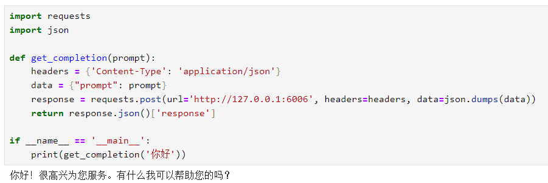

# TransNormerLLM-7B FastApi deployment call

## 1. TransNormer Introduction

TransNormerLLM is a linear attention-based LLM that outperforms traditional softmax attention-based models in both accuracy and efficiency. Trained on a high-quality corpus of up to 1.4 trillion tokens, TransNormerLLM evolves from the previous linear attention architecture TransNormer with advanced modifications including LRPE position embedding, lightning attention acceleration, new gating and normalization mechanisms (which will be briefly introduced below). TransNormerLLM achieves competitive performance comparable to its scale on several well-recognized Chinese, English, and multilingual general and domain-specific benchmarks. TransNormer includes basic versions with 385M, 1B, and 7B parameters. All versions are fully open to academic research.

**Architecture improvements of TransNormerLLM**

The following will briefly introduce the various modules of TransNormerLLM and some improvements proposed by researchers.

**Improvement 1: Position Encoding**

The lower layers in TransNormer use DiagAttention to avoid the dilution problem. However, this will lead toThere is a lack of global interaction between tokens. To solve this problem, the researchers used LRPE (linearized relative position encoding) with exponential decay for TransNormerLLM, which can retain full attention at lower levels. The researchers called this method LRPE-d.

**Improvement 2: Gating mechanism**

Gating can enhance the performance of the model and smooth the training process. The researchers used the Flash method from the paper "Transformer quality in linear time" for TransNormerLLM and used the gated linear attention (GLA) structure in token mixing. To further improve the speed of the model, they also proposed Simple GLU (SGLU), which removes the activation function of the original GLU structure because the gate itself can introduce nonlinearity.

**Improvement 3: Tensor Normalization**

The researchers used NormAttention introduced in TransNormer. In TransNormerLLM, they replaced RMSNorm with a new simple normalization function SimpleRMSNorm (abbreviated as SRMSNorm).

Its overall structure is as follows:
Figure 1: Overall architecture of the newly proposed model

Okay, based on the understanding of TransNormer, let's start calling it. Here we start to deploy the TransNormerLLM-7B model.

## 2. Environment preparation

### 2.1 Enter the configuration environment

Rent a 3090/4090 or other 24G graphics card machine on the Autodl platform. As shown in the figure below, select PyTorch-->2.0.0-->3.8(ubuntu20.04)-->11.8 (versions above 11.3 are acceptable).
Next, open JupyterLab on the server you just rented, and open the terminal in it to start environment configuration, model download and run demonstrations.


Open the terminal interface on the startup page:


Left-click the red box to enter the Python terminal console, as shown below:


### 2.2 pip source change to speed up downloading and installing dependent packages

Next, install and run TransNormerLLM-7BThere are two ways to install the required dependent libraries. However, before installing the dependent libraries, we first update the pip version (to prevent the version from being too low) and switch the pip installation source (to the domestic source, so that the installation can be faster and the download link can be prevented from timeout)

Enter the following commands in "2.2" line by line in the red box:
```shell
# Upgrade pip
python -m pip install --upgrade pip
# Change the pypi source to accelerate the installation of the library
pip config set global.index-url https://pypi.tuna.tsinghua.edu.cn/simple
```

**Method 1:**
Still enter the following commands in "2.2" line by line in the red box:

```shell
pip install fastapi==0.104.1
pip install uvicorn==0.24.0.post1
pip install requests==2.25.1
pip install modelscope==1.11.0
pip install transformers==4.37.0 pip install streamlit==1.24.0 pip install sentencepiece==0.1.99
pip install accelerate==0.24.1
pip install transformers_stream_generator==0.0.4
pip install triton==2.0.0
pip install einops
``` 

**Method 2:**
Put the following content:
```shell
fastapi==0.104.1
uvicorn==0.24.0.post1
requests==2.25.1
modelscope==1.11.0
transformers==4.37.0
streamlit==1.24.0
sentencepiece==0.1.99
accelerate==0.24.1
transformers_stream_generator==0.0.4
triton==2.0.0
einops
``` 
Use vim to write a requirements.txt file, and then run the command: pip install -r requirements.txt

## 3. Model download

Use s in modelscopeThe snapshot_download function downloads the model. The first parameter is the model name, and the parameter cache_dir is the model download path.

Model introduction address (Mota community):
https://www.modelscope.cn/models/OpenNLPLab/TransNormerLLM-7B/summary

Create a new model_download.py file in the /root/autodl-tmp path and enter the following content in it. Please save the file in time after pasting the code, as shown in the figure below. And run `python /root/autodl-tmp/model_download.py` to execute the download. The model size is 12GB, and it takes about 6 minutes to download the model.

The process in the terminal interface is as follows:
```cmd
cd /root/autodl-tmp
vim model_download.py
```
Then save and exit (:wq)

Contents in the model_download.py file:
```python
import torch
from modelscope import snapshot_download, AutoModel, AutoTokenizer
imort os
model_dir = snapshot_download('OpenNLPLab/TransNormerLLM-7B', cache_dir='/root/autodl-tmp', revision='master')
``` 

> Let me explain what is happening here: First, we load the basic torch environment and the snapshot_download, AutoModel, and AutoTokenizer classes of the modelscope library, and use the snapshot_download function to download the model. (Although there are many ways to download models, snapshot_download has certain advantages)

## Code preparation 

Create a new api.py file in the /root/autodl-tmp path and enter the following content in it. Please save the file in time after pasting the code. The following code has very detailed comments. If you don't understand anything, please raise an issue. 

```python
from fastapi import FastAPI, Request
from transformers import AutoTokenizer, AutoModelForCausalLM, GenerationConfig
import uvicorn
import json
import datetime
import torch

# Set device parameters
DEVICE = "cuda" # Use CUDA
DEVICE_ID = "0" # CUDA device ID, empty if not set
CUDA_DEVICE = f"{DEVICE}:{DEVICE_ID}" if DEVICE_ID else DEVICE # Combine CUDA device information

# Clean up GPU memory function
def torch_gc():
if torch.cuda.is_available(): # Check if CUDA is available
with torch.cuda.device(CUDA_DEVICE): # Specify CUDA device
torch.cuda.empty_cache() # Clear CUDA cache
torch.cuda.ipc_collect() # Collect CUDA memory fragments

# Create FastAPI application
app = FastAPI()

# Endpoint for handling POST requests
@app.post("/")
async def create_item(request: Request):
global model, tokenizer # Declare global variables for use of models and tokenizers inside functions
json_post_raw = await request.json() # Get JSON data for POST request
json_post = json.dumps(json_post_raw) # Convert JSON data to a string
json_post_list = json.loads(json_post) # Convert a string to a Python object
prompt = json_post_list.get('prompt') # Get prompts in the request
messages = [
{"role": "system", "content": "You are a helpful assistant."},
{"role": "user", "content": prompt} ] # Call the model for dialogue generation input_ids = tokenizer.apply_chat_template(messages,tokenize=False,add_generation_prompt=True) model_inputs = tokenizer([input_ids], return_tensors="pt").to('cuda') generated_ids = model. generate(model_inputs.input_ids,max_new_tokens=512) generated_ids = [ output_ids[len(input_ids):] for input_ids, output_ids in zip(model_inputs.input_ids, generated_ids) ] response = tokenizer.batch_decode(generated_ids, skip_special_tokens=True)[0]now = datetime.datetime.now() # Get the current time
time = now.strftime("%Y-%m-%d %H:%M:%S") # Format the time as a string
# Build the response JSON
answer = {
"response": response,
"status": 200,
"time": time
}
# Build log information
log = "[" + time + "] " + '", prompt:"' + prompt + '", response:"' + repr(response) + '"'
print(log) # Print log
torch_gc() # Perform GPU memory cleanup
return answer # Return response

# Main function entry
if __name__ == '__main__':
# Load pre-trained tokenizer and model
model_name_or_path = '/root/autodl-tmp/OpenNLPLab/TransNormerLLM-7B'
tokenizer = AutoTokenizer.from_pretrained(model_name_or_path, trust_remote_code=True, use_fast=False)
model = AutoModelForCausalLM.from_pretrained(model_name_or_path, device_map="auto", trust_remote_code=True, torch_dtype=torch.bfloat16)

# Start FastAPI application
# Use port 6006 to map the port of autodl to the local, so as to use the api locally
uvicorn.run(app, host='0.0.0.0', port=6006, workers=1) # Start the application on the specified port and host
``` 

## Api deployment 

Enter the following command in the terminal to start the api service: 

```shell 
cd /root/autodl-tmp #If in the /root/autodl-tmp pathThen this sentence is not needed
python api.py
``` 

After loading, the following information appears, indicating success.


By default, it is deployed on port 6006 and is called through the POST method. You can use curl to call it, as shown below: 

```shell
curl -X POST "http://127.0.0.1:6006" \
-H 'Content-Type: application/json' \
-d '{"prompt": "你好"}'
``` 


You can also use the requests library in python to call it, as shown below:

Here we can enable Jupyter notebook for interaction


```python
import requests
import json

def get_completion(prompt):
headers ={'Content-Type': 'application/json'}
data = {"prompt": prompt}
response = requests.post(url='http://127.0.0.1:6006', headers=headers, data=json.dumps(data))
return response.json()['response']

if __name__ == '__main__':
print(get_completion('Hello'))
```

The return value is as follows:

```json
{"response":"Hello! Is there anything I can help you with?","status":200,"time":"2024-02-05 18:08:19"}
``` 

