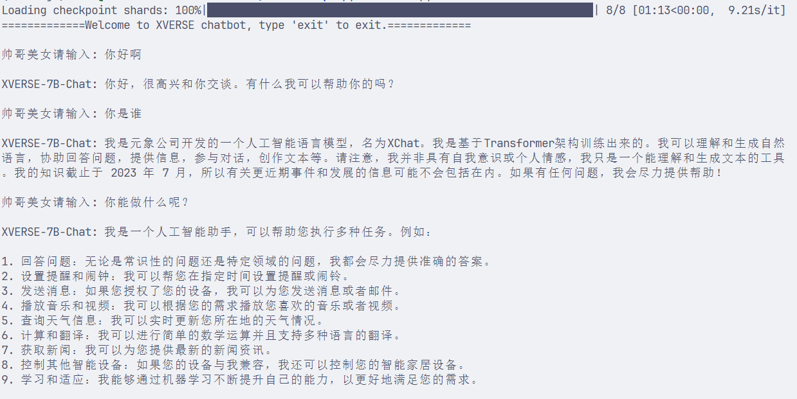

# XVERSE-7B-chat Transformers 推理

XVERSE-7B-Chat为[XVERSE-7B](https://huggingface.co/xverse/XVERSE-7B)模型对齐后的版本。

XVERSE-7B 是由深圳元象科技自主研发的支持多语言的大语言模型（Large Language Model），参数规模为 70 亿，主要特点如下：

- 模型结构：XVERSE-7B 使用主流 Decoder-only 的标准 Transformer 网络结构，支持 8K 的上下文长度（Context Length），能满足更长的多轮对话、知识问答与摘要等需求，模型应用场景更广泛。
- 训练数据：构建了 2.6 万亿 token 的高质量、多样化的数据对模型进行充分训练，包含中、英、俄、西等 40 多种语言，通过精细化设置不同类型数据的采样比例，使得中英两种语言表现优异，也能兼顾其他语言效果。
- 分词：基于 BPE（Byte-Pair Encoding）算法，使用上百 GB 语料训练了一个词表大小为 100,534 的分词器，能够同时支持多语言，而无需额外扩展词表。
- 训练框架：自主研发多项关键技术，包括高效算子、显存优化、并行调度策略、数据-计算-通信重叠、平台和框架协同等，让训练效率更高，模型稳定性强，在千卡集群上的峰值算力利用率可达到 58.5%，位居业界前列。

## 环境准备  

在 Autodl 平台中租赁一个 3090 等 24G 显存的显卡机器，如下图所示镜像选择 PyTorch-->2.1.0-->3.10(ubuntu22.04)-->12.1（11.3 版本以上的都可以）。
接下来打开刚刚租用服务器的 JupyterLab，并且打开其中的终端开始环境配置、模型下载和运行演示。  


pip 换源加速下载并安装依赖包，为了方便大家进行环境配置，在 code 文件夹里面给大家提供了 requirement.txt 文件，大家直接使用下面的命令安装即可。如果你使用的是 [autodl](https://www.autodl.com/) 部署模型的话，我们有制作好的镜像供大家使用：[XVERSE-7B-Chat](https://www.codewithgpu.com/i/datawhalechina/self-llm/XVERSE-7B-Chat)

```shell
# 升级pip
python -m pip install --upgrade pip
# 更换 pypi 源加速库的安装
pip config set global.index-url https://pypi.tuna.tsinghua.edu.cn/simple

pip install -r requirement.txt
```  

## 模型下载  

使用 modelscope 中的 snapshot_download 函数下载模型，第一个参数为模型名称，参数 cache_dir 为模型的下载路径。

在 /root/autodl-tmp 路径下新建 [model_download.py](code/model_download.py) 文件并在其中输入以下内容，粘贴代码后请及时保存文件，如下图所示。并运行 `python /root/autodl-tmp/model_download.py` 执行下载，模型大小为 14GB，下载模型大概需要 2 分钟。

```python
import torch
from modelscope import snapshot_download, AutoModel, AutoTokenizer
import os
model_dir = snapshot_download('xverse/XVERSE-7B-Chat', cache_dir='/root/autodl-tmp', revision='master')
``` 

## Transformers 推理以及 INT8、INT4 量化推理

我们在 /root/autodl-tmp 路径下新建 [xverse.py](code/xverse.py) 文件，内容如下：

```python
import torch
from transformers import AutoTokenizer, AutoModelForCausalLM
from transformers import GenerationConfig


# 加载预训练的分词器和模型
model_path = "xverse/XVERSE-7B-Chat"
tokenizer = AutoTokenizer.from_pretrained(model_path, trust_remote_code=True)
model = AutoModelForCausalLM.from_pretrained(model_path, torch_dtype=torch.float16, trust_remote_code=True).cuda()
model.generation_config = GenerationConfig.from_pretrained(model_path)

# 使用 INT8、INT4 进行量化推理 
# model = model.quantize(8).cuda()
model = model.quantize(4).cuda()

model = model.eval()

print("=============Welcome to XVERSE chatbot, type 'exit' to exit.=============")


# 设置多轮对话
while True:
    user_input = input("\n帅哥美女请输入: ")
    if user_input.lower() == "exit":
        break
    # 创建消息
    history = [{"role": "user", "content": user_input}]
    response = model.chat(tokenizer, history)
    print("\nXVERSE-7B-Chat: {}".format(response))

    # 添加回答到历史
    history.append({"role": "assistant", "content": response})

```

XVERSE-7B 默认是支持 INT8 和 INT4 类型的量化，这样在推理的适合可以大幅降低模型加载所需的显存。只需要在 `model = model.eval()` 前面添加 `model = model.quantize(4).cuda()` 即可。

> 4指的是 INT4 量化，同理8则表示 INT8 量化。

INT4 量化推理的运行效果如下：

