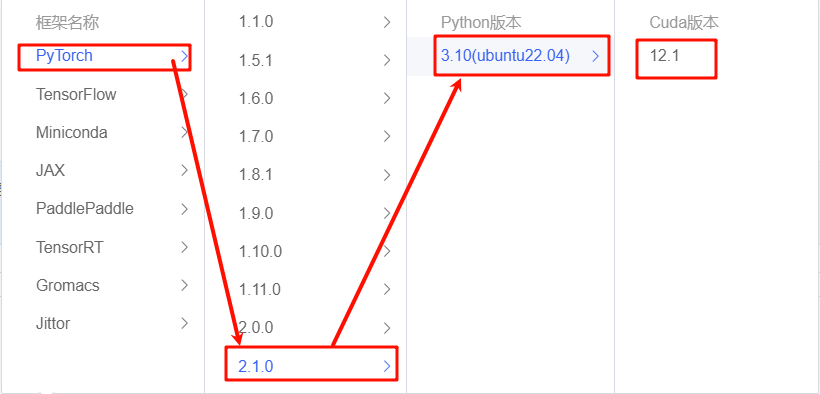

# XVERSE-7B-chat WebDemo 部署

XVERSE-7B-Chat为[XVERSE-7B](https://huggingface.co/xverse/XVERSE-7B)模型对齐后的版本。

XVERSE-7B 是由深圳元象科技自主研发的支持多语言的大语言模型（Large Language Model），参数规模为 70 亿，主要特点如下：

- 模型结构：XVERSE-7B 使用主流 Decoder-only 的标准 Transformer 网络结构，支持 8K 的上下文长度（Context Length），能满足更长的多轮对话、知识问答与摘要等需求，模型应用场景更广泛。
- 训练数据：构建了 2.6 万亿 token 的高质量、多样化的数据对模型进行充分训练，包含中、英、俄、西等 40 多种语言，通过精细化设置不同类型数据的采样比例，使得中英两种语言表现优异，也能兼顾其他语言效果。
- 分词：基于 BPE（Byte-Pair Encoding）算法，使用上百 GB 语料训练了一个词表大小为 100,534 的分词器，能够同时支持多语言，而无需额外扩展词表。
- 训练框架：自主研发多项关键技术，包括高效算子、显存优化、并行调度策略、数据-计算-通信重叠、平台和框架协同等，让训练效率更高，模型稳定性强，在千卡集群上的峰值算力利用率可达到 58.5%，位居业界前列。

## 环境准备  

在 Autodl 平台中租赁一个 3090 等 24G 显存的显卡机器，如下图所示镜像选择 PyTorch-->2.1.0-->3.10(ubuntu22.04)-->12.1（11.3 版本以上的都可以）。



pip 换源加速下载并安装依赖包，为了方便大家进行环境配置，在 code 文件夹里面给大家提供了 requirement.txt 文件，大家直接使用下面的命令安装即可。如果你使用的是 [autodl](https://www.autodl.com/) 部署模型的话，我们有制作好的镜像供大家使用：[XVERSE-7B-Chat](https://www.codewithgpu.com/i/datawhalechina/self-llm/XVERSE-7B-Chat)


```bash
# 升级pip
python -m pip install --upgrade pip
# 更换 pypi 源加速库的安装
pip config set global.index-url https://pypi.tuna.tsinghua.edu.cn/simple

# 安装python依赖
pip install -r requirement.txt
```

## 模型下载

XVERSE-7B-Chat 模型：

* [huggingface](https://huggingface.co/xverse/XVERSE-7B-Chat)
* [modelscope](https://www.modelscope.cn/models/xverse/XVERSE-7B-Chat/summary)

### 使用modelscope下载

使用 modelscope 中的 snapshot_download 函数下载模型，第一个参数为模型名称，参数 cache_dir 为模型的下载路径，模型路径为`/root/autodl-tmp`。在 /root/autodl-tmp 下创建model_download.py文件内容如下: 

```python
from modelscope import snapshot_download
model_dir = snapshot_download("xverse/XVERSE-7B-Chat", cache_dir='/root/autodl-tmp', revision="master")
```

## 代码准备

> 为了方便大家部署，在 code 文件夹里面已经准备好了代码，大家可以将仓库 clone 到服务器上直接运行。

在`/root/autodl-tmp`路径下新建 `chatBot.py` 文件并在其中输入以下内容：
```python
import argparse
import torch
import gradio as gr
import json
from datetime import datetime
from transformers import AutoModelForCausalLM, AutoTokenizer,GenerationConfig

tokenizer, model = None, None

def init_model(args):
    global tokenizer, model
    tokenizer = AutoTokenizer.from_pretrained(args.tokenizer_path, truncation_side="left", padding_side="left")
    model = AutoModelForCausalLM.from_pretrained(args.model_path, trust_remote_code=True, torch_dtype=torch.bfloat16,
                                                 low_cpu_mem_usage=True, device_map='auto')
    model.generation_config = GenerationConfig.from_pretrained(args.model_path)
    model = model.eval()

def chat(message, history, request: gr.Request):
    global tokenizer, model
    history = history or []
    history.append({"role": "user", "content": message})

    # init
    history.append({"role": "assistant", "content": ""})
    utter_history = []
    for i in range(0, len(history), 2):
        utter_history.append([history[i]["content"], history[i+1]["content"]])

    # chat with stream
    for next_text in model.chat(tokenizer, history[:-1], stream=True):
        utter_history[-1][1] += next_text
        history[-1]["content"] += next_text
        if torch.backends.mps.is_available():
            torch.mps.empty_cache()
        yield utter_history, history

    # log
    current_time = datetime.now().strftime('%Y-%m-%d %H:%M:%S')
    print(f'{current_time} request_ip:{request.client.host}\nquery: {message}\nhistory: {json.dumps(history, ensure_ascii=False)}\nanswer: {json.dumps(utter_history[-1][1], ensure_ascii=False)}')

# 增加配置，添加模型地址
def get_args():
    parser = argparse.ArgumentParser()
    parser.add_argument("--port", type=int, default=6006,
                       help="server port")
    parser.add_argument("--model_path", type=str, default="/root/autodl-tmp/xverse/XVERSE-7B-Chat",
                        help="model path")
    parser.add_argument("--tokenizer_path", type=str, default="/root/autodl-tmp/xverse/XVERSE-7B-Chat",
                        help="Path to the tokenizer.")
    args = parser.parse_args()
    return args

if __name__ == "__main__":
    args = get_args()
    # 初始化模型
    init_model(args)

    # 构建demo应用
    with gr.Blocks(theme=gr.themes.Soft()) as demo:
        gr.Markdown("""
                        # <center>💬 XVERSE-7B-Chat</center>
                        ## <center>🚀 A Gradio chatbot powered by Self-LLM</center>
                        ### <center>✨ 感兴趣的小伙伴可以去看我们的开源项目哦——[开源大模型食用指南 self-llm](https://github.com/datawhalechina/self-llm.git)，教你一杯奶茶跑通所有主流大模型😀。</center>
                    """)
        chatbot = gr.Chatbot(label="Chat history", height=500)
        state = gr.State([])

        with gr.Row():
            text_box = gr.Textbox(label="Message", show_label=False, placeholder="请输入你的消息并回车")

        with gr.Row():
            submit_btn = gr.Button(value="Send", variant="secondary")
            reset_btn = gr.Button(value="Reset")

        text_box.submit(fn=chat,
                        inputs=[text_box, state],
                        outputs=[chatbot, state],
                        api_name="chat")
        submit_btn.click(fn=chat,
                         inputs=[text_box, state],
                         outputs=[chatbot, state])

        # 用于清空text_box
        def clear_textbox():
            return gr.update(value="")
        text_box.submit(fn=clear_textbox, inputs=None, outputs=[text_box])
        submit_btn.click(fn=clear_textbox, inputs=None, outputs=[text_box])

        # 用于清空页面和重置state
        def reset():
            return None, []
        reset_btn.click(fn=reset, inputs=None, outputs=[chatbot, state])

    demo.launch(server_name="0.0.0.0", server_port=args.port)
```

## 运行 demo

在终端中运行以下命令，启动gradio服务，并按照 `autodl` 的指示将端口映射到本地，然后在浏览器中打开链接 http://localhost:6006/ ，即可看到聊天界面。

```bash
python chatBot.py
```
如下图所示：

