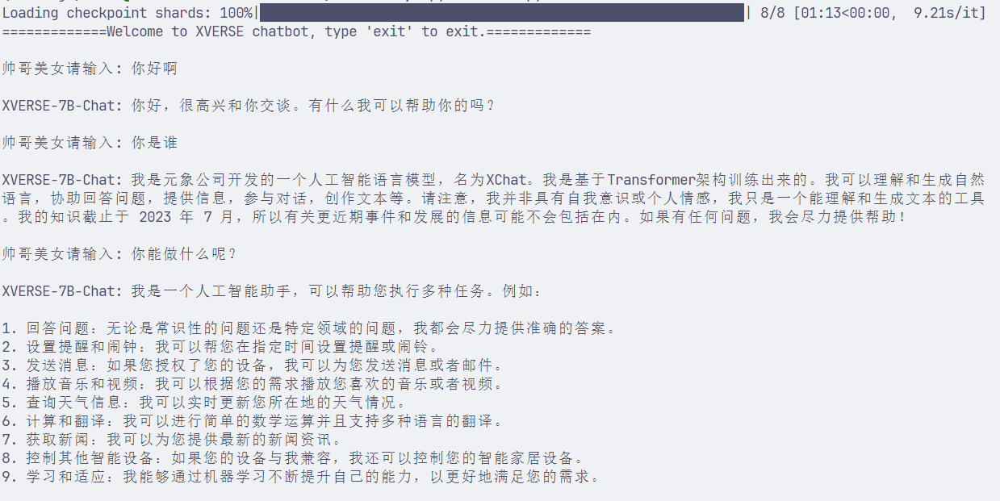

# XVERSE-7B-chat Transformers Reasoning

XVERSE-7B-Chat is the aligned version of the [XVERSE-7B](https://huggingface.co/xverse/XVERSE-7B) model.

XVERSE-7B is a large language model (Large Language Model) independently developed by Shenzhen Yuanxiang Technology that supports multiple languages. The parameter scale is 7 billion. The main features are as follows:

- Model structure: XVERSE-7B uses the mainstream decoder-only standard Transformer network structure, supports 8K context length (Context Length), can meet the needs of longer multi-round dialogues, knowledge questions and answers, and summaries, and the model has a wider range of application scenarios.

- Training data: 2.6 trillion tokens of high-quality and diverse data are constructed to fully train the model, including more than 40 languages ​​such as Chinese, English, Russian, and Spanish. By finely setting the sampling ratio of different types of data, the performance of Chinese and English is excellent, and the effects of other languages ​​can also be taken into account.
- Word segmentation: Based on the BPE (Byte-Pair Encoding) algorithm, a word segmenter with a vocabulary size of 100,534 was trained using hundreds of GB of corpus, which can support multiple languages ​​at the same time without additional expansionVocabulary.
- Training framework: self-developed a number of key technologies, including efficient operators, video memory optimization, parallel scheduling strategies, data-computing-communication overlap, platform and framework collaboration, etc., to make training more efficient and model more stable. The peak computing power utilization rate on the Qianka cluster can reach 58.5%, ranking among the top in the industry.

## Environment preparation

Rent a 3090 or other 24G video memory graphics card machine on the Autodl platform. As shown in the figure below, select PyTorch-->2.1.0-->3.10(ubuntu22.04)-->12.1 (versions above 11.3 are acceptable).
Next, open JupyterLab on the server you just rented, and open the terminal in it to start environment configuration, model download and run demonstrations.


pip source change speeds up downloading and installing dependent packages. In order to facilitate your environment configuration, a requirement.txt file is provided in the code folder. You can directly use the following command to install it. If you use [autodl](https://www.autodl.com/) to deploy the model, we have a prepared image for you to use: [XVERSE-7B-Chat](https://www.codewithgpu.com/i/datawhalechina/self-llm/XVERSE-7B-Chat)

```shell
# Upgrade pip
python -m pip install --upgrade pip
# Replace the installation of the pypi source acceleration library
pip config set global.index-url https://pypi.tuna.tsinghua.edu.cn/simple

pip install -r requirement.txt
``` 

## Model download

Use the snapshot_download function in modelscope to download the model. The first parameter is the model name, and the parameter cache_dir is the download path of the model.

Create a new [model_download.py](code/model_download.py) file in the /root/autodl-tmp path and enter the following content in it. Please save the file in time after pasting the code, as shown in the figure below. And run `python /root/autodl-tmp/model_download.py` to execute the download. The model size is 14GB, and it takes about 2 minutes to download the model.

```python
import torch
from modelscope import snapshot_download, AutoModel, AutoTokenizer
import os
model_dir = snapshot_download('xverse/XVERSE-7B-Chat', cache_dir='/root/autodl-tmp', revision='master')
``` 

## Transformers reasoning and INT8, INT4 quantized reasoning

We create a new [xverse.py](code/xverse.py) file in the /root/autodl-tmp path, the content is as follows:

```python
import torch
from transformers import AutoTokenizer, AutoModelForCausalLM
from transformers import GenerationConfig

# Load pre-trained tokenizer and model
model_path = "xverse/XVERSE-7B-Chat"
tokenizer = AutoTokenizer.from_pretrained(model_path, trust_remote_code=True) model = AutoModelForCausalLM.from_pretrained(model_path, torch_dtype=torch.float16, trust_remote_code=True).cuda() model.generation_config = GenerationConfig.from_pretrained(model_path) # Use INT8, INT4 for quantitative reasoning # model = model.quantize(8).cuda() model = model.quantize(4).cuda() model = model.eval() print("==============Welcome to XVERSE chatbot, type 'exit' to exit.=============") # Set up multiple rounds of dialogue while True: user_input = input("\nhandsome guyBeautiful girl please input: ")
if user_input.lower() == "exit":
break
# Create message
history = [{"role": "user", "content": user_input}]
response = model.chat(tokenizer, history)
print("\nXVERSE-7B-Chat: {}".format(response))

# Add answer to history
history.append({"role": "assistant", "content": response})

```

XVERSE-7B supports INT8 and INT4 type quantization by default, which can greatly reduce the video memory required for model loading during inference. Just add `model = model.quantize(4).cuda()` before `model = model.eval()`.

> 4 refers to INT4 quantization, and 8 refers to INT8 quantization.

The running effect of INT4 quantization inference is as follows:
