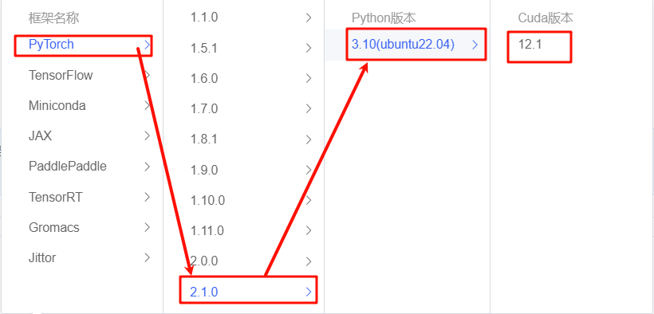

# XVERSE-7B-chat FastAPI deployment

XVERSE-7B-Chat is the aligned version of [XVERSE-7B](https://huggingface.co/xverse/XVERSE-7B) model.

XVERSE-7B is a large language model (Large Language Model) independently developed by Shenzhen Yuanxiang Technology that supports multiple languages. The parameter scale is 7 billion. The main features are as follows:

- Model structure: XVERSE-7B uses the mainstream Decoder-only standard Transformer network structure, supports 8K context length (Context Length), can meet the needs of longer multi-round dialogues, knowledge questions and answers, and summaries, and the model has a wider range of application scenarios.

- Training data: 2.6 trillion tokens of high-quality and diverse data are constructed to fully train the model, including more than 40 languages ​​​​including Chinese, English, Russian, Spanish, etc. By finely setting the sampling ratio of different types of data, the performance of Chinese and English is excellent, and the effects of other languages ​​can also be taken into account.
- Word segmentation: Based on the BPE (Byte-Pair Encoding) algorithm, a word segmenter with a vocabulary size of 100,534 was trained using hundreds of GB of corpus, which can support multiple languages ​​at the same time without the need to expand the vocabulary.
-Training framework: We independently developed a number of key technologies, including efficient operators, video memory optimization, parallel scheduling strategies, data-computing-communication overlap, platform and framework collaboration, etc., to make training more efficient and model more stable. The peak computing power utilization rate on the Qianka cluster can reach 58.5%, ranking among the top in the industry.

## Environment preparation

Rent a 3090 or other 24G video memory graphics card machine on the Autodl platform. As shown in the figure below, select PyTorch-->2.1.0-->3.10(ubuntu22.04)-->12.1 (versions above 11.3 are acceptable).

Next, open JupyterLab on the server you just rented, and open the terminal in it to start environment configuration, model download and run demonstrations.



pip source change accelerates downloading and installing dependent packages. In order to facilitate your environment configuration, the requirement.txt file is provided in the code folder. You can directly use the following command to install it. If you are using [autodl](https://www.autodl.com/) to deploy the model, we have a ready-made image for you to use: [XVERSE-7B-Chat](https://www.codewithgpu.com/i/datawhalechina/self-llm/XVERSE-7B-Chat)

```shell
# Upgrade pip
python -m pip install --upgrade pip
# Replace the installation of the pypi source acceleration library
pip config set global.index-url https://pypi.tuna.tsinghua.edu.cn/simple

pip install -r requirement.txt
``` 

## Model download

Use the snapshot_download function in modelscope to download the model. The first parameter is the model name, and the parameter cache_dir is the download path of the model.

Create a new [model_download.py](code/model_download.py) file in the /root/autodl-tmp path and enter the following content in it. Please save the file in time after pasting the code, as shown in the figure below. And run `python /root/autodl-tmp/model_download.py` to execute the download. The model size is 14GB, and it takes about 2 minutes to download the model.

```pythonimport torch
from modelscope import snapshot_download, AutoModel, AutoTokenizer
import os
model_dir = snapshot_download('xverse/XVERSE-7B-Chat', cache_dir='/root/autodl-tmp', revision='master')
``` 

## Code preparation 

> In order to facilitate your deployment, the code has been prepared in the code folder. You can clone the repository to the server and run it directly.

Create a new [api.py](code/api.py) file in the /root/autodl-tmp path and enter the following content in it. Please save the file in time after pasting the code. The following code has very detailed comments. If you don’t understand anything, please raise an issue. 

```python
from fastapi import FastAPI, Request
from transformers import AutoTokenizer, AutoModelForCausalLM, GenerationConfig
import uvicorn
import json
import datetime
import torch

# Set device parameters
DEVICE = "cuda" # Use CUDA
DEVICE_ID = "0" # CUDA device ID, empty if not set
CUDA_DEVICE = f"{DEVICE}:{DEVICE_ID}" if DEVICE_ID else DEVICE # Combine CUDA device information

# Clean up GPU memory function
def torch_gc():
if torch.cuda.is_available(): # Check if CUDA is available
with torch.cuda.device(CUDA_DEVICE): # Specify CUDA device
torch.cuda.empty_cache() # Clear CUDA cache
torch.cuda.ipc_collect() # Collect CUDA memory fragments

# Create FastAPI application
app = FastAPI()

# Endpoint to handle POST requests
@app.ipcost("/")
async def create_item(request: Request):
global model, tokenizer # Declare global variables to use the model and tokenizer inside the function
json_post_raw = await request.json() # Get the JSON data of the POST request
json_post = json.dumps(json_post_raw) # Convert JSON data to a string
json_post_list = json.loads(json_post) # Convert a string to a Python object
prompt = json_post_list.get('prompt') # Get the prompt in the request

# Build a message
history = [{"role": "user", "content": prompt}]

response = model.chat(tokenizer, history)

now = datetime.datetime.now() # Get the current timetime = now.strftime("%Y-%m-%d %H:%M:%S") # Format time as a string
# Build response JSON
answer = {
"response": response,
"status": 200,
"time": time
}
# Build log information
log = "[" + time + "] " + '", prompt:"' + prompt + '", response:"' + repr(response) + '"'
print(log) # Print log
torch_gc() # Perform GPU memory cleanup
return answer # Return response

# Main function entry
if __name__ == '__main__':
# Load pre-trained tokenizer and model
model_path = "xverse/XVERSE-7B-Chat"
tokenizer = AutoTokenizer.from_pretrained(model_path, trust_remote_code=True)
model = AutoModelForCausalLM.from_pretrained(model_path, torch_dtype=torch.float16, trust_remote_code=True).cuda()
model.generation_config = GenerationConfig.from_pretrained(model_path)
model = model.eval()

# Start FastAPI application
# Use port 6006 to map the port of autodl to the local, so that the api can be used locally
uvicorn.run(app, host='0.0.0.0', port=6006, workers=1) # Start the application on the specified port and host
``` 

## Api deployment 

Enter the following command in the terminal to start the api service: 

```shell 
cd /root/autodl-tmp
python api.py
``` 

After loading, the following information appears, indicating success.


By default, it is deployed on port 6006 and can be called through the POST method. You can use curl to call it, as shown below: 

```shell
curl -X POST "http://127.0.0.1:6006" \
-H 'Content-Type: application/json' \
-d '{"prompt": "Hello, who are you?"}'
``` 

You can also use the requests library in python to call it, as shown below: 

```python
import requests
import json

def get_completion(prompt):
headers = {'Content-Type': 'application/json'}
data = {"prompt": prompt}
response = requests.post(url='http://127.0.0.1:6006', headers=headers, data=json.dumps(data))
returnresponse.json()['response']

if __name__ == '__main__':
print(get_completion('Hello, who are you?'))
```

The return value is as follows:

```json
{"response":"I am an artificial intelligence language model developed by Yuanxiang Company, named XChat. I am trained based on the Transformer architecture. I can understand and generate natural language, assist in answering questions, provide information, participate in conversations, create texts, etc. Please note that I do not have self-awareness or personal emotions, I am just a tool that can understand and generate text. My knowledge ends in July 2023, so information about more recent events and developments may not be included. If you have any questions, I will try my best to help! ","status":200,"time":"2024-04-18 12:07:16"}
``` 

