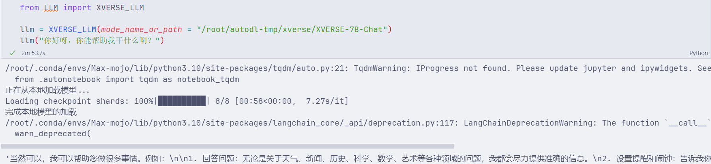

# XVERSE-7B-chat langchain access

XVERSE-7B-Chat is the aligned version of the [XVERSE-7B](https://huggingface.co/xverse/XVERSE-7B) model.

XVERSE-7B is a large language model (Large Language Model) independently developed by Shenzhen Yuanxiang Technology that supports multiple languages. The parameter scale is 7 billion. The main features are as follows:

- Model structure: XVERSE-7B uses the mainstream Decoder-only standard Transformer network structure, supports 8K context length (Context Length), can meet the needs of longer multi-round dialogues, knowledge questions and answers, and summaries, and the model has a wider range of application scenarios.

- Training data: 2.6 trillion tokens of high-quality and diverse data are constructed to fully train the model, including more than 40 languages ​​​​including Chinese, English, Russian, Spanish, etc. By finely setting the sampling ratio of different types of data, the performance of Chinese and English is excellent, and the effects of other languages ​​can also be taken into account.
- Word segmentation: Based on the BPE (Byte-Pair Encoding) algorithm, a word segmenter with a vocabulary size of 100,534 was trained using hundreds of GB of corpus. It can support multiple languages ​​at the same time without the need to expand the vocabulary.- Training framework: We independently developed a number of key technologies, including efficient operators, video memory optimization, parallel scheduling strategies, data-computing-communication overlap, platform and framework collaboration, etc., to make training more efficient and model more stable. The peak computing power utilization rate on the Qianka cluster can reach 58.5%, ranking among the top in the industry.

## Environment preparation

Rent a 3090 or other 24G video memory graphics card machine on the Autodl platform. As shown in the figure below, select PyTorch-->2.1.0-->3.10(ubuntu22.04)-->12.1 (versions above 11.3 are acceptable).


Next, open JupyterLab on the server you just rented, and open the terminal in it to start environment configuration, model download and run demo.

pip source change accelerates downloading and installing dependent packages. In order to facilitate your environment configuration, the requirement.txt file is provided in the code folder. You can directly use the following command to install it. If you are using [autodl](https://www.autodl.com/) to deploy the model, we have a pre-made image for you to use: [XVERSE-7B-Chat](https://www.codewithgpu.com/i/datawhalechina/self-llm/XVERSE-7B-Chat)

```shell
# Upgrade pip
python -m pip install --upgrade pip
# Replace the installation of the pypi source acceleration library
pip config set global.index-url https://pypi.tuna.tsinghua.edu.cn/simple

pip install -r requirement.txt
``` 

## Model download

Use the snapshot_download function in modelscope to download the model. The first parameter is the model name, and the parameter cache_dir is the download path of the model.

Create a new [model_download.py](code/model_download.py) file in the /root/autodl-tmp path and enter the following content in it. Please save the file in time after pasting the code, as shown in the figure below. And run `python /root/autodl-tmp/model_download.py` to execute the download. The model size is 14GB, and it takes about 2 minutes to download the model.

```python
import torch
from modelscope import snapshot_download, AutoModel, AutoTokenizer
import os
model_dir = snapshot_download('xverse/XVERSE-7B-Chat', cache_dir='/root/autodl-tmp', revision='master')
``` 

## Code preparation

> For your convenience, the code has been prepared in the code folder. You can clone the repository to the server and run it directly.

To build LLM applications conveniently, we need to customize an LLM class based on the locally deployed XVERSE-LLM and connect XVERSE to the LangChain framework. After completing the customized LLM class, you can call the LangChain interface in a completely consistent way without considering the inconsistency of the underlying model call.

It is not complicated to customize the LLM class based on the locally deployed XVERSE. We only need to inherit a subclass from the LangChain.llms.base.LLM class and rewrite the constructor and _call function. The following creates [LLM.py](code/LLM.py) file, the content is as follows: ```python from langchain.llms.base import LLM from typing import Any, List, Optional from langchain.callbacks.manager import CallbackManagerForLLMRun from transformers import AutoTokenizer, AutoModelForCausalLM , GenerationConfig, LlamaTokenizerFast import torch class XVERSE_LLM(LLM): # Customized LLM class tokenizer based on local XVERSE-7B-Chat: AutoTokenizer = None model: AutoModelForCausalLM = None def __init__(self, mode_name_or_path :str): super().__init__()
print("Loading model from local...")
self.tokenizer = AutoTokenizer.from_pretrained(mode_name_or_path, trust_remote_code=True)
self.model = AutoModelForCausalLM.from_pretrained(mode_name_or_path, torch_dtype=torch.float16, trust_remote_code=True).cuda()
self.model = self.model.eval()
print("Complete loading of local model")

def _call(self, prompt : str, stop: Optional[List[str]] = None,
run_manager: Optional[CallbackManagerForLLMRun] = None,**kwargs: Any):

# Build a message
history = [{"role": "user", "content": prompt}]

response = self.model.chat(self.tokenizer, history)

return response
@property
def _llm_type(self) -> str:
return "XVERSE_LLM"

```

In the above class definition, we rewrite the constructor and _call function respectively: for the constructor, we load the locally deployed XVERSE-7B model at the beginning of the object instantiation to avoid the long time of reloading the model for each call; the _call function is the core function of the LLM class, LangChain will call this function to call LLM, in which we call the chat method of the instantiated model to call the model and return the call result.

In the overall project, we encapsulate the above code as [LLM.py](code/LLM.py), and will directly call it fromImport the custom LLM class in this file.

## Run the code

Then you can use it like any other langchain model function.

```python
from LLM import XVERSE_LLM

llm = XVERSE_LLM(mode_name_or_path = "/root/autodl-tmp/xverse/XVERSE-7B-Chat")

llm("Hello, what can you do for me?")

```

The result is as follows:
```json
'Of course, I can help you do a lot of things. For example:\n\n1. Answer questions: Whether it is about weather, news, history, science, mathematics, art and other fields, I will try my best to provide accurate information. \n2. Set reminders and alarms: Tell me the time you need to be reminded or set, and I will notify you at the specified time. \n3. Send messages: If you want to send a message to someone, just tell me the recipient's name or contact information, and I can help you do it. \n4. Query route: Enter your destination and I can plan the best route for you. \n5. Play music and movies: Just tell me which song you want to listen to or which movie you want to watch, and I can play it for you. \n6. Learn new knowledge: If you have any learning needs, such as learning new languages, skills, etc., II can also provide relevant learning resources and suggestions. \n7. Perform simple calculations: If you need to perform complex mathematical operations, I may not be able to answer them directly, but I can try to provide some basic calculation methods. \n8. Provide news updates: I can provide you with real-time news updates to keep you informed of world events. \n9. Many other tasks: As long as it is what you need, I will do my best. '
```
