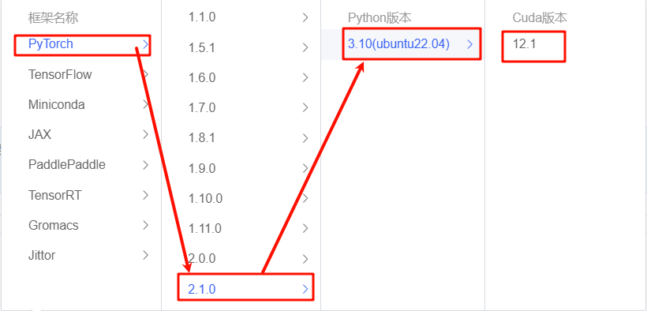
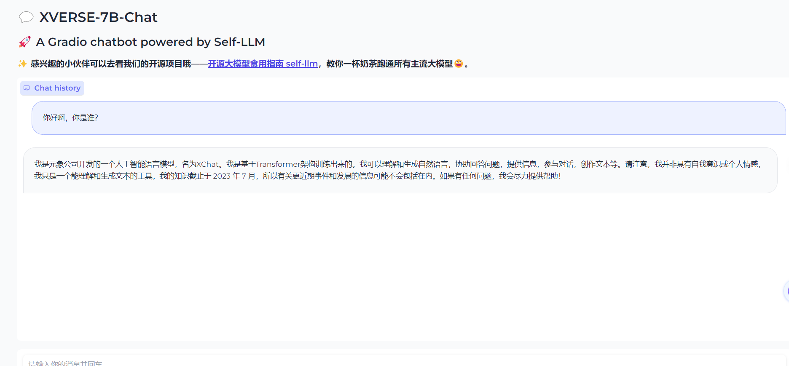

# XVERSE-7B-chat WebDemo deployment

XVERSE-7B-Chat is the aligned version of the [XVERSE-7B](https://huggingface.co/xverse/XVERSE-7B) model.

XVERSE-7B is a large language model (Large Language Model) independently developed by Shenzhen Yuanxiang Technology that supports multiple languages. The parameter scale is 7 billion. The main features are as follows:

- Model structure: XVERSE-7B uses the mainstream decoder-only standard Transformer network structure, supports 8K context length (Context Length), can meet the needs of longer multi-round dialogues, knowledge questions and answers, and summaries, and the model has a wider range of application scenarios.

- Training data: 2.6 trillion tokens of high-quality and diverse data are constructed to fully train the model, including more than 40 languages ​​such as Chinese, English, Russian, and Spanish. By finely setting the sampling ratio of different types of data, the performance of Chinese and English is excellent, and the effects of other languages ​​can also be taken into account.
- Word segmentation: Based on the BPE (Byte-Pair Encoding) algorithm, a word segmenter with a vocabulary size of 100,534 was trained using hundreds of GB of corpus, which can support multiple languages ​​at the same time without the need to expand the vocabulary.
-Training framework: We independently developed a number of key technologies, including efficient operators, video memory optimization, parallel scheduling strategies, data-computing-communication overlap, platform and framework collaboration, etc., to make training more efficient and model more stable. The peak computing power utilization rate on the Qianka cluster can reach 58.5%, ranking among the top in the industry.

## Environment preparation

Rent a 3090 or other 24G video memory graphics card machine on the Autodl platform. As shown in the figure below, select PyTorch-->2.1.0-->3.10(ubuntu22.04)-->12.1 (versions above 11.3 are acceptable).



pip source switching accelerates downloading and installing dependent packages. In order to facilitate your environment configuration, we provide you with the requirement.txt file in the code folder. You can directly use the following command to install it. If you use [autodl](https://www.autodl.com/) to deploy the model, we have a ready-made image for you to use: [XVERSE-7B-Chat](https://www.codewithgpu.com/i/datawhalechina/self-llm/XVERSE-7B-Chat)

```bash
# Upgrade pip
python -m pip install --upgrade pip
# Replace the pypi source to accelerate the installation of the library
pip config set global.index-url https://pypi.tuna.tsinghua.edu.cn/simple

# Install python dependencies
pip install -r requirement.txt
```

## Model download

XVERSE-7B-Chat model:

* [huggingface](https://huggingface.co/xverse/XVERSE-7B-Chat)

* [modelscope](https://www.modelscope.cn/models/xverse/XVERSE-7B-Chat/summary)

### Download using modelscope

Use the snapshot_download function in modelscope to download the model. The first parameter is the model name, the parameter cache_dir is the model download path, and the model path is `/root/autodl-tmp`. Create model_download under /root/autodl-tmp.The contents of the py file are as follows: 

```python
from modelscope import snapshot_download
model_dir = snapshot_download("xverse/XVERSE-7B-Chat", cache_dir='/root/autodl-tmp', revision="master")
```

## Code preparation

> In order to facilitate your deployment, the code has been prepared in the code folder. You can clone the repository to the server and run it directly.

Create a new file `chatBot.py` in the `/root/autodl-tmp` path and enter the following content in it:
```python
import argparse
import torch
import gradio as gr
import json
from datetime import datetime
from transformers import AutoModelForCausalLM, AutoTokenizer,GenerationConfig

tokenizer, model = None, Nonedef init_model(args): global tokenizer, model tokenizer = AutoTokenizer.from_pretrained(args.tokenizer_path, truncation_side="left", padding_side="left") model = AutoModelForCausalLM.from_pretrained(args.model_path, trust_remote_code=True, torch_dtype=torch. bfloat16, low_cpu_mem_usage=True, device_map='auto') model.generation_config = GenerationConfig.from_pretrained(args.model_path) model = model.eval() def chat(message, history, request: gr.Request): global tokenizer, model history = history or [] history.append({"role": "user", "content": message}) # init history.append({"role": "assistant", "content": ""}) utter_history = [] for i in range(0, len(history), 2): utter_history.append([history[i]["content"], history[i+ 1]["content"]]) # chat with stream for next_text in model.chat(tokenizer, history[:-1], stream=True): utter_history[-1][1] += next_text history[-1]["content"] += next_text if torch.backends.mps.is_available(): torch.mps.empty_cache() yield utter_history, history # log current_time = datetime.now().strftime('%Y -%m-%d %H:%M:%S') print(f'{current_time} request_ip:{request.client.host}\nquery: {message}\nhistory: {json.dumps(history, ensure_ascii= False)}\nanswer: {json.dumps(utter_history[-1][1], ensure_ascii=False)}') # Add configuration and model address def get_args(): parser = argparse.ArgumentParser() parser.add_argument("--port", type=int, default=6006, help="server port") parser.add_argument("--model_path", type=str, default="/root/autodl-tmp/xverse /XVERSE-7B-Chat", help="model path") parser.add_argument("--tokenizer_path", type=str, default="/root/autodl-tmp/xverse/XVERSE-7B-Chat", help= "Path to the tokenizer.") args = parser.parse_args() return args if __name__ == "__main__": args = get_args() #Initialize the model
init_model(args)

# Build a demo application
with gr.Blocks(theme=gr.themes.Soft()) as demo:
gr.Markdown("""
# <center>💬 XVERSE-7B-Chat</center>
## <center>🚀 A Gradio chatbot powered by Self-LLM</center>
### <center>✨ Interested friends can go to our open source project - [Open Source Large Model Usage Guide self-llm](https://github.com/datawhalechina/self-llm.git), teach you to run all mainstream large models with a cup of milk tea😀.</center>
""")
chatbot = gr.Chatbot(label="Chat history", height=500) state = gr.State([]) with gr.Row(): text_box = gr.Textbox(label="Message", show_label=False, placeholder="Please enter your message and press Enter") with gr. Row(): submit_btn = gr.Button(value="Send", variant="secondary") reset_btn = gr.Button(value="Reset") text_box.submit(fn=chat, inputs=[text_box, state], outputs=[chatbot, state], api_name="chat") submit_btn.click(fn=chat, inputs=[text_box, state], outputs=[chatbot, state]) # Used to clear text_box def clear_textbox(): return gr.update(value="") text_box.submit(fn=clear_textbox, inputs=None, outputs=[text_box]) submit_btn.click(fn=clear_textbox, inputs=None, outputs=[text_box]) # Used to clear the page and reset the state def reset(): return None, [] reset_btn.click(fn=reset , inputs=None, outputs=[chatbot, state])demo.launch(server_name="0.0.0.0", server_port=args.port)
```

## Run demo

Run the following command in the terminal to start the gradio service, and map the port to the local according to the instructions of `autodl`, then open the link http://localhost:6006/ in the browser to see the chat interface.

```bash
python chatBot.py
```
As shown below:
