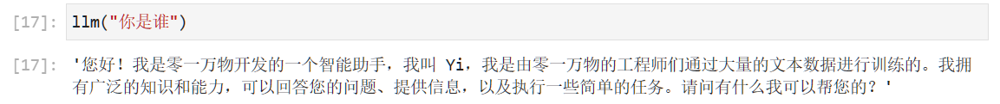
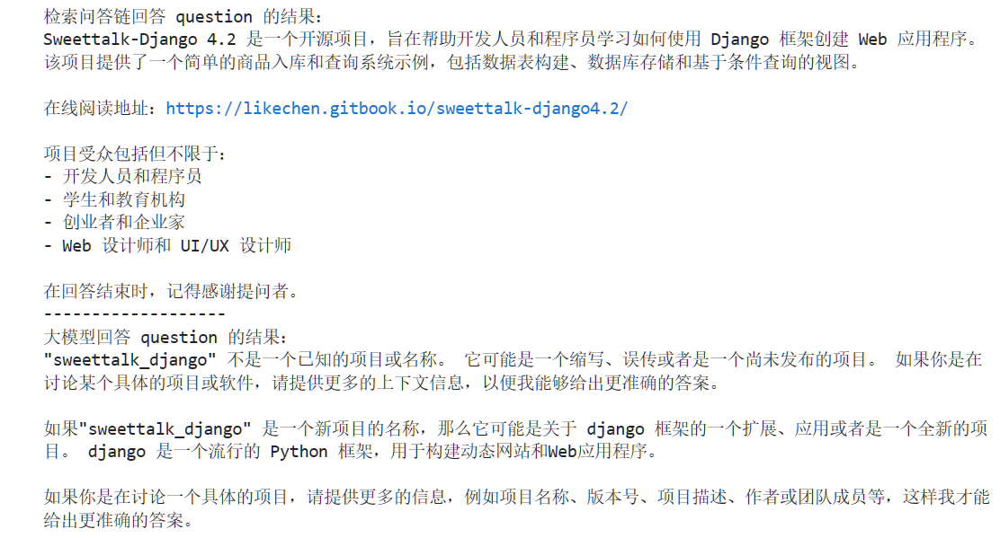

# Yi-6B-Chat connects to LangChain to build a knowledge base assistant 

## Environment preparation 

Rent a 3090 or other 24G graphics card machine on the autodl platform. As shown in the figure below, select PyTorch-->2.0.0-->3.8(ubuntu20.04)-->11.8 


Next, open JupyterLab on the server you just rented, and open the terminal to start environment configuration, model download and run demo.

pip changes the source to speed up downloading and installing dependent packages

```shell
# Upgrade pip
python -m pip install --upgrade pip
# Change pypi source to speed up library installation
pip config set global.index-url https://pypi.tuna.tsinghua.edu.cn/simple

pip install modelscope==1.9.5
pip install "transformers>=4.32.0" accelerate tiktoken einops scipy transformers_stream_generator==0.0.4 peft deepspeed
pip install -U huggingface_hub
``` 

## Model download

On the basis of completing the deployment of Yi-6B-chat, we also need to install the following dependency packages.
Please copy and paste the following command in the terminal and press Enter to run:

```shell
pip install langchain==0.0.292
pip install gradio==4.4.0
pip install chromadb==0.4.15
pip install sentence-transformers==2.2.2
pip install unstructured==0.10.30
pip install markdown==3.3.7
``` 

At the same time, we also need to use the open source word vector model [Sentence Transformer](https://huggingface.co/sentence-transformers/paraphrase-multilingual-MiniLM-L12-v2) .

Here we use huggingface mirror to download to local /root/autodl-tmp/embedding_model, you can also choose other ways to download.

Create a new download.py file in the /root/autodl-tmp path and enter the following content in it. Please save the file in time after pasting the code, as shown in the figure below. And run `python /root/autodl-tmp/download.py` to execute the download.

```python
import os
# Set environment variables
os.environ['HF_ENDPOINT'] = 'https://hf-mirror.com'
# Download model
os.system('huggingface-cli download --resume-download sentence-transformers/paraphrase-multilingual-MiniLM-L12-v2 --local-dir /root/autodl-tmp/embedding_model')
```

Use the snapshot_download function in modelscope to download the model. The first parameter is the model name, and the parameter cache_dir is the download path of the model.

In /Create a new model_download.py file in the root/autodl-tmp path and enter the following content in it. Remember to save the file after pasting the code, as shown in the figure below. And run `python /root/autodl-tmp/model_download.py` to download. The model size is 11 GB, and it takes about 8 to 15 minutes to download the model.

```python 

import torch
from modelscope import snapshot_download, AutoModel, AutoTokenizer
import os
model_dir = snapshot_download('01ai/Yi-6B-Chat', cache_dir='/root/autodl-tmp', revision='master')
```

## Knowledge base construction

We use the following open source warehouse as the source of the knowledge base:

- [sweettalk-django4.2](https://github.com/Joe-2002/sweettalk-django4.2)

First, we need to clone the above remote open source warehouse to the local, which can be used with the following command:```shell
# Enter the database disk
cd /root/autodl-tmp
# Open academic resource acceleration
source /etc/network_turbo
# clone open source repository
git clone https://github.com/Joe-2002/sweettalk-django4.2.git
# Close academic resource acceleration
unset http_proxy && unset https_proxy
```

Next, for the convenience of corpus processing, we will use all the markdown and txt files in the above repository as sample corpora. Note that you can also select the code files to add to the knowledge base, but you need to do additional processing for the code file format.

First, we find all the file paths that meet the conditions in the above warehouse. We define a function that will recursively specify the folder path and return all the file paths that meet the conditions (i.e., files with the suffix .md or .txt):

```python
import os
def get_files(dir_path):
# args: dir_path, target folder path
file_list = []
for filepath, dirrnames, filenames in os.walk(dir_path):
# os.walk function will recursively traverse the specified folder
for filename in filenames:
# Determine whether the file type meets the requirements by the suffix name
if filename.endswith(".md"):
# If it meets the requirements, add its absolute path to the result list
file_list.append(os.path.join(filepath, filename))
elif filename.endswith(".txt"):
file_list.append(os.path.join(filepath, filename))
return file_list
```

After getting all the target file paths, we can use the FileLoader object provided by LangChain to load the target file and get the plain text content parsed from the target file. Due to different typesDifferent files need to correspond to different FileLoaders. We determine the target file type and call the corresponding type of FileLoader in a targeted manner. At the same time, call the load method of the FileLoader object to get the loaded plain text object:

```python
from tqdm import tqdm
from langchain.document_loaders import UnstructuredFileLoader
from langchain.document_loaders import UnstructuredMarkdownLoader

def get_text(dir_path):
# args: dir_path, target folder path
# First call the function defined above to get the target file path list
file_lst = get_files(dir_path)
# docs stores the loaded plain text object
docs = []
# Traverse all target files
for one_file in tqdm(file_lst):
file_type = one_file.split('.')[-1]
if file_type == 'md':
loader = UnstructuredMarkdownLoader(one_file)
elif file_type == 'txt':
loader = UnstructuredFileLoader(one_file)
else:
# If it is a file that does not meet the conditions, skip it directly
continue
docs.extend(loader.load())
return docs
```

Using the above function, we get docs as a list corresponding to a plain text object.

```python
docs = get_text('/root/autodl-tmp/sweettalk-django4.2')
```

After getting the list, we can introduce it into the LangChain framework to build a vector database. To build a vector database from a plain text object, we need to first divide the text into blocks and then vectorize the text blocks.

LangChain provides a variety of text segmentation tools. Here we use the string recursive splitter and select a segment size of 500 and a block overlap length of 150:

```python
from langchain.text_splitter import RecursiveCharacterTextSplitter

text_splitter = RecursiveCharacterTextSplitter(
chunk_size=500, chunk_overlap=150)
split_docs = text_splitter.split_documents(docs) 
``` 

Then we use the open source word vector model [Sentence Transformer](https://huggingface.co/sentence-transformers/paraphrase-multilingual-MiniLM-L12-v2) to vectorize text.

LangChain provides an interface for directly introducing models from the HuggingFace open source community for vectorization: 

```python
from langchain.embeddings.huggingface import HuggingFaceEmbeddings

embeddings = HuggingFaceEmbeddings(model_name="/root/autodl-tmp/embedding_model")
``` 

At the same time, we choose Chroma as the vector database. Based on the documents after segmentation and the loaded open source vectorization model, load the corpus into the vector database under the specified path: 

```python
from langchain.vectorstores import Chroma

# Define the persistence path
persist_directory = 'data_base/vector_db/chroma'
# Load the database
vectordb = Chroma.from_documents(
documents=split_docs,
embedding=embeddings,
persist_directory=persist_directory # Allows us to save the persist_directory directory to disk
)
# Persist the loaded vector database to disk
vectordb.persist()
```

Integrate the above code together to build a script for the knowledge base:

```python
# First import the required third-party libraries
from langchain.document_loaders import UnstructuredFileLoader
from langchain.document_loaders import UnstructuredMarkdownLoader
from langchain.text_splitter import RecursiveCharacterTextSplitter
from langchain.vectorstores import Chroma
from langchain.embeddings.huggingface import HuggingFaceEmbeddings
from tqdm import tqdm
import os

# Get file path function
def get_files(dir_path):
# args: dir_path, target folder path
file_list = []
for filepath, dirnames, filenames in os.walk(dir_path):
# os.walk function will recursively traverse the specified folder
for filename in filenames:
# Determine whether the file type meets the requirements by the suffix name
if filename.endswith(".md"):
# If it meets the requirements, add its absolute path to the result list
file_list.append(os.path.join(filepath, filename))
elif filename.endswith(".txt"):
file_list.append(os.path.join(filepath, filename))
return file_list

# Load file function
def get_text(dir_path):
# args: dir_path, target folder path
# First call the definition aboveThe function gets the target file path list
file_lst = get_files(dir_path)
# docs stores the plain text object after loading
docs = []
# Traverse all target files
for one_file in tqdm(file_lst):
file_type = one_file.split('.')[-1]
if file_type == 'md':
loader = UnstructuredMarkdownLoader(one_file)
elif file_type == 'txt':
loader = UnstructuredFileLoader(one_file)
else:
# If it is a file that does not meet the conditions, skip it directly
continue
docs.extend(loader.load())
return docs

# Target folder
tar_dir = [
"/root/autodl-tmp/sweettalk-django4.2",
]

# Load target files
docs = []
for dir_path in tar_dir:
docs.extend(get_text(dir_path))

# Split text into chunks
text_splitter = RecursiveCharacterTextSplitter(
chunk_size=500, chunk_overlap=150)
split_docs = text_splitter.split_documents(docs)

# Load open source word vector model
embeddings = HuggingFaceEmbeddings(model_name="/root/autodl-tmp/embedding_model")

# Build vector database
# Define persistence path
persist_directory = 'data_base/vector_db/chroma'
# Load database
vectordb = Chroma.from_documents(
documents=split_docs,
embedding=embeddings,
persist_directory=persist_directory # Allows us to save the persist_directory directory to disk
)
# Persist the loaded vector database to disk
vectordb.persist()
```

Run the above script to build a persisted vector database locally, and then directly import the database without repeated construction.

## Yi connected to LangChain

To build LLM applications conveniently, we need to customize an LLM class based on the locally deployed YiLM and connect Yi to the LangChain framework. After completing the customized LLM class, the LangChain interface can be called in a completely consistent way without considering the inconsistency of the underlying model call.

Customizing the LLM class based on the locally deployed Yi is not complicated. We only need to inherit a subclass from the LangChain.llms.base.LLM class and rewrite the constructor and _call function:

```python
from langchain.llms.base import LLM
from typing import Any, List, Optional
from langchain.callbacks.manager import CallbackManagerForLLMRun
from transformers import AutoTokenizer, AutoModelForCausalLM, GenerationConfig, LlamaTokenizerFast
import torch

class Yi_LLM(LLM):
# Customize LLM class based on local Yi
tokenizer: AutoTokenizer = None
model: AutoModelForCausalLM = None

def __init__(self, mode_name_or_path :str):

super().__init__()
print("Loading model from local...")
self.tokenizer = AutoTokenizer.from_pretrained(mode_name_or_path, trust_remote_code=True, use_fast=False) self.model = AutoModelForCausalLM.from_pretrained(mode_name_or_path, trust_remote_code=True,torch_dtype=torch.bfloat16,device_map="auto") self.model.generation_config = GenerationConfig.from_pretrained(mode_name_or_path) self.model. generation_config.pad_token_id = self.model.generation_config.eos_token_id self.model = self.model.eval() print("Complete loading of local model") def _call(self, prompt : str, stop: Optional[List[str]] =None, run_manager: Optional[CallbackManagerForLLMRun] = None, **kwargs: Any): messages = [ {"role": "user", "content": prompt } ] input_ids = self.tokenizer.apply_chat_template(conversation=messages, tokenize =True, add_generation_prompt=True, return_tensors='pt') output_ids = self.model.generate(input_ids.to('cuda')) response = self.tokenizer.decode(output_ids[0][input_ids.shape[1]: ], skip_special_tokens=True)
return response
@property
def _llm_type(self) -> str:
return "Yi_LLM"
```

In the above class definition, we rewrite the constructor and _call function respectively: for the constructor, we load the locally deployed Yi model at the beginning of the object instantiation, so as to avoid the long time of reloading the model for each call; the _call function is the core function of the LLM class, and LangChain will call this function to call LLM. In this function, we call the generate method of the instantiated model to call the model and return the call result.

In the overall project, we encapsulate the above code as LLM.py, and then directly introduce the custom LLM class from this file.

## Build a retrieval question and answer chain

LangChain encapsulates the entire RAG process by providing a retrieval question and answer chain object. That is, we can call a RetrievalQA object provided by LangChain, and fill in the constructed database and custom LLM as parameters during initialization to easily complete the whole process of retrieval enhanced question answering. LangChain will automatically complete the basicThe entire process of searching for user questions, obtaining relevant documents, splicing them into appropriate prompts and handing them over to LLM Q&A.

First, we need to import the vector database built above. We can directly load the built database through Chroma and the word vector model defined above:

```python
from langchain.vectorstores import Chroma
from langchain.embeddings.huggingface import HuggingFaceEmbeddings
import os

# Define Embeddings
embeddings = HuggingFaceEmbeddings(model_name="/root/autodl-tmp/embedding_model")

# Vector database persistence path
persist_directory = 'data_base/vector_db/chroma'

# Load database
vectordb = Chroma(
persist_directory=persist_directory, 
embedding_function=embeddings
)
```

The vectordb object obtained by the above code is the vector database object we have built. This object can perform semantic vector retrieval for the user's query and obtain knowledge fragments related to the user's question.

Next, we instantiate an LLM object based on Yi customization:

```python
from LLM import Yi_LLM
llm = Yi_LLM(mode_name_or_path = "/root/autodl-tmp/01ai/Yi-6B-Chat")
llm("Who are you")
```


To build a retrieval question and answer chain, you also need to build a Prompt Template. The Template is actually based on a string with variables. After retrieval, LangChain will fill the retrieved relevant document fragments into the variables of the Template, thereby realizing the construction of a Prompt with knowledge. We can instantiate such a Template object based on the Template base class of LangChain:

```python
from langchain.prompts import PromptTemplate

# The Prompt template we constructed
template = """Use the following context to answer the final question. If you don't know the answer, just say you don't know, don't try to make up an answer. Try to make your answer brief and to the point. Always say "Thanks for your question! ”.
{context}
Question: {question}
Useful answer: """

# Call LangChain's method to instantiate a Template object, which contains two variables, context and question. When actually called, these two variables will be filled with the retrieved document fragment and the user's question
QA_CHAIN_PROMPT = PromptTemplate(input_variables=["context","question"],template=template)
```

Finally, you can call the retrieval QA chain constructor provided by LangChain to build a Yi-based retrieval QA chain based on our custom LLM, Prompt Template and vector knowledge base:

```python
from langchain.chains import RetrievalQA

qa_chain = RetrievalQA.from_chain_type(llm,retriever=vectordb.as_retriever(),return_source_documents=True,chain_type_kwargs={"prompt":QA_CHAIN_PROMPT})
``` 

The obtained qa_chain object can realize our core function, that is, the professional knowledge base assistant based on the Yi model. We can compare the Q&A effect of this retrieval Q&A chain and pure LLM: 

```python
question = "What is the sweettalk_django project?"
result = qa_chain({"query": question})
print("The result of retrieving the Q&A chain to answer question:")
print(result["result"])

print("-------------------")
# Only LLM answer effect
result_2 = llm(question)
print("The result of the large model answering question:")
print(result_2)
``` 

