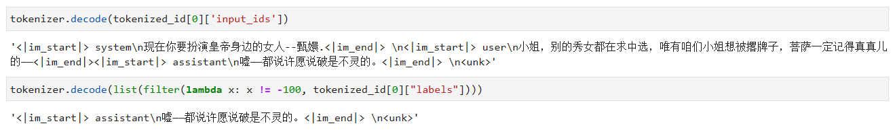
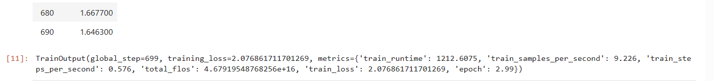
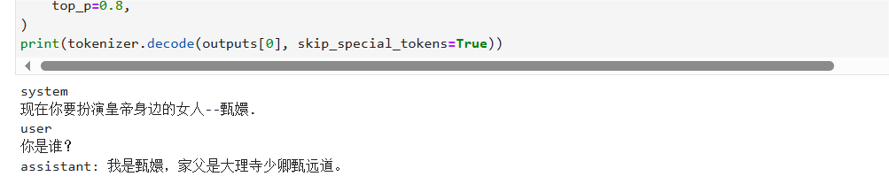

# 04-Yi-6B-Chat Lora fine-tuning

## Overview

In this section, we introduce how to fine-tune the Yi-6B-Chat model with Lora based on frameworks such as transformers and peft. Lora is an efficient fine-tuning method. For a deeper understanding of its principles, please refer to the blog: [Zhihu | A Simple Introduction to Lora](https://zhuanlan.zhihu.com/p/650197598).

The code script described in this section is in the same directory [04-Yi-6B-Chat Lora Fine-tuning](./04-Yi-6B-chat%20Lora Fine-tuning.py). Run the script to perform the fine-tuning process, but note that the code in this article does not use a distributed framework. Fine-tuning the Yi-6B-Chat model requires at least 20G of video memory and above, and the model path and dataset path in the script file need to be modified.

## Environment configuration

After completing the basic environment configuration and local model deployment (the model path used in this tutorial is /root/autodl-tmp/01ai/Yi-6B-Chat ), you also need to install some third-party libraries. You can use the following command:

```bash
pip install transformers==4.35.2
pip install peft==0.4.0
pip install datasets==2.10.1
pip install accelerate==0.20.3
pip install tiktoken
pip install transformers_stream_generator
```

In this tutorial, we will place the fine-tuning dataset in the root directory [/dataset](../dataset/huanhuan.jsonl).

## Instruction set construction

LLM fine-tuning generally refers to the instruction fine-tuning process. The so-called instruction fine-tuning means that the fine-tuning data we use is in the form of:

```json
{
"instrution":"Answer the following user question and only output the answer.",
"input":"What is 1+1?",
"output":"2"
}
```

Among them, `instruction` is the user instruction, telling the model what task it needs to complete; `input` is the user input, which is the input content required to complete the user instruction; `output` is the output that the model should give.

That is, our core training goal is to enable the model to understand and follow user instructions. Therefore, when constructing the instruction set, we should build the task instruction set specifically for our target task.The [Chat-甄嬛](https://github.com/KMnO4-zx/huanhuan-chat) project from the source is used as an example. Our goal is to build a personalized LLM that can simulate the conversation style of 甄嬛. Therefore, the instructions we construct are as follows:##

```json
{
"instruction": "Now you have to play the role of the woman next to the emperor--甄嬛",
"input":"Who are you?",
"output":"My father is Zhen Yuandao, the Shaoqing of the Dali Temple."
}
```
All the instruction data sets we constructed are in the root directory.

## Data formatting

The data trained by `Lora` needs to be formatted and encoded before being input to the model for training. Students who are familiar with the `Pytorch` model training process will know that we generally need to encode the input text as input_ids and the output text as `labels`. The results after encoding are all multi-dimensional vectors. We first define a preprocessing function, which is used to encode the input and output text for each sample and return an encoded dictionary:

```python
def process_func(example):
MAX_LENGTH = 384 # Llama tokenizer will segment a Chinese character intoMultiple tokens, so some maximum lengths need to be relaxed to ensure data integrity
input_ids, attention_mask, labels = [], [], []
instruction = tokenizer("\n".join(["<|im_start|>system", "Now you have to play the woman beside the emperor--Zhen Huan.<|im_end|>" + "\n<|im_start|>user\n" + example["instruction"] + example["input"] + "<|im_end|>\n"]).strip(), add_special_tokens=False) # add_special_tokens does not add special_tokens at the beginning
response = tokenizer("<|im_start|>assistant\n" + example["output"] + "<|im_end|>\n", add_special_tokens=False)
input_ids = instruction["input_ids"] + response["input_ids"] + [tokenizer.pad_token_id]
attention_mask = instruction["attention_mask"] + response["attention_mask"] + [1] # Because we also need to pay attention to eos token, so add 1
labels = [-100] * len(instruction["input_ids"]) + response["input_ids"] + [tokenizer.pad_token_id] # This is how Yi-6B is constructed
if len(input_ids) > MAX_LENGTH: # Do a truncation
input_ids = input_ids[:MAX_LENGTH]
attention_mask = attention_mask[:MAX_LENGTH]
labels = labels[:MAX_LENGTH]
return {
"input_ids": input_ids,
"attention_mask": attention_mask,
"labels": labels
}
```

Then load our dataset and process the data using the function defined above
```python
# Convert JSON file to CSV file
import pandas as pd
from datasets import Dataset
df = pd.read_json('/root/dataset/huanhuan.json')
ds = Dataset.from_pandas(df)

tokenized_id = ds.map(process_func, remove_columns=ds.column_names)
```

The formatted data, that is, each piece of data sent to the model, is a dictionary containing three key-value pairs: `input_ids`, `attention_mask`, and `labels`, where `input_ids` is the encoding of the input text, `attention_mask` is the attention mask of the input text, and `labels` is the encoding of the output text. decode should be like this:

```text
<|im_start|>system
Now you have to play the role of the woman beside the emperor--Zhen Huan.<|im_end|>
<|im_start|>user
Miss, other girls are seeking to be selected, but ours is the only one who wants to be left out. The Bodhisattva must remember it for real--<|im_end|>
<|im_start|>assistant
Shh--it's said that making a wish out loud is useless. <|im_end|>
<|endoftext|>
```

We can output a text and observe it:

```python
print(tokenizer.decode(tokenized_id[0]['input_ids']))
print(tokenizer.decode(list(filter(lambda x: x != -100, tokenized_id[0]["labels"]))))
```

The output is as follows:


## Load tokenizer and half-precision model
```python
import torch
from transformers import AutoModelForCausalLM,AutoTokenizer
tokenizer = AutoTokenizer.from_pretrained('01ai/Yi-6B-Chat', use_fast=False, trust_remote_code=True)

# The model is loaded in half-precision format. If your graphics card is relatively new, you can load it in torch.bfolat format
model = AutoModelForCausalLM.from_pretrained('01ai/Yi-6B-Chat', trust_remote_code=True, torch_dtype=torch.half, device_map="auto")
```

## Define LoraConfig

Many parameters can be set in the `LoraConfig` class, but there are not many main parameters. I will briefly talk about them. Interested students can directly read the source code.

- `task_type`: model type
- `target_modules`: the name of the model layer to be trained, mainly the layer of the `attention` part. Different models have different corresponding layer names. You can pass in arrays, strings, or regular expressions.
- `r`: the rank of `lora`, see`Lora` principle
- `lora_alpha`: `Lora alaph`, see `Lora` principle for specific functions

```python
from peft import LoraConfig, TaskType, get_peft_model
config = LoraConfig(
task_type=TaskType.CAUSAL_LM, 
target_modules=["q_attn", "k_proj", "v_proj", "o_proj", "gate_proj", "up_proj", "down_proj"],
inference_mode=False, # Training mode
r=8, # Lora rank
lora_alpha=32, # Lora alaph, see Lora principle for specific functions
lora_dropout=0.1# Dropout ratio
)
```

## Training model
First, use the get_peft_model function to wrap the base model and peft_config to create PeftModel. To understand the number of trainable parameters in the model, you can use print_trainable_parameters method.

```python
model = get_peft_model(model, config)
model.enable_input_require_grads() # This method should be executed when gradient checkpoint is enabled
model.print_trainable_parameters()
```

Next, we customize the TrainingArguments parameter

The source code of the `TrainingArguments` class also introduces the specific role of each parameter. Of course, you can explore it yourself. Here are a few common ones.

- `output_dir`: output path of the model
- `per_device_train_batch_size`: As the name suggests `batch_size`
- `gradient_accumulation_steps`: gradient accumulation. If your video memory is small, you can set `batch_size` to a smaller value to increase the gradient accumulation.
- `logging_steps`: how many steps to output a `log`
- `num_train_epochs`: as the name suggests, `epoch`
- `gradient_che`ckpointing`: Gradient checking. Once this is turned on, the model must execute `model.enable_input_require_grads()`. You can explore this principle by yourself, so I won’t go into details here.

```python
from transformers import DataCollatorForSeq2Seq, TrainingArguments, Trainer
args = TrainingArguments(
output_dir="./output/Yi-6B",
per_device_train_batch_size=8,
gradient_accumulation_steps=2,
logging_steps=10,
num_train_epochs=3,
gradient_checkpointing=True,
save_steps=100,
learning_rate=1e-4,
save_on_each_node=True
)
```

Finally, use `Traniner` to train the model

```python
trainer = Trainer(
model=model,
args=args,
train_dataset=tokenized_id,
data_collator=DataCollatorForSeq2Seq(tokenizer=tokenizer, padding=True),
)
trainer.train()
```

After the model training is completed, the following information will be output:


## Model Inference
The downloaded model is saved in the ./output/Yi-6B directory. If you want to load the fine-tuned model from scratch, you need to execute the following code

```python
from transformers import AutoModelForSeq2SeqLM
from peft import PeftModel, PeftConfig

peft_model_id = "output/Yi-6B/checkpoint-600" # Here I trained the best version checkpoint-600, so I called this. You can choose according to your own situation
config = PeftConfig.from_pretrained(peft_model_id)
model = AutoModelForCausalLM.from_pretrained(config.base_model_name_or_path)
model = PeftModel.from_pretrained(model, peft_model_id)
```

Then use the following code for model inference:

```python
model.eval()
input = tokenizer("<|im_start|>system\nNow you have to play the role of the emperor's woman--Zhen Huan.<|im_end|>\n<|im_start|>user\n{}<|im_end|>\n".format("Who are you?", "").strip() + "\nassistant\n ", return_tensors="pt").to(model.device)

max_length = 512

outputs = model.generate(
**input,
max_length=max_length,
eos_token_id=7, do_sample=True, repetition_penalty=1.3, no_repeat_ngram_size=5, temperature=0.1, top_k=40, top_p=0.8, ) print(tokenizer.decode(outputs[0], skip_special_tokens=True)) ```` 