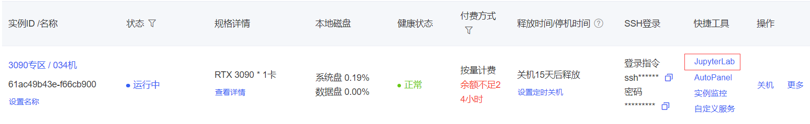
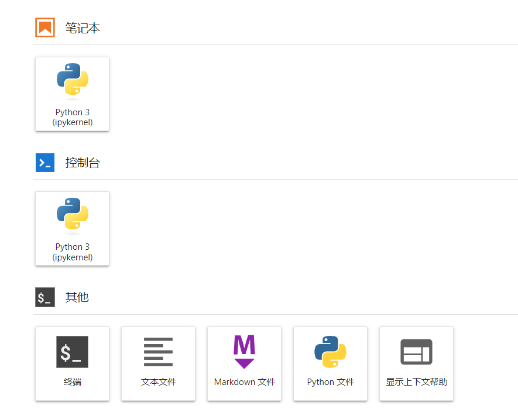

# Yuan2.0-M32 connects to LangChain to build a knowledge base assistant

## Environment preparation

Rent an RTX 3090/24G graphics card machine on the Autodl platform. As shown in the figure below, select PyTorch-->2.1.0-->3.10(ubuntu22.04)-->12.1.


Next, we open JupyterLab on the server we just rented, as shown in the figure below.



Then open the terminal to start environment configuration, model download and run the demonstration. 



## Environment configuration

Yuan2-M32-HF-INT4 is a model quantized from the original Yuan2-M32-HF by auto-gptq.

Through model quantization, the requirements for video memory and hard disk for deploying Yuan2-M32-HF-INT4 will be significantly reduced.

Note: Since the pip version of auto-gptq does not currently support Yuan2.0 M32, it needs to be compiled and installed

```shell
# Upgrade pip
python -m pip install --upgradepip

# Replace the pypi source to accelerate the installation of the library
pip config set global.index-url https://pypi.tuna.tsinghua.edu.cn/simple

# Pull the Yuan2.0-M32 project
git clone https://github.com/IEIT-Yuan/Yuan2.0-M32.git

# Enter AutoGPTQ
cd Yuan2.0-M32/3rd_party/AutoGPTQ

# Install autogptq
pip install --no-build-isolation -e .

# Install einops langchain modelscope
pip install einops langchain modelscope
```

> Considering that some students may encounter some problems in configuring the environment, we have prepared a Yuan2.0-M32 image on the AutoDL platform. Click the link below and directly create an Autodl example.
> ***https://www.codewithgpu.com/i/datawhalechina/self-llm/Yuan2.0-M32***## Model download 

Use the snapshot_download function in modelscope to download the model. The first parameter is the model name, and the parameter cache_dir is the model download path.

Here you can first enter the autodl platform and initialize the file storage in the corresponding area of ​​the machine. The file storage path is '/root/autodl-fs'.

The files in this storage will not be lost when the machine is shut down, which can avoid the model from being downloaded twice.


Then run the following code to execute the model download.

```python
from modelscope import snapshot_download
model_dir = snapshot_download('YuanLLM/Yuan2-M32-HF-INT4', cache_dir='/root/autodl-fs')
``` 

## Model merging

The downloaded model is multiple files, which need to be merged.

```shell cat /root/autodl-fs/YuanLLM/Yuan2-M32-HF-INT4/gptq_model-4bit-128g.safetensors* > /root/autodl-fs/YuanLLM/Yuan2-M32-HF-INT4/gptq_model-4bit-128g.safetensors
```

## Code preparation

To build LLM applications conveniently, we need to customize an LLM class based on the locally deployed Yuan2 and connect Yuan2 to the LangChain framework.

After completing the customized LLM class, the LangChain interface can be called in a completely consistent manner without considering the inconsistency of the underlying model call.

Customizing the LLM class based on the locally deployed Yuan2 is not complicated. We only need to inherit a subclass from the LangChain.llms.base.LLM class and rewrite the constructor and _call function:

```python
from langchain.llms.base import LLM
from typing import Any, List, Optional
from langchain.callbacks.manager import CallbackManagerForLLMRun
from auto_gptq import AutoGPTQForCausalLM
from transformers import LlamaTokenizer
import torch

class Yuan2_LLM(LLM):
# Customize LLM class based on local Yuan2
tokenizer: LlamaTokenizer = None
model: AutoGPTQForCausalLM = None

def __init__(self, mode_name_or_path :str):
super().__init__()

# Load pre-trained tokenizer and model
print("Creat tokenizer...")
self.tokenizer = LlamaTokenizer.from_pretrained(mode_name_or_path, add_eos_token=False, add_bos_token=False, eos_token='<eod>')
self.tokenizer.add_tokens(['<sep>', '<pad>', '<mask>', '<predict>', '<FIM_SUFFIX>', '<FIM_PREFIX>', '<FIM_MIDDLE>','<commit_before>','<commit_msg>','<commit_after> ','<jupyter_start>','<jupyter_text>','<jupyter_code>','<jupyter_output>','<empty_output>'], special_tokens=True) print("Creat model...") self.model = AutoGPTQForCausalLM.from_quantized(mode_name_or_path, trust_remote_code=True).cuda() def _call(self, prompt : str, stop: Optional[List[str]] = None, run_manager: Optional[CallbackManagerForLLMRun] = None,
**kwargs: Any):

prompt += "<sep>"
inputs = self.tokenizer(prompt, return_tensors="pt").to(self.model.device)
outputs = self.model.generate(**inputs, do_sample=False, max_new_tokens=256)
output = self.tokenizer.decode(outputs[0])
response = output.split("<sep>")[-1]

return response

@property
def _llm_type(self) -> str:
return "Yuan2_LLM"
```

In the above class definition, we rewrite the constructor and _call function respectively: For the constructor, we load the local deployment at the beginning of the object instantiationYuan2 model, so as to avoid the long time of reloading the model for each call; _call function is the core function of LLM class, LangChain will call this function to call LLM, in which we call the generate method of the instantiated model to call the model and return the call result.

In the overall project, we encapsulate the above code as LLM.py, and then directly introduce the custom LLM class from this file.

## Call

Then you can use it like any other langchain large model function.

```python
from LLM import Yuan2_LLM
llm = Yuan2_LLM('/root/autodl-fs/YuanLLM/Yuan2-M32-HF-INT4')
print(llm("Who are you"))
```

