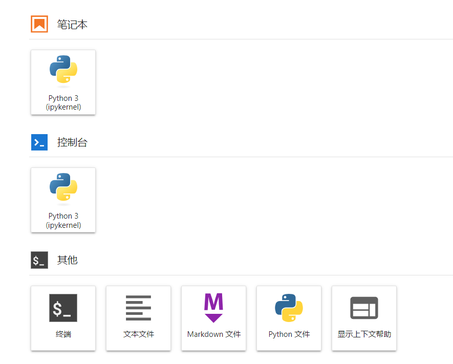
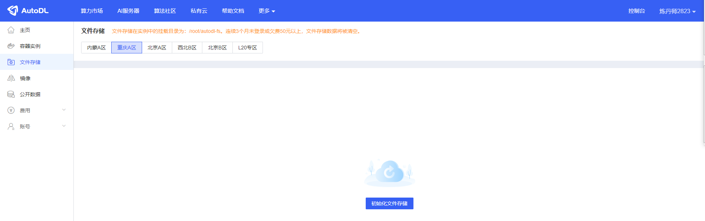
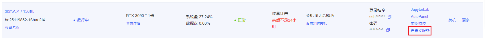
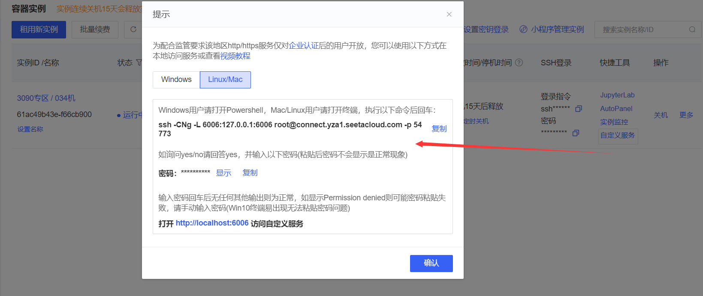
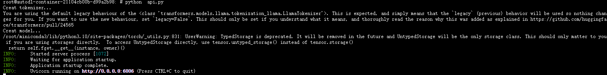
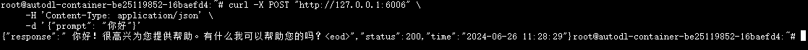

# Yuan2.0-2B FastApi deployment call

## Environment preparation

Rent an RTX 3090/24G graphics card machine in the Autodl platform. As shown in the figure below, select PyTorch-->2.1.0-->3.10(ubuntu22.04)-->12.1.


Next, we open JupyterLab on the server we just rented, as shown in the figure below.


Then open the terminal to start environment configuration, model download and run the demonstration. 



## Environment configuration

pip source change to speed up downloading and installing dependent packages

```shell
# Upgrade pip
python -m pip install --upgrade pip

# Change pypi source to speed up library installation
pip config set global.index-url https://pypi.tuna.tsinghua.edu.cn/simple

# Install fastapi modelscope
pip install fastapi modelscope
``` 

> Considering that some students may encounter some problems in configuring the environment, we have prepared a Yuan2.0 image on the AutoDL platform. Click the link below and create an Autodl example directly.
> ***https://www.codewithgpu.com/i/datawhalechina/self-llm/Yuan2.0***

## Model download 

Use the snapshot_download function in modelscope to download the model. The first parameter is the model name, and the parameter cache_dir is the download path of the model.

Here you can first enter the autodl platform and initialize the file storage in the corresponding area of ​​the machine. The file storage path is '/root/autodl-fs'.

The files in this storage will not be lost when the machine is shut down, which can avoid the model from being downloaded twice.



Then run the following code to execute the model download. The model size is 4.5GB, and it takes about 5 minutes to download.

```python from modelscope import snapshot_download model_dir = snapshot_download('YuanLLM/Yuan2-2B-Mars-hf', cache_dir='/root/autodl-fs')
```

## Code preparation 

Click Custom Service to open the AutoDL open port.



Machines in some areas need to configure the AutoDL open port. The configuration method is written in the General-Setting directory of this project. Please refer to this document for the first use.

The configuration method is shown in the figure below.



Create a new api.py file and enter the following content in it. Please save the file in time after pasting the code.

The code below has very detailed comments. If you don’t understand anything, please raise an issue.

```python from fastapi import FastAPI, Request from transformers import LlamaTokenizer, AutoModelForCausalLM import uvicorn import json import datetime import torch # Set device parametersDEVICE = "cuda" # Use CUDA
DEVICE_ID = "0" # CUDA device ID, empty if not set
CUDA_DEVICE = f"{DEVICE}:{DEVICE_ID}" if DEVICE_ID else DEVICE # Combine CUDA device information

# Clean up GPU memory function
def torch_gc():
if torch.cuda.is_available(): # Check if CUDA is available
with torch.cuda.device(CUDA_DEVICE): # Specify CUDA device
torch.cuda.empty_cache() # Clear CUDA cache
torch.cuda.ipc_collect() # Collect CUDA memory fragments

# Create FastAPI application
app = FastAPI()

# Endpoint to handle POST requests
@app.post("/")
async def create_item(request: Request):
global model, tokenizer # Declare global variables to use the model and tokenizer inside the function
json_post_raw = await request.json() # Get the JSON data of the POST request
json_post = json.dumps(json_post_raw) # Convert JSON data to a string
json_post_list = json.loads(json_post) # Convert a string to a Python object
prompt = json_post_list.get('prompt') # Get the prompt in the request

# Call the model for dialogue generation
prompt += "<sep>"
inputs = tokenizer(prompt, return_tensors="pt")["input_ids"].cuda()
outputs = model.generate(inputs,do_sample=False,max_length=4000)
output = tokenizer.decode(outputs[0])
response= output.split("<sep>")[-1]

now = datetime.datetime.now() # Get the current time
time = now.strftime("%Y-%m-%d %H:%M:%S") # Format the time as a string

# Build the response JSON
answer = {
"response": response,
"status": 200,
"time": time
}
# Build log information
log = "[" + time + "] " + '", prompt:"' + prompt + '", response:"' + repr(response) + '"'
print(log) # Print log
torch_gc() # Perform GPU memory cleanup
return answer # Return response

# Main function entry
if __name__ == '__main__':
# Load pre-trained tokenizer and model
path = '/root/autodl-fs/YuanLLM/Yuan2-2B-Mars-hf' print("Creat tokenizer...") tokenizer = LlamaTokenizer.from_pretrained(path, add_eos_token=False, add_bos_token=False, eos_token='<eod>') tokenizer. add_tokens(['<sep>', '<pad>', '<mask>', '<predict>', '<FIM_SUFFIX>', '<FIM_PREFIX>', '<FIM_MIDDLE>','<commit_before>' ,'<commit_msg>','<commit_after>','<jupyter_start>','<jupyter_text>','<jupyter_code>','<jupyter_output>','<empty_output>'], special_tokens=True) print("Creat model...") model = AutoModelForCausalLM.from_pretrained(path, torch_dtype=torch.bfloat16, trust_remote_code=True).cuda()

# Start FastAPI application
# Use port 6006 to map the port of autodl to the local machine, so that the api can be used locally
uvicorn.run(app, host='0.0.0.0', port=6006, workers=1) # Start the application on the specified port and host
``` 

## Api deployment 

Enter the following command in the terminal to start the api service: 

```shell
python api.py
``` 

After loading, the following information appears, indicating success.



By default, it is deployed on port 6006 and can be called via the POST method. You can use curl to call it as follows: 

```shell
curl -X POST "http://127.0.0.1:6006" \
-H 'Content-Type: application/json' \
-d '{"prompt": "Hello"}'
```



You can also use the requests library in python to call it, as follows:

```python
import requests
import json

def get_completion(prompt):
headers = {'Content-Type': 'application/json'}
data = {"prompt": prompt}
response = requests.post(url='http://127.0.0.1:6006', headers=headers, data=json.dumps(data))
return response.json()['response']

if __name__ == '__main__':
print(get_completion('Hello'))
```

