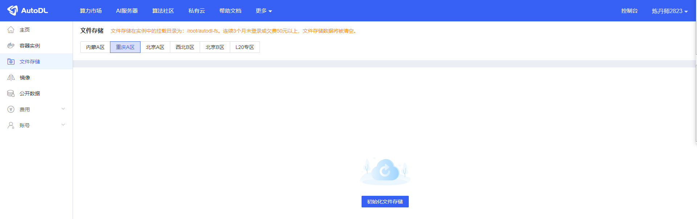

# Yuan2.0-2B WebDemo deployment

## Environment preparation

Rent an RTX 3090/24G graphics card machine in the Autodl platform. As shown in the figure below, select PyTorch-->2.1.0-->3.10(ubuntu22.04)-->12.1.


Next, we open JupyterLab on the server we just rented, as shown in the figure below.


Then open the terminal to start environment configuration, model download and run the demonstration. 


## Environment configuration

pip source change to speed up downloading and installing dependent packages

```shell
# Upgrade pip
python -m pip install --upgrade pip

# Change pypi source to speed up library installation
pip config set global.index-url https://pypi.tuna.tsinghua.edu.cn/simple

# Install einops modelscope streamlit
pip installl einops modelscope streamlit==1.24.0
``` 

> Considering that some students may encounter some problems in configuring the environment, we have prepared a Yuan2.0 image on the AutoDL platform. Click the link below and directly create an Autodl example.
> ***https://www.codewithgpu.com/i/datawhalechina/self-llm/Yuan2.0***

## Model download 

Use the snapshot_download function in modelscope to download the model. The first parameter is the model name, and the parameter cache_dir is the download path of the model.

Here you can first enter the autodl platform and initialize the file storage in the corresponding area of ​​the machine. The file storage path is '/root/autodl-fs'.

The files in this storage will not be lost when the machine is shut down, which can avoid the model from being downloaded twice.



Then run the following code to execute the model download. The model size is 4.5GB, and it takes about 5 minutes to download.

```python from modelscope import snapshot_download model_dir = snapshot_download('YuanLLM/Yuan2-2B-Mars-hf', cache_dir='/root/autodl-fs')
```

## Code preparation

Create a new `chatBot.py` file in the `/root/autodl-tmp` path and enter the following content in it. Remember to save the file after pasting the code. The following code has very detailed comments. If you have any questions, please raise an issue.

chatBot.py code is as follows

```python
# Import the required libraries
from transformers import LlamaTokenizer, AutoModelForCausalLM
import torch
import streamlit as st

# Create a title and a link in the sidebar
with st.sidebar:
st.markdown("## Yuan2.0 LLM")
"[Open Source Large Model Eating Guide self-llm](https://github.com/datawhalechina/self-llm.git)"
# Create a slider to select the maximum length, rangeRanges from 0 to 1024, with a default value of 512
max_length = st.slider("max_length", 0, 1024, 512, step=1)

# Create a title and a subtitle
st.title("💬 Yuan2.0 Chatbot")
st.caption("🚀 A streamlit chatbot powered by Self-LLM")

# Define the model path
path = '/root/autodl-fs/YuanLLM/Yuan2-2B-Mars-hf'

# Define a function to get the model and tokenizer
@st.cache_resource
def get_model():
print("Creat tokenizer...")
tokenizer = LlamaTokenizer.from_pretrained(path, add_eos_token=False, add_bos_token=False, eos_token='<eod>')
tokenizer.add_tokens(['<sep>', '<pad>', '<mask>', '<predict>', '<FIM_SUFFIX>', '<FIM_PREFIX>', '<FIM_MIDDLE>','<commit_before>','<commit_msg>','<commit_after>','<jupyter_start>','<jupyter_text>','<jupyter_code>','<jupyter_output>','<empty_output>'], special_tokens=True)

print("Creat model...")
model = AutoModelForCausalLM.from_pretrained(path, torch_dtype=torch.bfloat16, trust_remote_code=True).cuda()

return tokenizer, model

# Load model and tokenizer
tokenizer, model = get_model()

# If there is no "messages" in session_state, create a list with default messagesif "messages" not in st.session_state:
st.session_state["messages"] = [{"role": "assistant", "content": "How can I help you?"}]

# Traverse all messages in session_state and display them on the chat interface
for msg in st.session_state.messages:
st.chat_message(msg["role"]).write(msg["content"])

# If the user enters content in the chat input box, do the following
if prompt := st.chat_input():
# Add the user's input to the messages list in session_state
st.session_state.messages.append({"role": "user", "content": prompt})

# Display the user's input on the chat interface
st.chat_message("user").write(prompt)

# Call the modelinput_str = "<n>".join(msg["content"] for msg in st.session_state.messages) + "<sep>"
inputs = tokenizer(input_str, return_tensors="pt")["input_ids"].cuda()
outputs = model.generate(inputs,do_sample=False,max_length=4000)
output = tokenizer.decode(outputs[0])
response = output.split("<sep>")[-1].replace("<eod>", '')

# Add the output of the model to the messages list in session_state
st.session_state.messages.append({"role": "assistant", "content": response})

# Display the output of the model on the chat interface
st.chat_message("assistant").write(response)

# print(st.session_state)
```

# Configure vscode ssh

Copy the machine ssh login command


Paste it into the .ssh/config of the local computer and modify it to the following format


Then connect to this ssh and select linx


Copy the password and enter it, press Enter to log in to the machine

## Run demo

Run the following command in the terminal to start the streamlit service

```shell
streamlit run chatBot.py --server.address 127.0.0.1 --server.port 6006
```


Click Open in the browser to see the chat interface.

The running effect is as follows:

