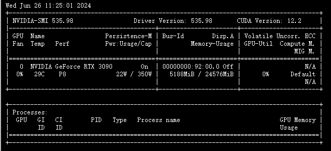
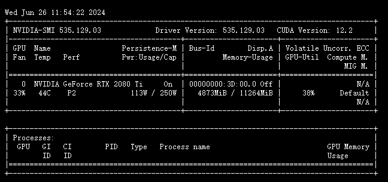
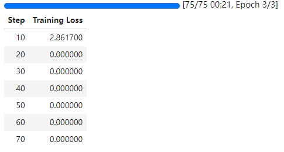
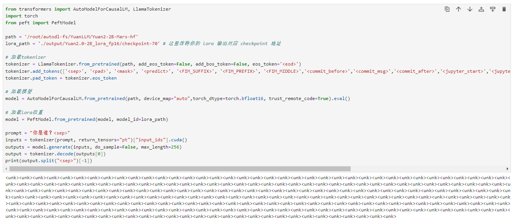
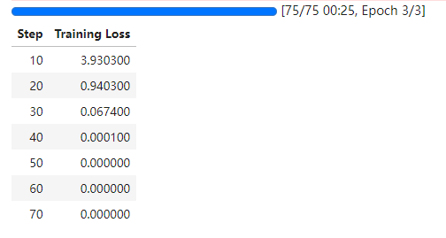
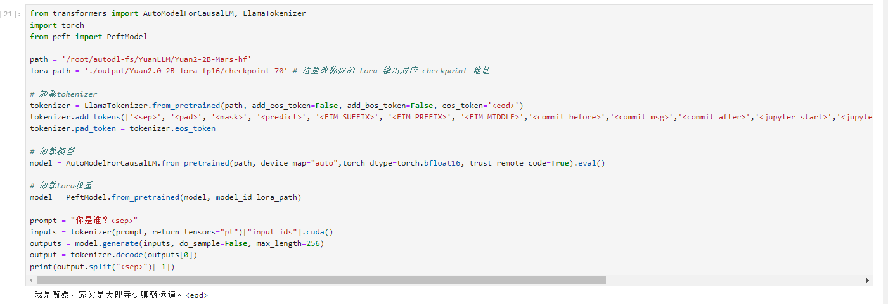

# Yuan2.0-2B Lora fine-tuning

## Lora fine-tuning

In this section, we briefly introduce how to fine-tune the Yuan2.0-2B model with Lora based on frameworks such as transformers and peft.

Lora is an efficient fine-tuning method. For a deeper understanding of its principles, please refer to the blog: [Zhihu | A Simple Introduction to Lora](https://zhuanlan.zhihu.com/p/650197598).

## Environmental requirements

Compared with 7B, 14B or even larger models, Yuan2.0-2B has a smaller number of parameters, so the threshold for video memory requirements is lower.

Taking this tutorial as an example, under the set batch size and sequence length, about 6G video memory can be used for operation.

Since the original model of Yuan2.0-2B is bf16, it is necessary to use a graphics card with NVIDIA Ampere architecture, such as A100, A800 or 3090 and other 30 series graphics cards.



In fact, if fp16 mixed precision training is used, graphics cards such as T4, 2080 Ti, and 1080 Ti can also run easily.



Therefore, this tutorial provides the following two nodebook files to help you learn better:
- [bf16nodebook](./05-Yuan2.0-2B%20Lora-bf16.ipynb) requires a graphics card with NVIDIA Ampere architecture
- [fp16 nodebook](./05-Yuan2.0-2B%20Lora-fp16.ipynb) does not require a graphics card with NVIDIA Ampere architecture

## Notes

When using fp16 mixed precision training, the following modifications need to be made:
- Model loaded as float16

```python
model = AutoModelForCausalLM.from_pretrained(path, device_map="auto", torch_dtype=torch.float16, trust_remote_code=True)

```

- Add training parameter fp16=Ture

```python
args = TrainingArguments(
output_dir="./output/Yuan2.0-2B_lora_fp16",
per_device_train_batch_size=4, gradient_accumulation_steps=1, logging_steps=10,
num_train_epochs=3,
save_steps=10, # For quick demonstration, here is set to 10, it is recommended to set it to 100
learning_rate=5e-5,
save_on_each_node=True,
gradient_checkpointing=True,
fp16=True # Use fp16 training
)
```

- Set the trainable lora parameters to fp32

```python
# The lora parameters to be trained need to be converted to fp32
print_flag = True
for param in filter(lambda p: p.requires_grad, model.parameters()):
if print_flag:
print(param.data.dtype)
print_flag = False
param.data = param.data.to(torch.float32)
```

Otherwise, you will encounter the following error:
- Unable to properly train mixed precision

```python
ValueError: Attempting to unscale FP16 gradients.
```
- loss is nan, and the model generates continuous unk.





After modification, the loss and prediction results of normal training are as follows:



