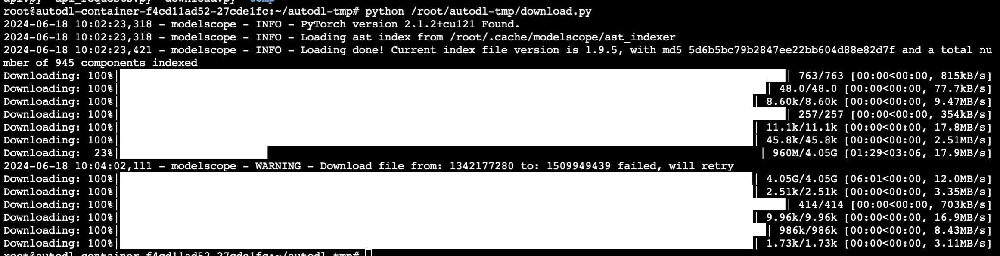

# Index-1.9B-chat FastApi deployment call

## Environment preparation

Rent a 3090 or other 24G video memory graphics card machine on the [AutoDL](https://www.autodl.com/) platform, and select `PyTorch`-->`2.1.0`-->`3.10(ubuntu22.04)`-->`12.1` as shown in the following image.


Next, open the `JupyterLab` of the server just rented, and open the terminal in it to start environment configuration, model download and run `demo`.

pip changes the source and installs dependent packages.

```bash
# Upgrade pip
python -m pip install --upgrade pip
# Change the pypi source to accelerate the installation of the library
pip config set global.index-url https://pypi.tuna.tsinghua.edu.cn/simple

pip install fastapi==0.104.1
pip install uvicorn==0.24.0.post1
pip install requests==2.32.3
pip install modelscope==1.9.5
pip install transformers==4.39.2
pip install streamlit==1.24.0
pip install sentencepiece==0.1.99
pip install accelerate==0.27.0
pip install tiktoken==0.7.0
pip install huggingface_hub==0.23.4
```

## Model download

Use the `snapshot_download` function in `modelscope` to download the model. The first parameter is the model name, the parameter `cache_dir` is the download path of the model, the parameter `revision` is the version of the model, and master represents the main branch, which is the latest version.

Create a new `download.py` file in the `/root/autodl-tmp` path and enter the following content in it. Remember to save the file after pasting the code, as shown in the figure below. And run `python /root/autodl-tmp/download.py` to download. The model size is 8 GB. Downloading the model takes about5 minutes.

```python
import torch
from modelscope import snapshot_download, AutoModel, AutoTokenizer
import os

model_dir = snapshot_download('IndexTeam/Index-1.9B-Chat', cache_dir='/root/autodl-tmp', revision='master')
```

The following result appears in the terminal, indicating that the download is successful.



## Code preparation

Create a new `api.py` file in the `/root/autodl-tmp` path and enter the following content in it. Remember to save the file after pasting the code. The following code has very detailed comments. If you have any questions, please raise an issue.

```python
from fastapi import FastAPI, Request
from transformers import AutoTokenizer, AutoModelForCausalLM, pipeline
import uvicorn
import json
import datetime
import torch

# Set device parameters
DEVICE = "cuda" # Use CUDA
DEVICE_ID = "0" # CUDA device ID, empty if not set
CUDA_DEVICE = f"{DEVICE}:{DEVICE_ID}" if DEVICE_ID else DEVICE # Combine CUDA device information

# Clean up GPU memory function
def torch_gc():
if torch.cuda.is_available(): # Check if CUDA is available
with torch.cuda.device(CUDA_DEVICE): # Specify CUDA device
torch.cuda.empty_cache() # Clear CUDA cache
torch.cuda.ipc_collect() # Collect CUDA memory fragments

# Create FastAPI application
app = FastAPI()

# Endpoint to handle POST requests
@app.post("/")
async defcreate_item(request: Request):
global model, tokenizer # Declare global variables to use the model and tokenizer inside the function
json_post_raw = await request.json() # Get the JSON data of the POST request
json_post = json.dumps(json_post_raw) # Convert JSON data to a string
json_post_list = json.loads(json_post) # Convert a string to a Python object
prompt = json_post_list.get('prompt') # Get the prompt in the request
history = json_post_list.get('history') # Get the history in the request
max_length = json_post_list.get('max_length') # Get the maximum length in the request
top_p = json_post_list.get('top_p') # Get the top_p parameter in the requesttop_k = json_post_list.get('top_k') # Get the top_k parameter in the request
temperature = json_post_list.get('temperature') # Get the temperature parameter in the request
repetition_penalty = json_post_list.get('repetition_penalty') # Get the repetition penalty parameter in the request
model_input = []
for q, a in history:
model_input.append({"role": "user", "content": q})
model_input.append({"role": "assistant", "content": a})
model_input.append({"role": "user", "content": prompt})
# Call the model for dialogue generation
model_output = generator(
model_input, 
max_new_tokens=max_length if max_length else 1024,
top_k=top_k if top_k else 5, # If top_k is not provided, 0.5 is used by default
top_p=top_p if top_p else 0.7, # If top_p is not provided, 0.7 is used by default
temperature=temperature if temperature else 0.95, # If temperature is not provided, 0.95 is used by default, 
repetition_penalty=repetition_penalty if repetition_penalty else 1.1, # If repetition penalty is not provided, 1.1 is used by default, 
do_sample=True
)
response = model_output[0]['generated_text'][-1]['content']
history.append([prompt, response])
now = datetime.datetime.now() # Get the current time
time = now.strftime("%Y-%m-%d %H:%M:%S") # Format the time as a string
# Build the response JSON
answer = {
"response": response,
"history": history,
"status": 200,
"time": time
}
# Build log information
log = "[" + time + "] " + '", prompt:"' + prompt + '", response:"' + repr(response) + '"'
print(log) # Print log
torch_gc() # Perform GPU memory cleanup
return answer # Return response

# Main function entry
if __name__ == '__main__':
# Load pre-trained tokenizer and model
tokenizer =AutoTokenizer.from_pretrained("/root/autodl-tmp/IndexTeam/Index-1.9B-Chat", trust_remote_code=True)
generator = pipeline(
"text-generation",
model="/root/autodl-tmp/IndexTeam/Index-1.9B-Chat",
tokenizer=tokenizer, 
trust_remote_code=True, 
device="cuda:0"
)

# Start FastAPI application
# Use port 6006 to map the port of autodl to the local, so as to use the api locally
uvicorn.run(app, host='0.0.0.0', port=6006, workers=1) # Start the application on the specified port and host
```

## Api deployment

Enter the following command in the terminal to start the `api` service.

```shell
cd /root/autodl-tmp
python api.py
```

The following result appears in the terminal, indicating that the `api` service is enabled successfully.


By default, it is deployed on port 6006. It can be called through the POST method. You can reopen a terminal and use `curl` to call it, as shown below:

```shell
curl -X POST "http://127.0.0.1:6006" \
-H 'Content-Type: application/json' \
-d '{"prompt": "你好", "history": []}'
```

The return value is as follows:

```json
{
"response":"OK! I am Index, a large language model independently developed by Bilibili. I can perform a variety of natural language processing tasks including but not limited to text classification, entity annotation, creative writing, etc., and can be widely used in a variety of scenarios to provide strong technical support for text processing needs. If you need any help, please feel free to let me know.",
"history":[["你好"," Hello! I am Index, a large language model independently developed by Bilibili. I can perform tasks including but not limited to textIt can be widely used in a variety of scenarios to provide powerful technical support for text processing needs, such as classification, entity labeling, creative writing, etc. If you need any help, please feel free to let me know. "]],
"status":200,
"time":"2024-06-15 22:02:28"
}
```

The call example result is shown in the figure below:


You can also use the requests library in python to call, as shown below:

```python
import requests
import json

def get_completion(prompt):
headers = {'Content-Type': 'application/json'}
data = {"prompt": prompt, "history": []}
response = requests.post(url='http://127.0.0.1:6006', headers=headers, data=json.dumps(data))
return response.json()['response']

if __name__ == '__main__':
print(get_completion('Hello, tell me a humorous story'))
```

The call result is as shown below:

